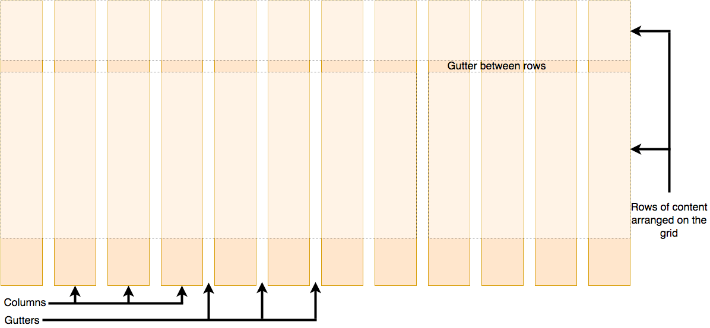

# CSS Layout

- Now it's time to look at how to correctly arrange your boxes in relation to the viewport as well as to one another. We've covered the necessary prerequisites, so let's dive deep into CSS layout, looking at such various features as: different display settings, positioning, modern layout tools like flexbox and CSS grid, and some of the legacy techniques you might still want to know about.

# Introduction to CSS Layout

- In this module, we'll discuss things like different `display` values, and introduce other new concepts throughout the module.

- CSS page layout techniques allow us to take elements contained in a web page and control where they're positioned relative to the following factors: their default position in normal layout flow, the other elements around them, their parent container, and the main viewport/window. The page layout techniques we'll be covering in more detail in this module are:

  - Normal flow
  - The `display` property
  - Flexbox
  - Grid
  - Floats
  - Positioning
  - Table layout
  - Multiple-column layout

- Each technique has its uses, advantages, and disadvantages. No technique is designed to be used in isolation. By understanding what each layout method is designed for you'll be in a good position to understand which method is most appropriate for each task.

## Normal Flow

- Normal flow is how the browser lays out HTML pages by default when you do nothing to control page layout. Let's look at a quick HTML example:

```
<p>I love my cat.</p>

<ul>
  <li>Buy cat food</li>
  <li>Exercise</li>
  <li>Cheer up friend</li>
</ul>

<p>The end!</p>
```

- Note how the HTML is displayed in the exact order in which it appears in the source code, with elements stacked on top of one another — the first paragraph, followed by the unordered list, followed by the second paragraph.
- The elements that appear one below the other are described as **block** elements, in contrast to **inline** elements, which appear beside one another like the individual words in a paragraph.
- Note: The direction in which block element contents are laid out is described as the Block Direction.
- The Block Direction runs vertically in a language such as English, which has a horizontal writing mode.
- It would run horizontally in any language with a Vertical Writing Mode, such as Japanese.
- The corresponding Inline Direction is the direction in which inline contents (such as a sentence) would run.
- For many of the elements on your page, the normal flow will create exactly the layout you need.
- However, for more complex layouts you will need to alter this default behavior using some of the tools available to you in CSS.
- Starting with a well-structured HTML document is very important because you can then work with the way things are laid out by default rather than fighting against it.

- The methods that can change how elements are laid out in CSS are:
  - **The `display` property** — Standard values such as `block`, `inline` or `inline-block` can change how elements behave in normal flow, for example, by making a block-level element behave like an inline-level element (see Types of CSS boxes for more information).
    - We also have entire layout methods that are enabled via specific `display` values, for example, CSS Grid and Flexbox, which alter how child elements are laid out inside their parents.
  - **Floats** — Applying a float value such as `left` can cause block-level elements to wrap along one side of an element, like the way images sometimes have text floating around them in magazine layouts.
  - **The position property** — Allows you to precisely control the placement of boxes inside other boxes. `static` positioning is the default in normal flow, but you can cause elements to be laid out differently using other values, for example, as fixed to the top of the browser viewport.
  - **Table layout** — Features designed for styling parts of an HTML table can be used on non-table elements using `display: table` and associated properties.
  - **Multi-column layout** — The Multi-column layout properties can cause the content of a block to layout in columns, as you might see in a newspaper.

## The display property

- The main methods for achieving page layout in CSS all involve specifying values for the `display` property. This property allows us to change the default way something displays.
- Everything in normal flow has a default value for `display`; i.e., a default way that elements are set to behave.

  - For example, the fact that paragraphs in English display one below the other is because they are styled with `display: block`.
  - If you create a link around some text inside a paragraph, that link remains inline with the rest of the text, and doesn't break onto a new line.
  - This is because the `<a>` element is `display: inline` by default.

- You can change this default display behavior. For example, the `<li>` element is `display: block` by default, meaning that list items display one below the other in our English document.
- If we were to change the display value to `inline` they would display next to each other, as words would do in a sentence. The fact that you can change the value of `display` for any element means that you can pick HTML elements for their semantic meaning without being concerned about how they will look. The way they look is something that you can change.
- In addition to being able to change the default presentation by turning an item from `block` to `inline` and vice versa, there are some more involved layout methods that start out as a value of `display`. However, when using these you will generally need to invoke additional properties. The two values most important for our discussion of layout are `display: flex` and `display: grid`.

## Flexbox

- Flexbox is the short name for the Flexible Box Layout CSS module, designed to make it easy for us to lay things out in one dimension — either as a row or as a column.
- To use flexbox, you apply `display: flex` to the parent element of the elements you want to lay out; all its direct children then become _flex items_. We can see this in a simple example.

### Setting display: flex

- The HTML markup below gives us a containing element with a class of wrapper, inside of which are three `<div>` elements. By default these would display as block elements, that is, below one another in our English language document.

- However, if we add `display: flex` to the parent, the three items now arrange themselves into columns.
- This is due to them becoming _flex items_ and being affected by some initial values that flexbox sets on the flex container.
- They are displayed in a row because the property `flex-direction` of the parent element has an initial value of `row`.
- They all appear to stretch in height because the property `align-items` of their parent element has an initial value of `stretch`.
  - This means that the items stretch to the height of the flex container, which in this case is defined by the tallest item. The items all line up at the start of the container, leaving any extra space at the end of the row.

```
.wrapper {
  display: flex;
}
```

```
<div class="wrapper">
  <div class="box1">One</div>
  <div class="box2">Two</div>
  <div class="box3">Three</div>
</div>
```

### Setting the flex property

- In addition to properties that can be applied to a _flex container_, there are also properties that can be applied to _flex items_.
- These properties, among other things, can change the way that items _flex_, enabling them to expand or contract according to available space.

- As a simple example, we can add the `flex` property to all of our child items, and give it a value of `1`. This will cause all of the items to grow and fill the container, rather than leaving space at the end.
- If there is more space then the items will become wider; if there is less space they will become narrower. In addition, if you add another element to the markup, the other items will all become smaller to make space for it; the items all together continue taking up all the space.

```
.wrapper {
  display: flex;
}

.wrapper > div {
  flex: 1;
}
```

```
<div class="wrapper">
  <div class="box1">One</div>
  <div class="box2">Two</div>
  <div class="box3">Three</div>
</div>
```

## Grid Layout

- While flexbox is designed for one-dimensional layout, Grid Layout is designed for two dimensions — lining things up in rows and columns.

### Setting display: grid

- Similar to flexbox, we enable Grid Layout with its specific display value — `display: grid`.
- The below example uses similar markup to the flex example, with a container and some child elements.
- In addition to using `display: grid`, we also define some row and column _tracks_ for the parent using the `grid-template-rows` and `grid-template-columns` properties respectively.
  - We've defined three columns, each of `1fr`, as well as two rows of `100px`.
  - We don't need to put any rules on the child elements; they're automatically placed into the cells our grid's created.

```
.wrapper {
  display: grid;
  grid-template-columns: 1fr 1fr 1fr;
  grid-template-rows: 100px 100px;
  gap: 10px;
}
```

```
<div class="wrapper">
  <div class="box1">One</div>
  <div class="box2">Two</div>
  <div class="box3">Three</div>
  <div class="box4">Four</div>
  <div class="box5">Five</div>
  <div class="box6">Six</div>
</div>
```

### Placing items on the grid

- Once you have a grid, you can explicitly place your items on it, rather than relying on the auto-placement behavior seen above.
- In the next example below, we've defined the same grid, but this time with three child items.
- We've set the start and end line of each item using the `grid-column` and `grid-row` properties. This causes the items to span multiple tracks.
- Basically, where it starts and where it ends. Notice that it starts the beginning of the first numbered box, and end at the beginning of the second numbered box.

```
.wrapper {
  display: grid;
  grid-template-columns: 1fr 1fr 1fr;
  grid-template-rows: 100px 100px;
  gap: 10px;
}

.box1 {
  grid-column: 2 / 4;
  grid-row: 1;
}

.box2 {
  grid-column: 1;
  grid-row: 1 / 3;
}

.box3 {
  grid-row: 2;
  grid-column: 3;
}
```

- The rest of this guide covers other layout methods that are less important for the main layout of your page, but still help to achieve specific tasks.
- By understanding the nature of each layout task you will soon find that when you look at a particular component of your design, the type of layout most suitable for it will often be clear.

## Floats

- Floating an element changes the behavior of that element and the block level elements that follow it in normal flow.
- The floated element is moved to the left or right and removed from normal flow, and the surrounding content _floats_ around it.

- The float property has four possible values:

  - `left` — Floats the element to the left.
  - `right` — Floats the element to the right.
  - `none` — Specifies no floating at all. This is the default value.
  - `inherit` — Specifies that the value of the float property should be inherited from the element's parent element.

- In the example below, we float a `<div>` left and give it a `margin` on the right to push the surrounding text away from it.
- This gives us the effect of text wrapped around the boxed element, and is most of what you need to know about floats as used in modern web design.

```
<h1>Simple float example</h1>

<div class="box">Float</div>

<p>
  Lorem ipsum dolor sit amet, consectetur adipiscing elit. Nulla luctus aliquam
  dolor, eu lacinia lorem placerat vulputate. Duis felis orci, pulvinar id metus
  ut, rutrum luctus orci. Cras porttitor imperdiet nunc, at ultricies tellus
  laoreet sit amet. Sed auctor cursus massa at porta. Integer ligula ipsum,
  tristique sit amet orci vel, viverra egestas ligula. Curabitur vehicula tellus
  neque, ac ornare ex malesuada et. In vitae convallis lacus. Aliquam erat
  volutpat. Suspendisse ac imperdiet turpis. Aenean finibus sollicitudin eros
  pharetra congue. Duis ornare egestas augue ut luctus. Proin blandit quam nec
  lacus varius commodo et a urna. Ut id ornare felis, eget fermentum sapien.
</p>
```

```
.box {
  float: left;
  width: 150px;
  height: 150px;
  margin-right: 30px;
}
```

- Floats is a legacy technique that's used as a method for creating column layouts, which we might cover later.

## Positioning technique

- Positioning allows you to move an element from where it would otherwise be placed in normal flow over to another location.
- Positioning isn't a method for creating the main layouts of a page; it's more about managing and fine-tuning the position of specific items on a page.

- There are, however, useful techniques for obtaining specific layout patterns that rely on the `position` property.
- Understanding positioning also helps in understanding normal flow, and what it means to move an item out of the normal flow.

- There are five types of positioning you should know about:

- **Static positioning** is the default that every element gets. It just means "put the element into its normal position in the document layout flow — nothing special to see here".
- **Relative positioning** allows you to modify an element's position on the page, moving it relative to its position in normal flow, as well as making it overlap other elements on the page.
- **Absolute positioning** moves an element completely out of the page's normal layout flow, like it's sitting on its own separate layer. From there, you can fix it to a position relative to the edges of its closest positioned ancestor (which becomes `<html>` if no other ancestors are positioned).
  - This is useful for creating complex layout effects, such as tabbed boxes where different content panels sit on top of one another and are shown and hidden as desired, or information panels that sit off-screen by default, but can be made to slide on screen using a control button.
- **Fixed positioning** is very similar to absolute positioning except that it fixes an element relative to the browser viewport, not another element.
  - This is useful for creating effects such as a persistent navigation menu that always stays in the same place on the screen as the rest of the content scrolls.
- **Sticky positioning** is a newer positioning method that makes an element act like `position: relative` until it hits a defined offset from the viewport, at which point it acts like `position: fixed`.

### Simple positioning example

- To provide familiarity with these page layout techniques, we'll show you a couple of quick examples. Our examples will all feature the same HTML structure (a heading followed by three paragraphs), which is as follows:

```
<h1>Positioning</h1>

<p>I am a basic block level element.</p>
<p class="positioned">I am a basic block level element.</p>
<p>I am a basic block level element.</p>
```

- Styled by the following default CSS

```
body {
  width: 500px;
  margin: 0 auto;
}

p {
  background-color: rgb(207, 232, 220);
  border: 2px solid rgb(79, 185, 227);
  padding: 10px;
  margin: 10px;
  border-radius: 5px;
}
```

### Relative positioning

- Relative positioning allows you to offset an item from its default position in normal flow.
- This means you could achieve a task such as moving an icon down a bit so it lines up with a text label.
- To do this, we could add the following rule to add relative positioning:

```
.positioned {
  position: relative;
  top: 30px;
  left: 30px;
}
```

- Here we give our middle paragraph a `position` value of `relative`. This doesn't do anything on its own, so we also add `top` and `left` properties. These serve to move the affected element down and to the right. This might seem like the opposite of what you were expecting, but you need to think of it as the element being pushed on its left and top sides, which results in it moving right and down.

- The achieved effect is that relative to its original position in the normal flow, it's moved 30px toward the bottom left corner, which also makes it overlap with the other element.

### Absolute positioning

- Absolute positioning is used to completely remove an element from the normal flow and instead position it using offsets from the edges of a containing block.
- Going back to our original non-positioned example, we could add the following CSS rule to implement absolute positioning:

```
.positioned {
  position: absolute;
  top: 30px;
  left: 30px;
}
```

- Here we give our middle paragraph a position value of absolute and the same top and left properties as before. Adding this code will produce the following result:

  - The element completely overlaps with the heading.

- This is very different!
- The positioned element has now been completely separated from the rest of the page layout and sits over the top of it.
- The other two paragraphs now sit together as if their positioned sibling doesn't exist.
- The `top` and `left` properties have a different effect on absolutely positioned elements than they do on relatively positioned elements.
  - In this case, the offsets have been calculated from the top and left of the page.
  - It is possible to change the parent element that becomes this container and we will take a look at that in the lesson on positioning.

### Fixed positioning

- Fixed positioning removes our element from document flow in the same way as absolute positioning.
- However, instead of the offsets being applied from the container, they are applied from the viewport.
- Because the item remains fixed in relation to the viewport, we can create effects such as a menu that remains fixed as the page scrolls beneath it.

- For this example, our HTML contains three paragraphs of text so that we can scroll through the page, as well as a box with the property of `position: fixed`.

```
<h1>Fixed positioning</h1>

<div class="positioned">Fixed</div>

<p>
  Lorem ipsum dolor sit amet, consectetur adipiscing elit. Nulla luctus aliquam
  dolor, eu lacinia lorem placerat vulputate. Duis felis orci, pulvinar id metus
  ut, rutrum luctus orci.
</p>

<p>
  Cras porttitor imperdiet nunc, at ultricies tellus laoreet sit amet. Sed
  auctor cursus massa at porta. Integer ligula ipsum, tristique sit amet orci
  vel, viverra egestas ligula. Curabitur vehicula tellus neque, ac ornare ex
  malesuada et.
</p>

<p>
  In vitae convallis lacus. Aliquam erat volutpat. Suspendisse ac imperdiet
  turpis. Aenean finibus sollicitudin eros pharetra congue. Duis ornare egestas
  augue ut luctus. Proin blandit quam nec lacus varius commodo et a urna. Ut id
  ornare felis, eget fermentum sapien.
</p>
```

```
.positioned {
  position: fixed;
  top: 30px;
  left: 30px;
}
```

- The fixed box actually just stays on top of the page and doesn't move at all.

### Sticky positioning

- Sticky positioning is the final positioning method that we have at our disposal.
- It mixes relative positioning with fixed positioning.
- When an item has `position: sticky`, it'll scroll in normal flow until it hits offsets from the viewport that we have defined. At that point, it becomes "stuck" as if it had `position: fixed` applied.

```
.positioned {
  position: sticky;
  top: 30px;
  left: 30px;
}
```

- Note that if you scrollback up, it no longer stays there.

## Table Layout

- HTML tables are fine for displaying tabular data, but many years ago — before even basic CSS was supported reliably across browsers — web developers used to also use tables for entire web page layouts, putting their headers, footers, columns, etc. into various table rows and columns.
- This worked at the time, but it has many problems: table layouts are inflexible, very heavy on markup, difficult to debug, and semantically wrong (e.g., screen reader users have problems navigating table layouts).

- The way that a table looks on a webpage when you use table markup is due to a set of CSS properties that define table layout.
- These same properties can also be used to lay out elements that aren't tables, a use which is sometimes described as "using CSS tables".

- The example below shows one such use. It must be noted, that using CSS tables for layout should be considered a legacy method at this point, and should only be used to support old browsers that lack support for Flexbox or Grid.

- Let's look at an example. First, some simple markup that creates an HTML form. Each input element has a label, and we've also included a caption inside a paragraph. Each label/input pair is wrapped in a `<div>` for layout purposes.

```
<form>
  <p>First of all, tell us your name and age.</p>
  <div>
    <label for="fname">First name:</label>
    <input type="text" id="fname" />
  </div>
  <div>
    <label for="lname">Last name:</label>
    <input type="text" id="lname" />
  </div>
  <div>
    <label for="age">Age:</label>
    <input type="text" id="age" />
  </div>
</form>
```

- As for the CSS, most of it's fairly ordinary except for the uses of the display property.
- The `<form>`, `<div>`s, and `<label>`s and `<input>`s have been told to display like a table, table rows, and table cells respectively.
- Basically, they'll act like HTML table markup, causing the labels and inputs to line up nicely by default. All we then have to do is add a bit of sizing, margin, etc., to make everything look a bit nicer and we're done.

- You'll notice that the caption paragraph has been given `display: table-caption;`, which makes it act like a table `<caption>`, and `caption-side: bottom;` to tell the caption to sit on the bottom of the table for styling purposes, even though the markup is before the `<input>` elements in the source. This allows for a nice bit of flexibility.

```
html {
  font-family: sans-serif;
}

form {
  display: table;
  margin: 0 auto;
}

form div {
  display: table-row;
}

form label,
form input {
  display: table-cell;
  margin-bottom: 10px;
}

form label {
  width: 200px;
  padding-right: 5%;
  text-align: right;
}

form input {
  width: 300px;
}

form p {
  display: table-caption;
  caption-side: bottom;
  width: 300px;
  color: #999;
  font-style: italic;
}
```

## Multi-column layout

- The multi-column layout CSS module provides us a way to lay out content in columns, similar to how text flows in a newspaper.
- While reading up and down columns is less useful in a web context due to the users having to scroll up and down, arranging content into columns can, nevertheless, be a useful technique.

- To turn a block into a multi-column container, we use either the `column-count` property, which tells the browser _how_ many columns we would like to have, or the `column-width` property, which tells the browser to fill the container with as many columns as possible of a _specified width_.

- In the below example, we start with a block of HTML inside a containing `<div>` element with a class of `container`.

```
<div class="container">
  <h1>Multi-column Layout</h1>

  <p>
    Lorem ipsum dolor sit amet, consectetur adipiscing elit. Nulla luctus
    aliquam dolor, eu lacinia lorem placerat vulputate. Duis felis orci,
    pulvinar id metus ut, rutrum luctus orci. Cras porttitor imperdiet nunc, at
    ultricies tellus laoreet sit amet. Sed auctor cursus massa at porta.
  </p>

  <p>
    Nam vulputate diam nec tempor bibendum. Donec luctus augue eget malesuada
    ultrices. Phasellus turpis est, posuere sit amet dapibus ut, facilisis sed
    est. Nam id risus quis ante semper consectetur eget aliquam lorem.
  </p>

  <p>
    Vivamus tristique elit dolor, sed pretium metus suscipit vel. Mauris
    ultricies lectus sed lobortis finibus. Vivamus eu urna eget velit cursus
    viverra quis vestibulum sem. Aliquam tincidunt eget purus in interdum. Cum
    sociis natoque penatibus et magnis dis parturient montes, nascetur ridiculus
    mus.
  </p>
</div>
```

- We're using a `column-width` of 200 pixels on that container, causing the browser to create as many 200 pixel columns as will fit. Whatever space is left between the columns will be shared.

```
.container {
  column-width: 200px;
}
```

# Normal Flow

- As detailed in the last lesson introducing layout, elements on a webpage lay out in normal flow if you haven't applied any CSS to change the way they behave.
- And, as we began to discover, you can change how elements behave either by adjusting their position in normal flow or by removing them from it altogether.
- Starting with a solid, well-structured document that's readable in normal flow is the best way to begin any webpage. It ensures that your content is readable even if the user's using a very limited browser or a device such as a screen reader that reads out the content of the page.
- In addition, since normal flow is designed to make a readable document, by starting in this way you're working with the document rather than struggling against it as you make changes to the layout.

## How are elements laid out by default

- The process begins as the boxes of individual elements are laid out in such a way that any padding, border, or margin they happen to have is added to their content. This is what we call the **box model**.

- By default, a block level element's content fills the available inline space of the parent element containing it and grows along the block dimension to accommodate its content.
- The size of inline elements is just the size of their content.
- You can't set width or height on inline elements — they just sit inside the content of block level elements — except for images.
- Unlike other inline elements, images can be resized without changing their display property.
- If you want to control the size of an inline element in this manner, you need to set it to behave like a block level element (e.g., with `display: block;` or `display: inline-block;`, which mixes characteristics from both).

- That explains how elements are structured individually, but how about the way they're structured when they interact with one another?
- The normal layout flow is the system by which elements are placed inside the browser's viewport.
- By default, block-level elements are laid out in the block flow direction, which is based on the parent's writing mode (`initial: horizontal-tb`).
- Each element will appear on a new line below the last one, with each one separated by whatever margin that's been specified. In English, for example, (or any other horizontal, top to bottom writing mode) block-level elements are laid out vertically.

- Inline elements behave differently.
- They don't appear on new lines; instead, they all sit on the same line along with any adjacent (or wrapped) text content as long as there is space for them to do so inside the width of the parent block level element.
- If there isn't space, then the overflowing content will move down to a new line.

- If two vertically adjacent elements both have a margin set on them and their margins touch, the larger of the two margins remains and the smaller one disappears. This is known as **margin collapsing**. Collapsing margins is only relevant in the **vertical direction**.

- Let's look at a simple example that explains all of this:

```
<h1>Basic document flow</h1>

<p>
  I am a basic block level element. My adjacent block level elements sit on new
  lines below me.
</p>

<p>
  By default we span 100% of the width of our parent element, and we are as tall
  as our child content. Our total width and height is our content + padding +
  border width/height.
</p>

<p>
  We are separated by our margins. Because of margin collapsing, we are
  separated by the width of one of our margins, not both.
</p>

<p>
  Inline elements <span>like this one</span> and <span>this one</span> sit on
  the same line along with adjacent text nodes, if there is space on the same
  line. Overflowing inline elements will
  <span>wrap onto a new line if possible (like this one containing text)</span>,
  or just go on to a new line if not, much like this image will do:
  
</p>
```

```
body {
  width: 500px;
  margin: 0 auto;
}

p {
  background: rgba(255, 84, 104, 0.3);
  border: 2px solid rgb(255, 84, 104);
  padding: 10px;
  margin: 10px;
}

span {
  background: white;
  border: 1px solid black;
}
```

# Flexbox

- Flexbox is a **one-dimensional** layout method for arranging items in rows or columns. Items _flex_ (expand) to fill additional space or shrink to fit into smaller spaces.

## Why flexbox?

- For a long time, the only reliable cross-browser compatible tools available for creating CSS layouts were features like floats and positioning. These work, but in some ways they're also limiting and frustrating.
- The following simple layout designs are either difficult or impossible to achieve with such tools in any kind of convenient, flexible way:
  - Vertically centering a block of content inside its parent.
  - Making all the children of a container take up an equal amount of the available width/height, regardless of how much width/height is available.
  - Making all columns in a multiple-column layout adopt the same height even if they contain a different amount of content.

## Introducing a simple example

- You'll see that we have a `<header>` element with a top level heading inside it and a `<section>` element containing three `<article>`s. We're going to use these to create a fairly standard three column layout.

## Specifying what elements to lay out as flexible boxes

- To start with, we need to select which elements are to be laid out as flexible boxes. To do this, we set a special value of `display` on the parent element of the elements you want to affect.
- In this case we want to lay out the `<article>` elements, so we set this on the `<section>`:

```
section {
  display: flex;
}
```

- This causes the `<section>` element to become a **flex container** and its children to become **flex items**. The result of this should be that the columns are now in line with each other.
- So, this single declaration gives us everything we need. Incredible, right?

  - We have our multiple column layout with equal-sized columns, and the columns are all the same height.
  - This is because the default values given to flex items (the children of the flex container) are set up to solve common problems such as this.

- To be clear, let's reiterate what is happening here.
- The element we've given a `display` value of `flex` to is acting like a block-level element in terms of how it interacts with the rest of the page, but its children are laid out as flex items.
- The next section will explain in more detail what this means. Note also that you can use a `display` value of `inline-flex` if you wish to lay out an element's children as flex items, but have that element behave like an inline element.

## The flex model

- When elements are laid out as flex items, they are laid out along two axes:


- The **main axis** is the axis running in the direction the flex items are laid out in (for example, as rows across the page, or columns down the page.) The start and end of this axis are called the **main start** and **main end**.
- The **cross axis** is the axis running perpendicular to the direction the flex items are laid out in. The start and end of this axis are called the **cross start** and **cross end**.
- The parent element that has `display: flex` set on it (the `<section>` in our example) is called the **flex container**.
- The items laid out as flexible boxes inside the flex container are called **flex items** (the `<article>` elements in our example).

## Columns or rows?

- Flexbox provides a property called `flex-direction` that specifies which direction the main axis runs (which direction the flexbox children are laid out in).
- By default this is set to `row`, which causes them to be laid out in a row in the direction your browser's default language works in (left to right, in the case of an English browser).

- Adding `flex direction: column;` to the `<section>` rule will cause the items to be back in a column layout, much like they were before we added any CSS.

- Note: You can also lay out flex items in a reverse direction using the `row-reverse` and `column-reverse` values.

## Wrapping

- One issue that arises when you have a fixed width or height in your layout is that eventually your flexbox children will overflow their container, breaking the layout.
- Have a look at our flexbox-wrap0.html example:

  - The columns are breaking out of the container

- One way to fix this is:

```
flex-wrap: wrap;
```

- As well as:

```
flex: 200px;
```

- We now have multiple rows.
- Each row has as many flexbox children fitted into it as is sensible.
- Any overflow is moved down to the next line.
- The `flex: 200px` declaration set on the articles means that each will be at least 200px wide.
- We'll discuss this property in more detail later on. You might also notice that the last few children on the last row are each made wider so that the entire row is still filled.

## flex-flow shorthand

- At this point it's worth noting that a shorthand exists for `flex-direction` and `flex-wrap: flex-flow`. So, for example, you can replace:

```
flex-direction: row;
flex-wrap: wrap;
```

- With:

```
flex-flow: row wrap;
```

## Flexible sizing of flex items

- Let's now return to our first example and look at how we can control what proportion of space flex items take up compared to the other flex items. Fire up your local copy of flexbox0.html, and add this rule:

```
article {
  flex: 1;
}
```

- This is a unitless proportion value that dictates how much available space along the **main axis** each flex item will take up compared to other flex items.
- In this case, we're giving each `<article>` element the same value (a value of 1), which means they'll all take up an equal amount of the spare space left after properties like padding and margin have been set.
- This value is proportionally shared among the flex items: giving each flex item a value of 400000 would have exactly the same effect.

- Now add the following rule below the previous one:

```
article:nth-of-type(3) {
  flex: 2;
}
```

- Now when you refresh, you'll see that the third `<article>` takes up twice as much of the available width as the other two.
- There are now four proportion units available in total (since 1 + 1 + 2 = 4).
- The first two flex items have one unit each, so they each take 1/4 of the available space. The third one has two units, so it takes up 2/4 of the available space (or one-half).

- You can also specify a minimum size value within the flex value. Try updating your existing article rules like so:

```
article {
  flex: 1 200px;
}

article:nth-of-type(3) {
  flex: 2 200px;
}
```

- This basically states, "Each flex item will first be given 200px of the available space. After that, the rest of the available space will be shared according to the proportion units." Try refreshing and you'll see a difference in how the space is shared.

- The real value of flexbox can be seen in its flexibility/responsiveness. If you resize the browser window or add another `<article>` element, the layout continues to work just fine.

## flex: shorthand vs longhand

- `flex` is a shorthand property that can specify up to three different values:

  - The unitless proportion value we discussed above. This can be specified separately using the `flex-grow` longhand property.
  - A second unitless proportion value, `flex-shrink`, which comes into play when the flex items are overflowing their container. This value specifies how much an item will shrink in order to prevent overflow. This is quite an advanced flexbox feature and we won't be covering it any further in this article.
  - The minimum size value we discussed above. This can be specified separately using the `flex-basis` longhand value.

- We'd advise against using the longhand flex properties unless you really have to (for example, to override something previously set). They lead to a lot of extra code being written, and they can be somewhat confusing.

## Horizontal and vertical alignment

- You can also use flexbox features to align flex items along the main or cross axis.
- Let's explore this by looking at a new example: flex-align0.html.
- We're going to turn this into a neat, flexible button/toolbar. At the moment you'll see a horizontal menu bar with some buttons jammed into the top left-hand corner.

- Add the following CSS:

```
div {
  display: flex;
  align-items: center;
  justify-content: space-around;
}
```

- Refresh the page and you'll see that the buttons are now nicely centered horizontally and vertically. We've done this via two new properties. **Align items is used for cross axis (vertical) alignment**.

- `align-items` controls where the flex items sit on the cross axis.

  - By default, the value is `stretch`, which stretches all flex items to fill the parent in the direction of the cross axis. If the parent doesn't have a fixed height in the cross axis direction, then all flex items will become as tall as the tallest flex item. This is how our first example had columns of equal height by default.
  - The `center` value that we used in our above code causes the items to maintain their intrinsic dimensions, but be centered along the cross axis. This is why our current example's buttons are centered vertically.
  - You can also have values like `flex-start` and `flex-end`, which will align all items at the start and end of the cross axis respectively.
  - Lookup `align-items` for the full details.

- You can override the `align-items` behavior for individual flex items by applying the `align-self` property to them. For example, try adding the following to your CSS:

```
button:first-child {
  align-self: flex-end;
}
```

- `justify-content` controls where the flex items sit on the main axis.

  - The default value is `flex-start`, which makes all the items sit at the start of the main axis.
  - You can use `flex-end` to make them sit at the end.
  - `center` is also a value for `justify-content`. It'll make the flex items sit in the center of the main axis.
  - The value we've used above, `space-around`, is useful — it distributes all the items evenly along the main axis with a bit of space left at either end.
  - There is another value, `space-between`, which is very similar to `space-around` except that it doesn't leave any space at either end.

- **The `justify-items` property is ignored in flexbox layouts**.

## Ordering flex items

- Flexbox also has a feature for changing the layout order of flex items without affecting the source order. This is another thing that is impossible to do with traditional layout methods.

- As an example:

```
button:first-child {
  order: 1;
}
```

- Refresh and you'll see that the "Smile" button has moved to the end of the main axis. Let's talk about how this works in a bit more detail:

  - By default, all flex items have an `order` value of 0.
  - Flex items with higher specified order values will appear later in the display order than items with lower order values.
  - Flex items with the same order value will appear in their source order. So if you have four items whose order values have been set as 2, 1, 1, and 0 respectively, their display order would be 4th, 2nd, 3rd, then 1st.
  - The 3rd item appears after the 2nd because it has the same order value and is after it in the source order.

- You can set negative order values to make items appear earlier than items whose value is 0. For example, you could make the "Blush" button appear at the start of the main axis using the following rule:

```
button:last-child {
  order: -1;
}
```

## Nested flex boxes

- It's possible to create some pretty complex layouts with flexbox. It's perfectly OK to set a flex item to also be a flex container, so that its children are also laid out like flexible boxes.
- Have a look at `complex-flexbox.html`.

- The HTML for this is fairly simple. We've got a `<section>` element containing three `<article>`s. The third `<article>` contains three `<div>`s, and the first `<div>` contains five `<button>`s :

```
section - article
          article
          article - div - button
                    div   button
                    div   button
                          button
                          button
```

- First of all, we set the children of the `<section>` to be laid out as flexible boxes.

```
section {
  display: flex;
}
```

- Next, we set some flex values on the `<article>`s themselves. Take special note of the second rule here: we're setting the third `<article>` to have its children laid out like flex items too, but this time we're laying them out like a column.

```
article {
  flex: 1 200px;
}

article:nth-of-type(3) {
  flex: 3 200px;
  display: flex;
  flex-flow: column;
}
```

- Next, we select the first `<div>`. We first use `flex: 1 100px;` to effectively give it a minimum height of 100px, then we set its children (the `<button>` elements) to also be laid out like flex items. Here we lay them out in a wrapping row and align them in the center of the available space as we did with the individual button example we saw earlier.

```
article:nth-of-type(3) div:first-child {
  flex: 1 100px;
  display: flex;
  flex-flow: row wrap;
  align-items: center;
  justify-content: space-around;
}
```

- Finally, we set some sizing on the button. This time by giving it a flex value of 1 auto.
- This has a very interesting effect, which you'll see if you try resizing your browser window width.
  - The buttons will take up as much space as they can. As many will fit on a line as is comfortable; beyond that, they'll drop to a new line.

```
button {
  flex: 1 auto;
  margin: 5px;
  font-size: 18px;
  line-height: 1.5;
}
```

## Cross-browser compatibility

- Flexbox support is available in most new browsers: Firefox, Chrome, Opera, Microsoft Edge, and IE 11, newer versions of Android/iOS, etc. However, you should be aware that there are still older browsers in use that don't support Flexbox (or do, but support a really old, out-of-date version of it.)

- While you're just learning and experimenting, this doesn't matter too much; however, if you're considering using flexbox in a real website, you need to do testing and make sure that your user experience is still acceptable in as many browsers as possible.

- We discuss strategies for overcoming cross-browser support issues in our Cross browser testing module.

# Grid

- CSS Grid Layout is a two-dimensional layout system for the web. It lets you lay content out in rows and columns. It has many features that make building complex layouts straightforward. This article will explain all you need to know to get started with page layout.

## What is grid layout?

- A grid is a collection of horizontal and vertical lines creating a pattern against which we can line up our design elements. They help us to create layouts in which our elements won't jump around or change width as we move from page to page, providing greater consistency on our websites.

- A grid will typically have **columns**, **rows**, and then gaps between each row and column. The gaps are commonly referred to as **gutters**.



## Creating your grid in CSS

- Having decided on the grid that your design needs, you can use CSS Grid Layout to create it. We'll look at the basic features of Grid Layout first and then explore how to create a simple grid system for your project.

### Defining a grid

- In the `starting_point.html`, you will see a live example using grid.

- It has a container, which has some child items.
- These display in normal flow by default, so the boxes display one below the other. We'll be working with this file for the first part of this lesson, making changes to see how its grid behaves.

- To define a grid we use the grid value of the display property. As with Flexbox, this enables Grid Layout; all of the direct children of the container become grid items:

```
.container {
display: grid;
}
```

- Unlike Flexbox, the items will not immediately look any different. Declaring `display: grid` gives you a one column grid, so your items will continue to display one below the other as they do in normal flow.

- To see something that looks more grid-like, we'll need to add some columns to the grid. Let's add three 200-pixel columns. You can use any length unit or percentage to create these column tracks.

```
.container {
  display: grid;
  grid-template-columns: 200px 200px 200px;
}
```

- Add the second declaration to your CSS rule, then reload the page. You should see that the items have rearranged themselves such that there's one in each cell of the grid.

### Flexible grids with fr unit

- In addition to creating grids using lengths and percentages, we can use the `fr` unit to flexibly size grid rows and columns. This unit represents one fraction of the available space in the grid container.

- Change your track listing to the following definition, creating three `1fr` tracks.

```
.container {
  display: grid;
  grid-template-columns: 1fr 1fr 1fr;
}
```

- You should now see that you have flexible tracks. The fr unit distributes space proportionally. So if you specify different positive values for your tracks like so:

```
.container {
  display: grid;
  grid-template-columns: 2fr 1fr 1fr;
}
```

- The first track now gets `2fr` of the available space and the other two tracks get `1fr`, making the first track larger. You can mix `fr` units with fixed length units — in such a case the space needed for the fixed tracks is used up first; the remaining space is then distributed to the other tracks.

- **Note**: The `fr` unit distributes available space, not all space. Therefore, if one of your tracks has something large inside it, there will be less free space to share.

### Gaps between tracks

- To create gaps between tracks we use the properties `column-gap` for gaps between columns, `row-gap` for gaps between rows, and `gap` as a shorthand for both.

```
.container {
  display: grid;
  grid-template-columns: 2fr 1fr 1fr;
  gap: 20px;
}
```

- These gaps can be any length unit or percentage, but not an `fr` unit.

- **Note**: The `gap` properties (`column-gap`, `row-gap` and `gap`) used to be prefixed by `grid-`, but this has been changed in the spec in order to make them usable in multiple layout methods.
- The prefixed versions will be maintained as an alias, so they'll be safe to use for some time. To be on the safe side, you could double up and add both properties to make your code more bulletproof:

```
.container {
  display: grid;
  grid-template-columns: 2fr 1fr 1fr;
  grid-gap: 20px;
  gap: 20px;
}
```

### Repeating track listings

- You can repeat all or merely a section of your track listing using the CSS `repeat()` function. Change your track listing to the following:

```
.container {
  display: grid;
  grid-template-columns: repeat(3, 1fr);
  gap: 20px;
}
```

- You'll now get three 1fr tracks just as before. The first value passed to the `repeat()` function specifies the number of times you want the listing to repeat, while the second value is a track listing, which may be one or more tracks that you want to repeat.

### The implicit and explicit grid

- We've only specified column tracks so far, yet rows are being created to hold our content. This is an example of the _explicit_ versus the _implicit_ grid.
- The explicit grid is the one that you create using `grid-template-columns` or `grid-template-rows`. The implicit grid is created when content is placed outside of that grid, such as into our rows.

- By default, tracks created in the implicit grid are `auto` sized, which in general means that they're large enough to accommodate their content.
- If you wish to give implicit grid tracks a size, you can use the `grid-auto-rows` and `grid-auto-columns` properties.
- If you add `grid-auto-rows` with a value of `100px` to your CSS, you'll see that those created rows are now 100 pixels tall.

```
.container {
  display: grid;
  grid-template-columns: repeat(3, 1fr);
  grid-auto-rows: 100px;
  gap: 20px;
}
```

### The minmax() function

- Our 100-pixel tall tracks won't be very useful if we add content into those tracks that is taller than 100 pixels, in which case it would cause an overflow.
- It might be better to have tracks that are at least 100 pixels tall and can still expand if more content becomes added. A fairly basic fact about the web is that you never really know how tall something is going to be — additional content or larger font sizes can cause problems with designs that attempt to be pixel perfect in every dimension.

- The `minmax()` function lets us set a minimum and maximum size for a track, for example, `minmax(100px, auto)`. The minimum size is 100 pixels, but the maximum is auto, which will expand to accommodate more content. Try changing `grid-auto-rows` to use a minmax value:

```
.container {
  display: grid;
  grid-template-columns: repeat(3, 1fr);
  grid-auto-rows: minmax(100px, auto);
  gap: 20px;
}
```

- If you add extra content, you'll see that the track expands to allow it to fit. Note that the expansion happens right along the row.

### As many columns as will fit

- We can combine some of the lessons we've learned about track listing, repeat notation, and `minmax()` to create a useful pattern.
- Sometimes it's helpful to be able to ask grid to create as many columns as will fit into the container.
- We do this by setting the value of `grid-template-columns` using the `repeat()` function, but instead of passing in a number, pass in the keyword `auto-fill`. For the second parameter of the function we use `minmax()` with a minimum value equal to the minimum track size that we would like to have and a maximum of `1fr`.

```
.container {
  display: grid;
  grid-template-columns: repeat(auto-fill, minmax(200px, 1fr));
  grid-auto-rows: minmax(100px, auto);
  gap: 20px;
}
```

- This works because grid is creating as many 200-pixel columns as will fit into the container, then sharing whatever space is leftover among all the columns. The maximum is `1fr` which, as we already know, distributes space evenly between tracks.

## Line-based placement

- We now move on from creating a grid to placing things on the grid.
- Our grid always has lines — these are numbered beginning with 1 and relate to the writing mode of the document.

  - For example, column line 1 in English (written left-to-right) would be on the left-hand side of the grid and row line 1 at the top, while in Arabic (written right-to-left), column line 1 would be on the right-hand side.

- We can arrange things in accordance with these lines by specifying the start and end line. We do this using the following properties:

  - `grid-column-start`
  - `grid-column-end`
  - `grid-row-start`
  - `grid-row-end`

- These properties can all have a line number as their value. You can also use the shorthand properties:

  - `grid-column`
  - `grid-row`

- It has a defined grid and a simple article outlined. You can see that auto-placement is placing each item into its own cell on the grid.

- Let's instead arrange all of the elements for our site by using the grid lines. Add the following rules to the bottom of your CSS:

```
header {
  grid-column: 1 / 3;
  grid-row: 1;
}

article {
  grid-column: 2;
  grid-row: 2;
}

aside {
  grid-column: 1;
  grid-row: 2;
}

footer {
  grid-column: 1 / 3;
  grid-row: 3;
}
```

- **Note**: You can also use the value -1 to target the end column or row line, then count inwards from the end using negative values. Note also that lines count always from the edges of the explicit grid, not the implicit grid.

## Positioning with grid-template-areas

- An alternative way to arrange items on your grid is to use the `grid-template-areas` property and give the various elements of your design a name.

```
.container {
  display: grid;
  grid-template-areas:
    "header header"
    "sidebar content"
    "footer footer";
  grid-template-columns: 1fr 3fr;
  gap: 20px;
}

header {
  grid-area: header;
}

article {
  grid-area: content;
}

aside {
  grid-area: sidebar;
}

footer {
  grid-area: footer;
}
```

- The rules for grid-template-areas are as follows:

  - You need to have every cell of the grid filled.
  - To span across two cells, repeat the name.
  - To leave a cell empty, use a . (period).
  - Areas must be rectangular — for example, you can't have an L-shaped area.
  - Areas can't be repeated in different locations.

- You can play around with our layout, changing the footer to only sit underneath the article and the sidebar to span all the way down.
- This is a very nice way to describe a layout because it's clear just from looking at the CSS to know exactly what's happening.

## Grid frameworks in CSS grid

- Grid "frameworks" tend to be based around 12 or 16-column grids.
- With CSS Grid, you don't need any third party tool to give you such a framework — it's already there in the spec.

- This has a container with a 12-column grid defined and the same markup we used in the previous two examples.
- We can now use line-based placement to place our content on the 12-column grid.

```
header {
  grid-column: 1 / 13;
  grid-row: 1;
}

article {
  grid-column: 4 / 13;
  grid-row: 2;
}

aside {
  grid-column: 1 / 4;
  grid-row: 2;
}

footer {
  grid-column: 1 / 13;
  grid-row: 3;
}
```

- Firefox Grid Inspector can show you all the grid lines over your layout.

# Floats

- Originally for floating images inside blocks of text, the `float` property became one of the most commonly used tools for creating multiple column layouts on webpages.
- With the advent of flexbox and grid it's now returned to its original purpose, as this article explains.

## The background of floats

- The `float` property was introduced to allow web developers to implement simple layouts involving an image floating inside a column of text, with the text wrapping around the left or right of it.
  - The kind of thing you might get in a newspaper layout.
- But web developers quickly realized that you can float anything, not just images, so the use of float broadened, for example, to fun layout effects such as drop-caps.
- Floats have commonly been used to create entire web site layouts featuring multiple columns of information floated so they sit alongside one another (the default behavior would be for the columns to sit below one another in the same order as they appear in the source).
- There are newer, better layout techniques available. Using floats in this way should be regarded as a legacy technique.

## A simple float example

- Let's explore the use of floats. We'll start with a really simple example involving floating a block of text around an element. You can follow along by creating a new index.html file on your computer, filling it with a simple HTML template, and inserting the below code into it at the appropriate places. At the bottom of the section, you can see a live example of what the final code should look like.
- If you save and refresh, you'll see something much like what you'd expect: the box is sitting above the text, in normal flow.

### Floating the box

- To float the box, add the float and margin-right properties to the .box rule:

```
.box {
  float: left;
  margin-right: 15px;
  width: 150px;
  height: 100px;
  border-radius: 5px;
  background-color: rgb(207, 232, 220);
  padding: 1em;
}
```

- Let's think about how the float works. The element with the float set on it (the `<div>` element in this case) is taken out of the normal layout flow of the document and stuck to the left-hand side of its parent container (`<body>`, in this case).
- Any content that would come below the floated element in the normal layout flow will now wrap around it instead, filling up the space to the right-hand side of it as far up as the top of the floated element. There, it will stop.

- Floating the content to the right has exactly the same effect, but in reverse: the floated element will stick to the right, and the content will wrap around it to the left.
- Try changing the float value to `right` and replace `margin-right` with `margin-left` in the last ruleset to see what the result is.

### Visualizing the float

- While we can add a margin to the float to push the text away, we can't add a margin to the text to move it away from the float.
- This is because a floated element is taken out of normal flow and the boxes of the following items actually run behind the float.
- You can see this by making some changes to your example.

- Add a class of `special` to the first paragraph of text, the one immediately following the floated box, then in your CSS add the following rules. These will give our following paragraph a background color.

```
.special {
  background-color: rgb(79, 185, 227);
  padding: 10px;
  color: #fff;
}
```

- To make the effect easier to see, change the `margin-left` on your float to `margin` so you get space all around the float. You'll be able to see the background on the paragraph running right underneath the floated box.

- The line boxes of our following element have been shortened so the text runs around the float, but due to the float being removed from normal flow the box around the paragraph still remains full width.

## Clearing floats

- We've seen that a float is removed from normal flow and that other elements will display beside it.
- If we want to stop the following element from moving up, we need to _clear_ it; this is achieved with the clear property.

- In your HTML from the previous example, add a class of cleared to the second paragraph below the floated item. Then add the following to your CSS:

```
.cleared {
  clear: left;
}
```

- You should see that the second paragraph now clears the floated element and no longer comes up alongside it. The clear property accepts the following values:
  - `left`: Clear items floated to the left.
  - `right`: Clear items floated to the right.
  - `both`: Clear any floated items, left or right.

## Clearing boxes wrapped around a float

- You now know how to clear something following a floated element, but let's see what happens if you have a tall float and a short paragraph, with a box wrapped around both elements.

### The problem

- Change your document so that the first paragraph and the floated box are jointly wrapped with a `<div>`, which has a class of wrapper.

```
<div class="wrapper">
  <div class="box">Float</div>

  <p>
    Lorem ipsum dolor sit amet, consectetur adipiscing elit. Nulla luctus
    aliquam dolor, eu lacinia lorem placerat vulputate.
  </p>
</div>
```

- In your CSS, add the following rule for the .wrapper class and then reload the page:

```
.wrapper {
  background-color: rgb(79, 185, 227);
  padding: 10px;
  color: #fff;
}
```

- In addition, remove the original `.cleared` class:

```
.cleared {
  clear: left;
}
```

- You'll see that, just like in the example where we put a background color on the paragraph, the background color runs behind the float.

- Once again, this is because the float has been taken out of normal flow.
- Clearing the following element won't work as it did before.
- This is a problem if you want the box to wrap jointly around the floated item as well as the text of the first paragraph that wraps around the float, while also having the following content cleared of the box.
- There are three potential ways to deal with this, two of which work in all browsers — yet are slightly hacky — and a third, newer way that deals with this situation properly.

### The clearfix hack

- The way that this situation has traditionally been dealt with is to use something known as a "clearfix hack".
- This involves first inserting some generated content after the box that contains both the float and content wrapped around it, then setting that generated content to clear both.

- Add the following CSS to our example:

```
.wrapper::after {
  content: "";
  clear: both;
  display: block;
}
```

- Now reload the page and the box should clear. This is essentially the same as if you had added an HTML element such as a `<div>` below the items and set it to `clear: both`.

### Using overflow

- An alternative method is to set the `overflow` property of the wrapper to a value other than `visible`.

- Remove the clearfix CSS you added in the last section; instead add `overflow: auto` to the rules for wrapper. Once again, the box should clear.

```
.wrapper {
  background-color: rgb(79, 185, 227);
  padding: 10px;
  color: #fff;
  overflow: auto;
}
```

- This example works by creating what's known as a **block formatting context** (BFC). This is like a mini layout inside your page, inside of which everything is contained.
- This means our floated element is contained inside the BFC, and the background runs behind both items.
- This will usually work; however, in certain cases you might find unwanted scrollbars or clipped shadows due to unintended consequences of using overflow.

### display: flow-root

- The modern way of solving this problem is to use the value `flow-root` of the `display` property.
- This exists only to create a BFC without using hacks — there will be no unintended consequences when you use it.
- Remove `overflow: auto` from your `.wrapper` rule and add `display: flow-root`. Assuming you have a supporting browser, the box will clear.

```
.wrapper {
  background-color: rgb(79, 185, 227);
  padding: 10px;
  color: #fff;
  display: flow-root;
}
```

# Positioning

- Positioning allows you to take elements out of normal document flow and make them behave differently, for example, by sitting on top of one another or by always remaining in the same place inside the browser viewport.
- This article explains the different position values and how to use them.

## Introducing positioning

- Positioning allows us to produce interesting results by overriding normal document flow.
- What if you want to slightly alter the position of some boxes from their default flow position to give a slightly quirky, distressed feel?
  - Positioning is your tool.
- Or what if you want to create a UI element that floats over the top of other parts of the page and/or always sits in the same place inside the browser window no matter how much the page is scrolled?

  - Positioning makes such layout work possible.

- There are a number of different types of positioning that you can put into effect on HTML elements.
  - To make a specific type of positioning active on an element, we use the `position` property.

## Static positioning

- Static positioning is the default that every element gets.
- It just means "put the element into its normal position in the document flow — nothing special to see here."

- To see this (and get your example set up for future sections) first add a class of `positioned` to the second `<p>` in the HTML:

```
<p class="positioned">…</p>
```

- With the following CSS:

```
.positioned {
  position: static;
  background: yellow;
}
```

- If you save and refresh, you'll see no difference at all, except for the updated background color of the 2nd paragraph.
- This is fine — as we said before, static positioning is the default behavior!

## Relative positioning

- Relative positioning is the first position type we'll take a look at.
- This is very similar to static positioning, except that once the positioned element has taken its place in the normal flow, you can then modify its final position, including making it overlap other elements on the page.
- Go ahead and update the position declaration in your code:

```
position: relative;
```

- If you save and refresh at this stage, you won't see a change in the result at all. So how do you modify the element's position?
- You need to use the `top`, `bottom`, `left`, and `right` properties.

### Introducing top, bottom, left, and right

- `top`, `bottom`, `left`, and `right` are used alongside `position` to specify exactly where to move the positioned element to. To try this out, add the following declarations to the `.positioned` rule in your CSS:

```
top: 30px;
left: 30px;
```

- Ok, so this probably wasn't what you were expecting.
- Why has it moved to the bottom and to the right if we specified top and left? This may seem counterintuitive.
- You need to think of it as if there's an invisible force that pushes the specified side of the positioned box, moving it in the opposite direction. So, for example, if you specify `top: 30px`;, it's as if a force will push the top of the box, causing it to move downwards by 30px.

## Absolute positioning

- Absolute positioning brings very different results.

### Setting position: absolute

- Let's try changing the position declaration in your code as follows:

```
position: absolute;
```

- We will notice the following changes:

- First of all, note that the gap where the positioned element should be in the document flow is no longer there — the first and third elements have closed together like it no longer exists!
  - Well, in a way, this is true.
- An absolutely positioned element no longer exists in the normal document flow.
- Instead, it sits on its own layer separate from everything else.

  - This is very useful: it means that we can create isolated UI features that don't interfere with the layout of other elements on the page.
  - For example, popup information boxes, control menus, rollover panels, UI features that can be dragged and dropped anywhere on the page, and so on.

- Second, notice that the position of the element has changed.
- This is because `top`, `bottom`, `left`, and `right` behave in a different way with absolute positioning.
- Rather than positioning the element based on its relative position within the normal document flow, they specify the distance the element should be from each of the containing element's sides.
- So in this case, we are saying that the absolutely positioned element should sit 30px from the top of the "containing element" and 30px from the left. (In this case, the "containing element" is the **initial containing block**.)
  - **Note**: You can use `top`, `bottom`, `left`, and `right` to resize elements if you need to. Try setting `top: 0; bottom: 0; left: 0; right: 0;` and `margin: 0`; on your positioned elements and see what happens! Put it back again afterwards…
  - **Note**: Yes, margins still affect positioned elements. Margin collapsing doesn't, however.

### Positioning contexts

- Which element is the "containing element" of an absolutely positioned element?

  - This is very much dependent on the position property of the ancestors of the positioned element (See Identifying the containing block).

- If no ancestor elements have their position property explicitly defined, then by default all ancestor elements will have a static position.

  - The result of this is the absolutely positioned element will be contained in the initial containing block.
  - The initial containing block has the dimensions of the viewport and is also the block that contains the `<html>` element.
  - In other words, the absolutely positioned element will be displayed outside of the `<html>` element and be positioned relative to the initial viewport.

- The positioned element is nested inside the `<body>` in the HTML source, but in the final layout it's 30px away from the top and the left edges of the page.
- We can change the **positioning context**, that is, which element the absolutely positioned element is positioned relative to.
- This is done by setting positioning on one of the element's ancestors to one of the elements it's nested inside of (you can't position it relative to an element it's not nested inside of).
- To see this, add the following declaration to your body rule:

```
position: relative;
```

- The positioned element now sits relative to the `<body>` element.
- You should see that it's relative to the body, which is more to the right.

### Introducing z-index

- All this absolute positioning is good fun, but there's another feature we haven't considered yet.
- When elements start to overlap, what determines which elements appear over others and which elements appear under others?
- In the example we've seen so far, we only have one positioned element in the positioning context, and it appears on the top since positioned elements win over non-positioned elements.
- What about when we have more than one?
- Try adding the following to your CSS to make the first paragraph absolutely positioned too:

```
p:nth-of-type(1) {
  position: absolute;
  background: lime;
  top: 10px;
  right: 30px;
}
```

- At this point you'll see the first paragraph colored lime, moved out of the document flow, and positioned a bit above from where it originally was.
- It's also stacked below the original `.positioned` paragraph where the two overlap. This is because the `.positioned` paragraph is the second paragraph in the source order, and positioned elements later in the source order win over positioned elements earlier in the source order.

- Can you change the stacking order?

  - Yes, you can, by using the `z-index` property. "z-index" is a reference to the z-axis.
  - You may recall from previous points in the course where we discussed web pages using horizontal (x-axis) and vertical (y-axis) coordinates to work out positioning for things like background images and drop shadow offsets.
  - For languages that run left to right, (0,0) is at the top left of the page (or element), and the x- and y-axes run across to the right and down the page.

- Web pages also have a z-axis: an imaginary line that runs from the surface of your screen towards your face (or whatever else you like to have in front of the screen).
- `z-index` values affect where positioned elements sit on that axis; positive values move them higher up the stack, negative values move them lower down the stack. By default, positioned elements all have a `z-index` of `auto`, which is effectively 0.

`To change the stacking order, try adding the following declaration to your `p:nth-of-type(1)` rule:

```
z-index: 1;
```

- You should now see the lime paragraph on top.

- Note that z-index only accepts unitless index values; you can't specify that you want one element to be 23 pixels up the Z-axis — it doesn't work like that.
- Higher values will go above lower values and it's up to you what values you use. Using values of 2 or 3 would give the same effect as values of 300 or 40000.

## Fixed positioning

- Let's now look at fixed positioning.
- This works in exactly the same way as absolute positioning, with one key difference: whereas absolute positioning fixes an element in place relative to its nearest positioned ancestor (the initial containing block if there isn't one), **fixed positioning** _usually_ fixes an element in place relative to the visible portion of the viewport.

  - (An exception to this occurs if one of the element's ancestors is a fixed containing block because its transform property has a value other than none.)
  - This means that you can create useful UI items that are fixed in place, like persistent navigation menus that are always visible no matter how much the page scrolls.

- Let's put together a simple example to show what we mean. First of all, delete the existing `p:nth-of-type(1)` and `.positioned` rules from your CSS.

- Now update the body rule to remove the `position: relative;` declaration and add a fixed height, like so:

```
body {
  width: 500px;
  height: 1400px;
  margin: 0 auto;
}
```

- Now we're going to give the `<h1>` element position: fixed; and have it sit at the top of the viewport. Add the following rule to your CSS:

```
h1 {
  position: fixed;
  top: 0;
  width: 500px;
  margin-top: 0;
  background: white;
  padding: 10px;
}
```

- The `top: 0;` is required to make it stick to the top of the screen.
- We give the heading the same width as the content column and then a white background and some padding and margin so the content won't be visible underneath it.

- If you save and refresh, you'll see a fun little effect of the heading staying fixed — the content appears to scroll up and disappear underneath it.
- But notice how some of the content is initially clipped under the heading.
- This is because the positioned heading no longer appears in the document flow, so the rest of the content moves up to the top.
- We could improve this by moving the paragraphs all down a bit. We can do this by setting some top margin on the first paragraph. Add this now:

```
p:nth-of-type(1) {
  margin-top: 60px;
}
```

## Sticky positioning

- There is another position value available called `position: sticky`, which is somewhat newer than the others.
- This is basically a hybrid between relative and fixed position.
- It allows a positioned element to act like it's relatively positioned until it's scrolled to a certain threshold (e.g., 10px from the top of the viewport), after which it becomes fixed.

### Basic example

- Sticky positioning can be used, for example, to cause a navigation bar to scroll with the page until a certain point and then stick to the top of the page.

```
.positioned {
  position: sticky;
  top: 30px;
  left: 30px;
}
```

### Scrolling index

- An interesting and common use of `position: sticky` is to create a scrolling index page where different headings stick to the top of the page as they reach it.
- The markup for such an example might look like so:

```
<h1>Sticky positioning</h1>

<dl>
  <dt>A</dt>
  <dd>Apple</dd>
  <dd>Ant</dd>
  <dd>Altimeter</dd>
  <dd>Airplane</dd>
  <dt>B</dt>
  <dd>Bird</dd>
  <dd>Buzzard</dd>
  <dd>Bee</dd>
  <dd>Banana</dd>
  <dd>Beanstalk</dd>
  <dt>C</dt>
  <dd>Calculator</dd>
  <dd>Cane</dd>
  <dd>Camera</dd>
  <dd>Camel</dd>
  <dt>D</dt>
  <dd>Duck</dd>
  <dd>Dime</dd>
  <dd>Dipstick</dd>
  <dd>Drone</dd>
  <dt>E</dt>
  <dd>Egg</dd>
  <dd>Elephant</dd>
  <dd>Egret</dd>
</dl>
```

- The CSS might look as follows.
- In normal flow the `<dt>` elements will scroll with the content.
- When we add `position: sticky` to the `<dt>` element, along with a top value of 0, supporting browsers will stick the headings to the top of the viewport as they reach that position.
- Each subsequent header will then replace the previous one as it scrolls up to that position.

```
dt {
  background-color: black;
  color: white;
  padding: 10px;
  position: sticky;
  top: 0;
  left: 0;
  margin: 1em 0;
}
```

# Multiple-column layout

- The multiple-column layout specification provides you with a method for laying content out in columns, as you might see in a newspaper. This article explains how to use this feature.

## A basic example

- Let's explore how to use multiple-column layout — often referred to as _multicol_.
- We will work through the example, multicol starting.

### A three column layout

- Our starting point file contains some very simple HTML: a wrapper with a class of `container`, inside of which is a heading and some paragraphs.

- The `<div>` with a class of container will become our multicol container.
- We enable multicol by using one of two properties: `column-count` or `column-width`. The `column-count` property takes a number as its value and creates that number of columns.
- If you add the following CSS to your stylesheet and reload the page, you'll get three columns:

```
.container {
  column-count: 3;
}
```

- The columns that you create have flexible widths — the browser works out how much space to assign each column.

### Setting column-width

- Change your CSS to use column-width as follows:

```
.container {
  column-width: 200px;
}
```

- The browser will now give you as many columns as it can of the size that you specify; any remaining space is then shared between the existing columns.
- This means that you won't get exactly the width that you specify unless your container is exactly divisible by that width.

## Styling the columns

- The columns created by multicol cannot be styled individually.
- There's no way to make one column bigger than other columns or to change the background or text color of a single column.
- You have two opportunities to change the way that columns display:
  - Changing the size of the gap between columns using the `column-gap`.
  - Adding a rule between columns with `column-rule`.
- Using your example above, change the size of the gap by adding a `column-gap` property.
- You can play around with different values — the property accepts any length unit.

- Now add a rule between the columns with `column-rule`.
- In a similar way to the `border` property that you encountered in previous lessons, `column-rule` is a shorthand for `column-rule-color`, `column-rule-style`, and `column-rule-width`, and accepts the same values as `border`.

```
.container {
  column-count: 3;
  column-gap: 20px;
  column-rule: 4px dotted rgb(79, 185, 227);
}
```

- Using this, you will get columns with a blue dotted line between the columns

- Something to take note of is that the rule doesn't take up any width of its own.
- It lies across the gap you created with `column-gap`.
- To make more space on either side of the rule, you'll need to increase the `column-gap` size.

## Spanning columns

- You can cause an element to span across all the columns.
- In this case, the content breaks where the spanning element's introduced and then continues below the element, creating a new set of columns.
- To cause an element to span all the columns, specify the value of `all` for the `column-span` property.
- **Note**: It isn't possible to cause an element to span just some columns. The property can only have the values of `none` (which is the default) or `all`.

## Columns and fragmentation

- The content of a multi-column layout is fragmented.
- It essentially behaves the same way as content behaves in paged media, such as when you print a webpage.
- When you turn your content into a multicol container, it fragments into columns. In order for the content to do this, it must _break_.

### Fragmented boxes

- Sometimes, this breaking will happen in places that lead to a poor reading experience. In the example below, I have used multicol to lay out a series of boxes, each of which has a heading and some text inside. The heading becomes separated from the text if the columns fragment between the two.

```
<div class="container">
  <div class="card">
    <h2>I am the heading</h2>
    <p>
      Lorem ipsum dolor sit amet, consectetur adipiscing elit. Nulla luctus
      aliquam dolor, eu lacinia lorem placerat vulputate. Duis felis orci,
      pulvinar id metus ut, rutrum luctus orci. Cras porttitor imperdiet nunc,
      at ultricies tellus laoreet sit amet. Sed auctor cursus massa at porta.
      Integer ligula ipsum, tristique sit amet orci vel, viverra egestas ligula.
    </p>
  </div>

  <div class="card">
    <h2>I am the heading</h2>
    <p>
      Lorem ipsum dolor sit amet, consectetur adipiscing elit. Nulla luctus
      aliquam dolor, eu lacinia lorem placerat vulputate. Duis felis orci,
      pulvinar id metus ut, rutrum luctus orci. Cras porttitor imperdiet nunc,
      at ultricies tellus laoreet sit amet. Sed auctor cursus massa at porta.
      Integer ligula ipsum, tristique sit amet orci vel, viverra egestas ligula.
    </p>
  </div>

  <div class="card">
    <h2>I am the heading</h2>
    <p>
      Lorem ipsum dolor sit amet, consectetur adipiscing elit. Nulla luctus
      aliquam dolor, eu lacinia lorem placerat vulputate. Duis felis orci,
      pulvinar id metus ut, rutrum luctus orci. Cras porttitor imperdiet nunc,
      at ultricies tellus laoreet sit amet. Sed auctor cursus massa at porta.
      Integer ligula ipsum, tristique sit amet orci vel, viverra egestas ligula.
    </p>
  </div>
  <div class="card">
    <h2>I am the heading</h2>
    <p>
      Lorem ipsum dolor sit amet, consectetur adipiscing elit. Nulla luctus
      aliquam dolor, eu lacinia lorem placerat vulputate. Duis felis orci,
      pulvinar id metus ut, rutrum luctus orci. Cras porttitor imperdiet nunc,
      at ultricies tellus laoreet sit amet. Sed auctor cursus massa at porta.
      Integer ligula ipsum, tristique sit amet orci vel, viverra egestas ligula.
    </p>
  </div>

  <div class="card">
    <h2>I am the heading</h2>
    <p>
      Lorem ipsum dolor sit amet, consectetur adipiscing elit. Nulla luctus
      aliquam dolor, eu lacinia lorem placerat vulputate. Duis felis orci,
      pulvinar id metus ut, rutrum luctus orci. Cras porttitor imperdiet nunc,
      at ultricies tellus laoreet sit amet. Sed auctor cursus massa at porta.
      Integer ligula ipsum, tristique sit amet orci vel, viverra egestas ligula.
    </p>
  </div>

  <div class="card">
    <h2>I am the heading</h2>
    <p>
      Lorem ipsum dolor sit amet, consectetur adipiscing elit. Nulla luctus
      aliquam dolor, eu lacinia lorem placerat vulputate. Duis felis orci,
      pulvinar id metus ut, rutrum luctus orci. Cras porttitor imperdiet nunc,
      at ultricies tellus laoreet sit amet. Sed auctor cursus massa at porta.
      Integer ligula ipsum, tristique sit amet orci vel, viverra egestas ligula.
    </p>
  </div>

  <div class="card">
    <h2>I am the heading</h2>
    <p>
      Lorem ipsum dolor sit amet, consectetur adipiscing elit. Nulla luctus
      aliquam dolor, eu lacinia lorem placerat vulputate. Duis felis orci,
      pulvinar id metus ut, rutrum luctus orci. Cras porttitor imperdiet nunc,
      at ultricies tellus laoreet sit amet. Sed auctor cursus massa at porta.
      Integer ligula ipsum, tristique sit amet orci vel, viverra egestas ligula.
    </p>
  </div>
</div>
```

```
.container {
  column-width: 250px;
  column-gap: 20px;
}

.card {
  background-color: rgb(207, 232, 220);
  border: 2px solid rgb(79, 185, 227);
  padding: 10px;
  margin: 0 0 1em 0;
}
```

- You will see that when you reach the end of a page, the different boxes will actually be broken up into separate components rather than remaining as one continuous column.

### Setting break-inside

- To control this behavior, we can use properties from the CSS Fragmentation specification.
- This specification gives us properties to control the breaking of content in multicol and in paged media.
- For example, by adding the property `break-inside` with a value of `avoid` to the rules for `.card`. This is the container of the heading and text, so we don't want it fragmented.

```
.card {
  break-inside: avoid;
  page-break-inside: avoid;
  background-color: rgb(207, 232, 220);
  border: 2px solid rgb(79, 185, 227);
  padding: 10px;
  margin: 0 0 1em 0;
}
```

- The addition of this property causes the boxes to stay in one piece—they now do not _fragment_ across the columns.

# Responsive Design

- _Responsive web design_ (RWD) is a web design approach to make web pages that render well on all screen sizes and resolutions while ensuring good usability.
- It is the way to design for a multi-device web.
- In this article, we'll help you understand some techniques that can be used to master it.

- HTML is fundamentally responsive, or fluid.
- If you create a web page containing only HTML, with no CSS, and resize the window, the browser will automatically reflow the text to fit the viewport.

- While the default responsive behavior may sound like no solution is needed, long lines of text displayed full screen on a wide monitor can be difficult to read.
- If wide screen line length is reduced with CSS, such as by creating columns or adding significant padding, the site may look squashed for the user who narrows their browser window or opens the site on a mobile device.

- Creating a non-resizable web page by setting a fixed width doesn't work either; that leads to scroll bars on narrow devices and too much empty space on wide screens.

- Responsive web design, or RWD, is a design approach that addresses the range of devices and device sizes, enabling automatic adaption to the screen, whether the content is viewed on a tablet, phone, television, or watch.

- Responsive web design isn't a separate technology — it is an approach.
- It is a term used to describe a set of best practices used to create a layout that can respond to any device being used to view the content.

- The term _responsive design_, coined by Ethan Marcotte in 2010, described using fluid grids, fluid images, and media queries to create responsive content, as discussed in Zoe Mickley Gillenwater's book Flexible Web Design.

- At the time, the recommendation was to use CSS `float` for layout and media queries to query the browser width, creating layouts for different breakpoints.
- Fluid images are set to not exceed the width of their container; they have their `max-width` property set to `100%`.
- Fluid images scale down when their containing column narrow but do not grow larger than their intrinsic size when the column grows.
- This enables an image to scale down to fit its content, rather than overflow it, but not grow larger and become pixelated if the container becomes wider than the image.

- Modern CSS layout methods are inherently responsive, and, since the publication of Gillenwater's book and Marcotte's article, we have a multitude of features built into the web platform to make designing responsive sites easier.

- The rest of this article will point you to the various web platform features you might want to use when creating a responsive site.

## Media queries

- Media queries allow us to run a series of tests (e.g. whether the user's screen is greater than a certain width, or a certain resolution) and apply CSS selectively to style the page appropriately for the user's needs.

- For example, the following media query tests to see if the current web page is being displayed as screen media (therefore not a printed document) and the viewport is at least `80rem` wide. The CSS for the `.container` selector will only be applied if these two things are true.

```
@media screen and (min-width: 80rem) {
  .container {
    margin: 1em 2em;
  }
}
```

- You can add multiple media queries within a stylesheet, tweaking your whole layout or parts of it to best suit the various screen sizes.
- The points at which a media query is introduced, and the layout changed, are known as **breakpoints**.

- A common approach when using Media Queries is to create a simple single-column layout for narrow-screen devices (e.g. mobile phones), then check for wider screens and implement a multiple-column layout when you know that you have enough screen width to handle it.
- Designing for mobile first is known as **mobile first** design.

- If using breakpoints, best practices encourage defining media query breakpoints with _relative units_ rather than absolute sizes of an individual device.

- There are different approaches to the styles defined within a media query block; ranging from using media queries to link style sheets based on browser size ranges to only including custom properties variables to store values associated with each breakpoint.

- Media queries can help with RWD, but are not a requirement. Flexible grids, relative units, and minimum and maximum unit values can be used without queries.

## Responsive layout technologies

- Responsive sites are built on flexible grids, meaning you don't need to target every possible device size with pixel perfect layouts.

- By using a flexible grid, you can change a feature or add in a breakpoint and change the design at the point where the content starts to look bad.

  - For example, to ensure line lengths don't become unreadably long as the screen size increases you can use `columns`; if a box becomes squashed with two words on each line as it narrows you can set a breakpoint.

- Several layout methods, including Multiple-column layout, Flexbox, and Grid are responsive by default.
- They all assume that you are trying to create a flexible grid and give you easier ways to do so.

### Multicol

- With multicol, you specify a `column-count` to indicate the maximum number of columns you want your content to be split into.
- The browser then works out the size of these, a size that will change according to the screen size.

```
.container {
  column-count: 3;
}
```

- If you instead specify a column-width, you are specifying a _minimum_ width.
- The browser will create as many columns of that width as will comfortably fit into the container, then share out the remaining space between all the columns.
- Therefore the number of columns will change according to how much space there is.

```
.container {
  column-width: 10em;
}
```

- You can use the `columns` shorthand to provide a maximum number of columns and a minimum column width.
- This can ensure line lengths don't become unreadably long as the screen size increases or too narrow as the screen size decreases.

### Flexbox

- In Flexbox, flex items shrink or grow, distributing space between the items according to the space in their container.
- By changing the values for `flex-grow` and `flex-shrink` you can indicate how you want the items to behave when they encounter more or less space around them.

- In the example below the flex items will each take an equal amount of space in the flex container, using the shorthand of `flex: 1` as described in the layout topic Flexbox: Flexible sizing of flex items.

```
.container {
display: flex;
}

.item {
flex: 1;
}
```

### CSS grid

- In CSS Grid Layout the `fr` unit allows the distribution of available space across grid tracks.
- The next example creates a grid container with three tracks sized at `1fr`.
  - This will create three column tracks, each taking one part of the available space in the container.
  - You can find out more about this approach to create a grid in the Learn Layout Grids topic, under Flexible grids with the fr unit.

```
.container {
  display: grid;
  grid-template-columns: 1fr 1fr 1fr;
}
```

## Responsive images

- To ensure media is never larger than its responsive container, the following approach can be used:

```
img, picture, video {
  max-width: 100%;
}
```

- This scales media to ensure they never overflow their containers.
- Using a single large image and scaling it down to fit small devices wastes bandwidth by downloading images larger that what is needed.

- Responsive Images, using the `<picture>` element and the `` `srcset` and `sizes` attributes enables serving images targeted to the user's viewport and the device's resolution.

  - For example, you can include a square image for mobile, but show the same scene as a landscape image on desktop.

- The `<picture>` element enables providing multiple sizes along with "hints" (metadata that describes the screen size and resolution the image is best suited for), and the browser will choose the most appropriate image for each device, ensuring that a user will download an image size appropriate for the device they are using.
- Using `<picture>` along with `max-width` removes the need for sizing images with media queries.
- It enables targeting images with different aspect ratios to different viewport sizes.

- You can also _art direct_ images used at different sizes, thus providing a different crop or completely different image to different screen sizes.

## Responsive typography

- Responsive typography describes changing font sizes within media queries or using viewport units to reflect lesser or greater amounts of screen real estate.

### Using media queries for responsive typography

- In this example, we want to set our level 1 heading to be `4rem`, meaning it will be four times our base font size.
- That's a really large heading!
- We only want this jumbo heading on larger screen sizes, therefore we first create a smaller heading then use media queries to overwrite it with the larger size if we know that the user has a screen size of at least `1200px`.

```
html {
  font-size: 1em;
}

h1 {
  font-size: 2rem;
}

@media (min-width: 1200px) {
  h1 {
    font-size: 4rem;
  }
}
```

- We have edited our responsive grid example above to also include responsive type using the method outlined. You can see how the heading switches sizes as the layout goes to the two column version.

- On mobile the heading is smaller, but on desktop, the heading is much larger.

- As this approach to typography shows, you do not need to restrict media queries to only changing the layout of the page.
- They can be used to tweak any element to make it more usable or attractive at alternate screen sizes.

### Using viewport units for responsive typography

- Viewport units `vw` can also be used to enable responsive typography, without the need for setting breakpoints with media queries.
- `1vw` is equal to one percent of the viewport width, meaning that if you set your font size using `vw`, it will always relate to the size of the viewport.

```
h1 {
  font-size: 6vw;
}
```

- The problem with doing the above is that the user loses the ability to zoom any text set using the `vw` unit, as that text is always related to the size of the viewport.
- **Therefore you should never set text using viewport units alone**.

- There is a solution, and it involves using `calc()`.
- If you add the `vw` unit to a value set using a fixed size such as `em`s or `rem`s then the text will still be zoomable.
- Essentially, the `vw` unit adds on top of that zoomed value:

```
h1 {
  font-size: calc(1.5rem + 3vw);
}
```

- This means that we only need to specify the font size for the heading once, rather than set it up for mobile and redefine it in the media queries.
- The font then gradually increases as you increase the size of the viewport.

## The viewport meta tag

- If you look at the HTML source of a responsive page, you will usually see the following `<meta>` tag in the `<head>` of the document.

```
<meta name="viewport" content="width=device-width,initial-scale=1" />
```

- This viewport meta tag tells mobile browsers that they should set the width of the viewport to the device width, and scale the document to 100% of its intended size, which shows the document at the mobile-optimized size that you intended.

- Why is this needed? Because mobile browsers tend to lie about their viewport width.

- This meta tag exists because when smartphones first arrived, most sites were not mobile optimized.
- The mobile browser would, therefore, set the viewport width to 980 pixels, render the page at that width, and show the result as a zoomed-out version of the desktop layout. Users could zoom in and pan around the website to view the bits they were interested in, but it looked bad.

- By setting `width=device-width` you are overriding a mobile device's default, like Apple's default `width=980px`, with the actual width of the device.
- Without it, your responsive design with breakpoints and media queries may not work as intended on mobile browsers. If you've got a narrow screen layout that kicks in at 480px viewport width or less, but the device is saying it is 980px wide, that user will not see your narrow screen layout.

- **So you should _always_ include the viewport meta tag in the head of your documents**.

## Summary

- Responsive design refers to a site or application design that responds to the environment in which it is viewed. It encompasses a number of CSS and HTML features and techniques and is now essentially just how we build websites by default. Consider the sites that you visit on your phone — it is probably fairly unusual to come across a site that is the desktop version scaled down, or where you need to scroll sideways to find things. This is because the web has moved to this approach of designing responsively.

- It has also become much easier to achieve responsive designs with the help of the layout methods you have learned in these lessons. If you are new to web development today you have many more tools at your disposal than in the early days of responsive design. It is therefore worth checking the age of any materials you are using. While the historical articles are still useful, modern use of CSS and HTML makes it far easier to create elegant and useful designs, no matter what device your visitor views the site with.

# Beginner's guide to media queries

- The **CSS Media Query** gives you a way to apply CSS only when the browser and device environment matches a rule that you specify, for example "viewport is wider than 480 pixels".
- Media queries are a key part of responsive web design, as they allow you to create different layouts depending on the size of the viewport, but they can also be used to detect other things about the environment your site is running on, for example whether the user is using a touchscreen rather than a mouse.
- In this lesson you will first learn about the syntax used in media queries, and then move on to use them in a working example showing how a simple design might be made responsive.

## Media Query Basics

- The simplest media query syntax looks like this:

```
@media media-type and (media-feature-rule) {
  /* CSS rules go here */
}
```

- It consists of:
  - A media type, which tells the browser what kind of media this code is for (e.g. print, or screen).
  - A media expression, which is a rule, or test that must be passed for the contained CSS to be applied.
  - A set of CSS rules that will be applied if the test passes and the media type is correct.

### Media types

- The possible types of media you can specify are:
  - `all`
  - `print`
  - `screen`
- The following media query will only set the body to 12pt if the page is printed. It will not apply when the page is loaded in a browser.

```
@media print {
  body {
    font-size: 12pt;
  }
}
```

- **Note:** The media type here is different from the so called MIME type.
- **Note:** There were a number of other media types defined in the Level 3 Media Queries specification; these have been deprecated and should be avoided.
- **Note:** Media types are optional; if you do not indicate a media type in your media query, then the media query will default to being for all media types.

### Media feature rules

- After specifying the type, you can then target a media feature with a rule.

#### Width and height

- The feature we tend to detect most often in order to create responsive designs (and that has widespread browser support) is viewport width, and we can apply CSS if the viewport is above or below a certain width — or an exact width — using the `min-width`, `max-width`, and `width` media features.

- These features are used to create layouts that respond to different screen sizes. For example, to change the body text color to red if the viewport is exactly 600 pixels, you would use the following media query.

```
@media screen and (width: 600px) {
  body {
    color: red;
  }
}
```

- The `width` (and `height`) media features can be used as ranges, and therefore be prefixed with `min-` or `max-` to indicate that the given value is a minimum, or a maximum.
- For example, to make the color blue if the viewport is 600 pixels or narrower, use max-width:

```
@media screen and (max-width: 600px) {
  body {
  color: blue;
  }
}
```

- In practice, using minimum or maximum values is much more useful for responsive design so you will rarely see width or height used alone.

- There are a number of other media features that you can test for, although some of the newer features introduced in Level 4 and 5 of the media queries specification have limited browser support.
- Each feature is documented on MDN along with browser support information, and you can find a full list at Using Media Queries: Media Features.

#### Orientation

- One well-supported media feature is `orientation`, which allows us to test for portrait or landscape mode.
- To change the body text color if the device is in landscape orientation, use the following media query.

```
@media (orientation: landscape) {
  body {
    color: rebeccapurple;
  }
}
```

- A standard desktop view has a landscape orientation, and a design that works well in this orientation may not work as well when viewed on a phone or tablet in portrait mode.
- Testing for orientation can help you to create a layout which is optimized for devices in portrait mode.

#### Use of pointing devices

- As part of the Level 4 specification, the `hover` media feature was introduced.
- This feature means you can test if the user has the ability to hover over an element, which essentially means they are using some kind of pointing device; touchscreen and keyboard navigation does not hover.

```
@media (hover: hover) {
  body {
    color: rebeccapurple;
  }
}
```

- If we know the user cannot hover, we could display some interactive features by default.
- For users who can hover, we might choose to make them available when a link is hovered over.

- Also in Level 4 is the pointer media feature.
- This takes three possible values, none, fine and coarse. A fine pointer is something like a mouse or trackpad.
- It enables the user to precisely target a small area. A coarse pointer is your finger on a touchscreen. The value none means the user has no pointing device; perhaps they are navigating with the keyboard only or with voice commands.

- Using pointer can help you to design better interfaces that respond to the type of interaction a user is having with a screen.
- For example, you could create larger hit areas if you know that the user is interacting with the device as a touchscreen.

## More complex media queries

- With all of the different possible media queries, you may want to combine them, or create lists of queries — any of which could be matched.

### "and" logic in media queries

- To combine media features you can use and in much the same way as we have used and above to combine a media type and feature.
- For example, we might want to test for a `min-width` and `orientation`.
- The body text will only be blue if the viewport is at least 600 pixels wide and the device is in landscape mode.

```
@media screen and (min-width: 600px) and (orientation: landscape) {
  body{
    color: blue;
  }
}
```

### "or" logic in media queries

- If you have a set of queries, any of which could match, then you can comma separate these queries. In the below example the text will be blue if the viewport is at least 600 pixels wide OR the device is in landscape orientation. If either of these things are true the query matches.

```
@media screen and (min-width: 600px), screen and (orientation: landscape) {
  body {
    color: blue;
  }
}
```

### "not" logic in media queries

- You can negate an entire media query by using the `not` operator. This reverses the meaning of the entire media query. Therefore in this next example the text will only be blue if the orientation is portrait.

```
@media not all and (orientation: landscape) {
  body {
    color: blue;
  }
}
```

## How to choose breakpoints

- In the early days of responsive design, many designers would attempt to target very specific screen sizes.
- Lists of the sizes of the screens of popular phones and tablets were published in order that designs could be created to neatly match those viewports.

- There are now far too many devices, with a huge variety of sizes, to make that feasible.
- This means that instead of targeting specific sizes for all designs, a better approach is to change the design at the size where the content starts to break in some way.
- Perhaps the line lengths become far too long, or a boxed out sidebar gets squashed and hard to read.
- That's the point at which you want to use a media query to change the design to a better one for the space you have available.
- This approach means that it doesn't matter what the exact dimensions are of the device being used, every range is catered for.
- The points at which a media query is introduced are known as **breakpoints**.

- The Responsive Design Mode in Firefox DevTools is very useful for working out where these breakpoints should go. You can easily make the viewport smaller and larger to see where the content would be improved by adding a media query and tweaking the design.

## Active learning: mobile first responsive design

- Broadly, you can take two approaches to a responsive design.
- You can start with your desktop or widest view and then add breakpoints to move things around as the viewport becomes smaller, or you can start with the smallest view and add layout as the viewport becomes larger.
- This second approach is described as **mobile first** responsive design and is quite often the best approach to follow.

- The view for the very smallest devices is quite often a simple single column of content, much as it appears in normal flow.
- This means that you probably don't need to do a lot of layout for small devices — order your source well and you will have a readable layout by default.

- The below walkthrough takes you through this approach with a very simple layout. In a production site you are likely to have more things to adjust within your media queries, however the approach would be exactly the same.

### Walkthrough: a simple mobile-first layout

- Our starting point is an HTML document with some CSS applied to add background colors to the various parts of the layout.

```
* {
  box-sizing: border-box;
}

body {
  width: 90%;
  margin: 2em auto;
  font: 1em/1.3 Arial, Helvetica, sans-serif;
}

a:link,
a:visited {
  color: #333;
}

nav ul,
aside ul {
  list-style: none;
  padding: 0;
}

nav a:link,
nav a:visited {
  background-color: rgba(207, 232, 220, 0.2);
  border: 2px solid rgb(79, 185, 227);
  text-decoration: none;
  display: block;
  padding: 10px;
  color: #333;
  font-weight: bold;
}

nav a:hover {
  background-color: rgba(207, 232, 220, 0.7);
}

.related {
  background-color: rgba(79, 185, 227, 0.3);
  border: 1px solid rgb(79, 185, 227);
  padding: 10px;
}

.sidebar {
  background-color: rgba(207, 232, 220, 0.5);
  padding: 10px;
}

article {
  margin-bottom: 1em;
}
```

- We've made no layout changes, however the source of the document is ordered in a way that makes the content readable. This is an important first step and one which ensures that if the content were to be read out by a screen reader, it would be understandable.

```
<body>
  <div class="wrapper">
    <header>
      <nav>
        <ul>
          <li><a href="">About</a></li>
          <li><a href="">Contact</a></li>
          <li><a href="">Meet the team</a></li>
          <li><a href="">Blog</a></li>
        </ul>
      </nav>
    </header>
    <main>
      <article>
        <div class="content">
          <h1>Veggies!</h1>
          <p>…</p>
        </div>
        <aside class="related">
          <p>…</p>
        </aside>
      </article>

      <aside class="sidebar">
        <h2>External vegetable-based links</h2>
        <ul>
          <li>…</li>
        </ul>
      </aside>
    </main>

    <footer><p>&copy;2019</p></footer>
  </div>
</body>
```

- This simple layout also works well on mobile. If we view the layout in Responsive Design Mode in DevTools we can see that it works pretty well as a straightforward mobile view of the site.

- From this point, start to drag the Responsive Design Mode view wider until you can see that the line lengths are becoming quite long, and we have space for the navigation to display in a horizontal line. This is where we'll add our first media query. We'll use ems, as this will mean that if the user has increased their text size, the breakpoint will happen at a similar line-length but wider viewport, than someone with a smaller text size.

- Add the media query to turn it into two columns if the screen size gets larger.

- Let's continue to expand the width until we feel there is enough room for the sidebar to also form a new column. Inside a media query we'll make the main element into a two column grid. We then need to remove the margin-bottom on the article in order that the two sidebars align with each other, and we'll add a border to the top of the footer. Typically these small tweaks are the kind of thing you will do to make the design look good at each breakpoint.

## Do you really need a media query?

- Flexbox, Grid, and multi-column layout all give you ways to create flexible and even responsive components without the need for a media query.
- It's always worth considering whether these layout methods can achieve what you want without adding media queries.
- For example, you might want a set of cards that are at least 200 pixels wide, with as many of these 200 pixels as will fit into the main article. This can be achieved with grid layout, using no media queries at all.

This could be achieved using the following:

```
<ul class="grid">
  <li>
    <h2>Card 1</h2>
    <p>…</p>
  </li>
  <li>
    <h2>Card 2</h2>
    <p>…</p>
  </li>
  <li>
    <h2>Card 3</h2>
    <p>…</p>
  </li>
  <li>
    <h2>Card 4</h2>
    <p>…</p>
  </li>
  <li>
    <h2>Card 5</h2>
    <p>…</p>
  </li>
</ul>
```

- With the following CSS:

```
.grid {
  list-style: none;
  margin: 0;
  padding: 0;
  display: grid;
  gap: 20px;
  grid-template-columns: repeat(auto-fill, minmax(200px, 1fr));
}

.grid li {
  border: 1px solid #666;
  padding: 10px;
}
```

- With the example open in your browser, make the screen wider and narrower to see the number of column tracks change. The nice thing about this method is that grid is not looking at the viewport width, but the width it has available for this component. It might seem strange to wrap up a section about media queries with a suggestion that you might not need one at all! However, in practice you will find that good use of modern layout methods, enhanced with media queries, will give the best results.

# Legacy layout method

- Grid systems are a very common feature used in CSS layouts, and before CSS Grid Layout they tended to be implemented using floats or other layout features.
- You imagine your layout as a set number of columns (e.g. 4, 6, or 12), and then fit your content columns inside these imaginary columns. In this article we'll explore how these older methods work, in order that you understand how they were used if you work on an older project.

## Layout and grid systems before CSS Grid Layout
