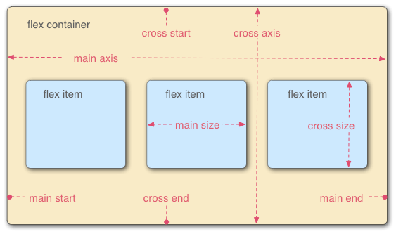

# CSS Layout

- Now it's time to look at how to correctly arrange your boxes in relation to the viewport as well as to one another. We've covered the necessary prerequisites, so let's dive deep into CSS layout, looking at such various features as: different display settings, positioning, modern layout tools like flexbox and CSS grid, and some of the legacy techniques you might still want to know about.

# Introduction to CSS Layout

- In this module, we'll discuss things like different `display` values, and introduce other new concepts throughout the module.

- CSS page layout techniques allow us to take elements contained in a web page and control where they're positioned relative to the following factors: their default position in normal layout flow, the other elements around them, their parent container, and the main viewport/window. The page layout techniques we'll be covering in more detail in this module are:

  - Normal flow
  - The `display` property
  - Flexbox
  - Grid
  - Floats
  - Positioning
  - Table layout
  - Multiple-column layout

- Each technique has its uses, advantages, and disadvantages. No technique is designed to be used in isolation. By understanding what each layout method is designed for you'll be in a good position to understand which method is most appropriate for each task.

## Normal Flow

- Normal flow is how the browser lays out HTML pages by default when you do nothing to control page layout. Let's look at a quick HTML example:

```
<p>I love my cat.</p>

<ul>
  <li>Buy cat food</li>
  <li>Exercise</li>
  <li>Cheer up friend</li>
</ul>

<p>The end!</p>
```

- Note how the HTML is displayed in the exact order in which it appears in the source code, with elements stacked on top of one another — the first paragraph, followed by the unordered list, followed by the second paragraph.
- The elements that appear one below the other are described as **block** elements, in contrast to **inline** elements, which appear beside one another like the individual words in a paragraph.
- Note: The direction in which block element contents are laid out is described as the Block Direction.
- The Block Direction runs vertically in a language such as English, which has a horizontal writing mode.
- It would run horizontally in any language with a Vertical Writing Mode, such as Japanese.
- The corresponding Inline Direction is the direction in which inline contents (such as a sentence) would run.
- For many of the elements on your page, the normal flow will create exactly the layout you need.
- However, for more complex layouts you will need to alter this default behavior using some of the tools available to you in CSS.
- Starting with a well-structured HTML document is very important because you can then work with the way things are laid out by default rather than fighting against it.

- The methods that can change how elements are laid out in CSS are:
  - **The `display` property** — Standard values such as `block`, `inline` or `inline-block` can change how elements behave in normal flow, for example, by making a block-level element behave like an inline-level element (see Types of CSS boxes for more information).
    - We also have entire layout methods that are enabled via specific `display` values, for example, CSS Grid and Flexbox, which alter how child elements are laid out inside their parents.
  - **Floats** — Applying a float value such as `left` can cause block-level elements to wrap along one side of an element, like the way images sometimes have text floating around them in magazine layouts.
  - **The position property** — Allows you to precisely control the placement of boxes inside other boxes. `static` positioning is the default in normal flow, but you can cause elements to be laid out differently using other values, for example, as fixed to the top of the browser viewport.
  - **Table layout** — Features designed for styling parts of an HTML table can be used on non-table elements using `display: table` and associated properties.
  - **Multi-column layout** — The Multi-column layout properties can cause the content of a block to layout in columns, as you might see in a newspaper.

## The display property

- The main methods for achieving page layout in CSS all involve specifying values for the `display` property. This property allows us to change the default way something displays.
- Everything in normal flow has a default value for `display`; i.e., a default way that elements are set to behave.

  - For example, the fact that paragraphs in English display one below the other is because they are styled with `display: block`.
  - If you create a link around some text inside a paragraph, that link remains inline with the rest of the text, and doesn't break onto a new line.
  - This is because the `<a>` element is `display: inline` by default.

- You can change this default display behavior. For example, the `<li>` element is `display: block` by default, meaning that list items display one below the other in our English document.
- If we were to change the display value to `inline` they would display next to each other, as words would do in a sentence. The fact that you can change the value of `display` for any element means that you can pick HTML elements for their semantic meaning without being concerned about how they will look. The way they look is something that you can change.
- In addition to being able to change the default presentation by turning an item from `block` to `inline` and vice versa, there are some more involved layout methods that start out as a value of `display`. However, when using these you will generally need to invoke additional properties. The two values most important for our discussion of layout are `display: flex` and `display: grid`.

## Flexbox

- Flexbox is the short name for the Flexible Box Layout CSS module, designed to make it easy for us to lay things out in one dimension — either as a row or as a column.
- To use flexbox, you apply `display: flex` to the parent element of the elements you want to lay out; all its direct children then become _flex items_. We can see this in a simple example.

### Setting display: flex

- The HTML markup below gives us a containing element with a class of wrapper, inside of which are three `<div>` elements. By default these would display as block elements, that is, below one another in our English language document.

- However, if we add `display: flex` to the parent, the three items now arrange themselves into columns.
- This is due to them becoming _flex items_ and being affected by some initial values that flexbox sets on the flex container.
- They are displayed in a row because the property `flex-direction` of the parent element has an initial value of `row`.
- They all appear to stretch in height because the property `align-items` of their parent element has an initial value of `stretch`.
  - This means that the items stretch to the height of the flex container, which in this case is defined by the tallest item. The items all line up at the start of the container, leaving any extra space at the end of the row.

```
.wrapper {
  display: flex;
}
```

```
<div class="wrapper">
  <div class="box1">One</div>
  <div class="box2">Two</div>
  <div class="box3">Three</div>
</div>
```

### Setting the flex property

- In addition to properties that can be applied to a _flex container_, there are also properties that can be applied to _flex items_.
- These properties, among other things, can change the way that items _flex_, enabling them to expand or contract according to available space.

- As a simple example, we can add the `flex` property to all of our child items, and give it a value of `1`. This will cause all of the items to grow and fill the container, rather than leaving space at the end.
- If there is more space then the items will become wider; if there is less space they will become narrower. In addition, if you add another element to the markup, the other items will all become smaller to make space for it; the items all together continue taking up all the space.

```
.wrapper {
  display: flex;
}

.wrapper > div {
  flex: 1;
}
```

```
<div class="wrapper">
  <div class="box1">One</div>
  <div class="box2">Two</div>
  <div class="box3">Three</div>
</div>
```

## Grid Layout

- While flexbox is designed for one-dimensional layout, Grid Layout is designed for two dimensions — lining things up in rows and columns.

### Setting display: grid

- Similar to flexbox, we enable Grid Layout with its specific display value — `display: grid`.
- The below example uses similar markup to the flex example, with a container and some child elements.
- In addition to using `display: grid`, we also define some row and column _tracks_ for the parent using the `grid-template-rows` and `grid-template-columns` properties respectively.
  - We've defined three columns, each of `1fr`, as well as two rows of `100px`.
  - We don't need to put any rules on the child elements; they're automatically placed into the cells our grid's created.

```
.wrapper {
  display: grid;
  grid-template-columns: 1fr 1fr 1fr;
  grid-template-rows: 100px 100px;
  gap: 10px;
}
```

```
<div class="wrapper">
  <div class="box1">One</div>
  <div class="box2">Two</div>
  <div class="box3">Three</div>
  <div class="box4">Four</div>
  <div class="box5">Five</div>
  <div class="box6">Six</div>
</div>
```

### Placing items on the grid

- Once you have a grid, you can explicitly place your items on it, rather than relying on the auto-placement behavior seen above.
- In the next example below, we've defined the same grid, but this time with three child items.
- We've set the start and end line of each item using the `grid-column` and `grid-row` properties. This causes the items to span multiple tracks.
- Basically, where it starts and where it ends. Notice that it starts the beginning of the first numbered box, and end at the beginning of the second numbered box.

```
.wrapper {
  display: grid;
  grid-template-columns: 1fr 1fr 1fr;
  grid-template-rows: 100px 100px;
  gap: 10px;
}

.box1 {
  grid-column: 2 / 4;
  grid-row: 1;
}

.box2 {
  grid-column: 1;
  grid-row: 1 / 3;
}

.box3 {
  grid-row: 2;
  grid-column: 3;
}
```

- The rest of this guide covers other layout methods that are less important for the main layout of your page, but still help to achieve specific tasks.
- By understanding the nature of each layout task you will soon find that when you look at a particular component of your design, the type of layout most suitable for it will often be clear.

## Floats

- Floating an element changes the behavior of that element and the block level elements that follow it in normal flow.
- The floated element is moved to the left or right and removed from normal flow, and the surrounding content _floats_ around it.

- The float property has four possible values:

  - `left` — Floats the element to the left.
  - `right` — Floats the element to the right.
  - `none` — Specifies no floating at all. This is the default value.
  - `inherit` — Specifies that the value of the float property should be inherited from the element's parent element.

- In the example below, we float a `<div>` left and give it a `margin` on the right to push the surrounding text away from it.
- This gives us the effect of text wrapped around the boxed element, and is most of what you need to know about floats as used in modern web design.

```
<h1>Simple float example</h1>

<div class="box">Float</div>

<p>
  Lorem ipsum dolor sit amet, consectetur adipiscing elit. Nulla luctus aliquam
  dolor, eu lacinia lorem placerat vulputate. Duis felis orci, pulvinar id metus
  ut, rutrum luctus orci. Cras porttitor imperdiet nunc, at ultricies tellus
  laoreet sit amet. Sed auctor cursus massa at porta. Integer ligula ipsum,
  tristique sit amet orci vel, viverra egestas ligula. Curabitur vehicula tellus
  neque, ac ornare ex malesuada et. In vitae convallis lacus. Aliquam erat
  volutpat. Suspendisse ac imperdiet turpis. Aenean finibus sollicitudin eros
  pharetra congue. Duis ornare egestas augue ut luctus. Proin blandit quam nec
  lacus varius commodo et a urna. Ut id ornare felis, eget fermentum sapien.
</p>
```

```
.box {
  float: left;
  width: 150px;
  height: 150px;
  margin-right: 30px;
}
```

- Floats is a legacy technique that's used as a method for creating column layouts, which we might cover later.

## Positioning technique

- Positioning allows you to move an element from where it would otherwise be placed in normal flow over to another location.
- Positioning isn't a method for creating the main layouts of a page; it's more about managing and fine-tuning the position of specific items on a page.

- There are, however, useful techniques for obtaining specific layout patterns that rely on the `position` property.
- Understanding positioning also helps in understanding normal flow, and what it means to move an item out of the normal flow.

- There are five types of positioning you should know about:

- **Static positioning** is the default that every element gets. It just means "put the element into its normal position in the document layout flow — nothing special to see here".
- **Relative positioning** allows you to modify an element's position on the page, moving it relative to its position in normal flow, as well as making it overlap other elements on the page.
- **Absolute positioning** moves an element completely out of the page's normal layout flow, like it's sitting on its own separate layer. From there, you can fix it to a position relative to the edges of its closest positioned ancestor (which becomes `<html>` if no other ancestors are positioned).
  - This is useful for creating complex layout effects, such as tabbed boxes where different content panels sit on top of one another and are shown and hidden as desired, or information panels that sit off-screen by default, but can be made to slide on screen using a control button.
- **Fixed positioning** is very similar to absolute positioning except that it fixes an element relative to the browser viewport, not another element.
  - This is useful for creating effects such as a persistent navigation menu that always stays in the same place on the screen as the rest of the content scrolls.
- **Sticky positioning** is a newer positioning method that makes an element act like `position: relative` until it hits a defined offset from the viewport, at which point it acts like `position: fixed`.

### Simple positioning example

- To provide familiarity with these page layout techniques, we'll show you a couple of quick examples. Our examples will all feature the same HTML structure (a heading followed by three paragraphs), which is as follows:

```
<h1>Positioning</h1>

<p>I am a basic block level element.</p>
<p class="positioned">I am a basic block level element.</p>
<p>I am a basic block level element.</p>
```

- Styled by the following default CSS

```
body {
  width: 500px;
  margin: 0 auto;
}

p {
  background-color: rgb(207, 232, 220);
  border: 2px solid rgb(79, 185, 227);
  padding: 10px;
  margin: 10px;
  border-radius: 5px;
}
```

### Relative positioning

- Relative positioning allows you to offset an item from its default position in normal flow.
- This means you could achieve a task such as moving an icon down a bit so it lines up with a text label.
- To do this, we could add the following rule to add relative positioning:

```
.positioned {
  position: relative;
  top: 30px;
  left: 30px;
}
```

- Here we give our middle paragraph a `position` value of `relative`. This doesn't do anything on its own, so we also add `top` and `left` properties. These serve to move the affected element down and to the right. This might seem like the opposite of what you were expecting, but you need to think of it as the element being pushed on its left and top sides, which results in it moving right and down.

- The achieved effect is that relative to its original position in the normal flow, it's moved 30px toward the bottom left corner, which also makes it overlap with the other element.

### Absolute positioning

- Absolute positioning is used to completely remove an element from the normal flow and instead position it using offsets from the edges of a containing block.
- Going back to our original non-positioned example, we could add the following CSS rule to implement absolute positioning:

```
.positioned {
  position: absolute;
  top: 30px;
  left: 30px;
}
```

- Here we give our middle paragraph a position value of absolute and the same top and left properties as before. Adding this code will produce the following result:

  - The element completely overlaps with the heading.

- This is very different!
- The positioned element has now been completely separated from the rest of the page layout and sits over the top of it.
- The other two paragraphs now sit together as if their positioned sibling doesn't exist.
- The `top` and `left` properties have a different effect on absolutely positioned elements than they do on relatively positioned elements.
  - In this case, the offsets have been calculated from the top and left of the page.
  - It is possible to change the parent element that becomes this container and we will take a look at that in the lesson on positioning.

### Fixed positioning

- Fixed positioning removes our element from document flow in the same way as absolute positioning.
- However, instead of the offsets being applied from the container, they are applied from the viewport.
- Because the item remains fixed in relation to the viewport, we can create effects such as a menu that remains fixed as the page scrolls beneath it.

- For this example, our HTML contains three paragraphs of text so that we can scroll through the page, as well as a box with the property of `position: fixed`.

```
<h1>Fixed positioning</h1>

<div class="positioned">Fixed</div>

<p>
  Lorem ipsum dolor sit amet, consectetur adipiscing elit. Nulla luctus aliquam
  dolor, eu lacinia lorem placerat vulputate. Duis felis orci, pulvinar id metus
  ut, rutrum luctus orci.
</p>

<p>
  Cras porttitor imperdiet nunc, at ultricies tellus laoreet sit amet. Sed
  auctor cursus massa at porta. Integer ligula ipsum, tristique sit amet orci
  vel, viverra egestas ligula. Curabitur vehicula tellus neque, ac ornare ex
  malesuada et.
</p>

<p>
  In vitae convallis lacus. Aliquam erat volutpat. Suspendisse ac imperdiet
  turpis. Aenean finibus sollicitudin eros pharetra congue. Duis ornare egestas
  augue ut luctus. Proin blandit quam nec lacus varius commodo et a urna. Ut id
  ornare felis, eget fermentum sapien.
</p>
```

```
.positioned {
  position: fixed;
  top: 30px;
  left: 30px;
}
```

- The fixed box actually just stays on top of the page and doesn't move at all.

### Sticky positioning

- Sticky positioning is the final positioning method that we have at our disposal.
- It mixes relative positioning with fixed positioning.
- When an item has `position: sticky`, it'll scroll in normal flow until it hits offsets from the viewport that we have defined. At that point, it becomes "stuck" as if it had `position: fixed` applied.

```
.positioned {
  position: sticky;
  top: 30px;
  left: 30px;
}
```

- Note that if you scrollback up, it no longer stays there.

## Table Layout

- HTML tables are fine for displaying tabular data, but many years ago — before even basic CSS was supported reliably across browsers — web developers used to also use tables for entire web page layouts, putting their headers, footers, columns, etc. into various table rows and columns.
- This worked at the time, but it has many problems: table layouts are inflexible, very heavy on markup, difficult to debug, and semantically wrong (e.g., screen reader users have problems navigating table layouts).

- The way that a table looks on a webpage when you use table markup is due to a set of CSS properties that define table layout.
- These same properties can also be used to lay out elements that aren't tables, a use which is sometimes described as "using CSS tables".

- The example below shows one such use. It must be noted, that using CSS tables for layout should be considered a legacy method at this point, and should only be used to support old browsers that lack support for Flexbox or Grid.

- Let's look at an example. First, some simple markup that creates an HTML form. Each input element has a label, and we've also included a caption inside a paragraph. Each label/input pair is wrapped in a `<div>` for layout purposes.

```
<form>
  <p>First of all, tell us your name and age.</p>
  <div>
    <label for="fname">First name:</label>
    <input type="text" id="fname" />
  </div>
  <div>
    <label for="lname">Last name:</label>
    <input type="text" id="lname" />
  </div>
  <div>
    <label for="age">Age:</label>
    <input type="text" id="age" />
  </div>
</form>
```

- As for the CSS, most of it's fairly ordinary except for the uses of the display property.
- The `<form>`, `<div>`s, and `<label>`s and `<input>`s have been told to display like a table, table rows, and table cells respectively.
- Basically, they'll act like HTML table markup, causing the labels and inputs to line up nicely by default. All we then have to do is add a bit of sizing, margin, etc., to make everything look a bit nicer and we're done.

- You'll notice that the caption paragraph has been given `display: table-caption;`, which makes it act like a table `<caption>`, and `caption-side: bottom;` to tell the caption to sit on the bottom of the table for styling purposes, even though the markup is before the `<input>` elements in the source. This allows for a nice bit of flexibility.

```
html {
  font-family: sans-serif;
}

form {
  display: table;
  margin: 0 auto;
}

form div {
  display: table-row;
}

form label,
form input {
  display: table-cell;
  margin-bottom: 10px;
}

form label {
  width: 200px;
  padding-right: 5%;
  text-align: right;
}

form input {
  width: 300px;
}

form p {
  display: table-caption;
  caption-side: bottom;
  width: 300px;
  color: #999;
  font-style: italic;
}
```

## Multi-column layout

- The multi-column layout CSS module provides us a way to lay out content in columns, similar to how text flows in a newspaper.
- While reading up and down columns is less useful in a web context due to the users having to scroll up and down, arranging content into columns can, nevertheless, be a useful technique.

- To turn a block into a multi-column container, we use either the `column-count` property, which tells the browser _how_ many columns we would like to have, or the `column-width` property, which tells the browser to fill the container with as many columns as possible of a _specified width_.

- In the below example, we start with a block of HTML inside a containing `<div>` element with a class of `container`.

```
<div class="container">
  <h1>Multi-column Layout</h1>

  <p>
    Lorem ipsum dolor sit amet, consectetur adipiscing elit. Nulla luctus
    aliquam dolor, eu lacinia lorem placerat vulputate. Duis felis orci,
    pulvinar id metus ut, rutrum luctus orci. Cras porttitor imperdiet nunc, at
    ultricies tellus laoreet sit amet. Sed auctor cursus massa at porta.
  </p>

  <p>
    Nam vulputate diam nec tempor bibendum. Donec luctus augue eget malesuada
    ultrices. Phasellus turpis est, posuere sit amet dapibus ut, facilisis sed
    est. Nam id risus quis ante semper consectetur eget aliquam lorem.
  </p>

  <p>
    Vivamus tristique elit dolor, sed pretium metus suscipit vel. Mauris
    ultricies lectus sed lobortis finibus. Vivamus eu urna eget velit cursus
    viverra quis vestibulum sem. Aliquam tincidunt eget purus in interdum. Cum
    sociis natoque penatibus et magnis dis parturient montes, nascetur ridiculus
    mus.
  </p>
</div>
```

- We're using a `column-width` of 200 pixels on that container, causing the browser to create as many 200 pixel columns as will fit. Whatever space is left between the columns will be shared.

```
.container {
  column-width: 200px;
}
```

# Normal Flow

- As detailed in the last lesson introducing layout, elements on a webpage lay out in normal flow if you haven't applied any CSS to change the way they behave.
- And, as we began to discover, you can change how elements behave either by adjusting their position in normal flow or by removing them from it altogether.
- Starting with a solid, well-structured document that's readable in normal flow is the best way to begin any webpage. It ensures that your content is readable even if the user's using a very limited browser or a device such as a screen reader that reads out the content of the page.
- In addition, since normal flow is designed to make a readable document, by starting in this way you're working with the document rather than struggling against it as you make changes to the layout.

## How are elements laid out by default

- The process begins as the boxes of individual elements are laid out in such a way that any padding, border, or margin they happen to have is added to their content. This is what we call the **box model**.

- By default, a block level element's content fills the available inline space of the parent element containing it and grows along the block dimension to accommodate its content.
- The size of inline elements is just the size of their content.
- You can't set width or height on inline elements — they just sit inside the content of block level elements — except for images.
- Unlike other inline elements, images can be resized without changing their display property.
- If you want to control the size of an inline element in this manner, you need to set it to behave like a block level element (e.g., with `display: block;` or `display: inline-block;`, which mixes characteristics from both).

- That explains how elements are structured individually, but how about the way they're structured when they interact with one another?
- The normal layout flow is the system by which elements are placed inside the browser's viewport.
- By default, block-level elements are laid out in the block flow direction, which is based on the parent's writing mode (`initial: horizontal-tb`).
- Each element will appear on a new line below the last one, with each one separated by whatever margin that's been specified. In English, for example, (or any other horizontal, top to bottom writing mode) block-level elements are laid out vertically.

- Inline elements behave differently.
- They don't appear on new lines; instead, they all sit on the same line along with any adjacent (or wrapped) text content as long as there is space for them to do so inside the width of the parent block level element.
- If there isn't space, then the overflowing content will move down to a new line.

- If two vertically adjacent elements both have a margin set on them and their margins touch, the larger of the two margins remains and the smaller one disappears. This is known as **margin collapsing**. Collapsing margins is only relevant in the **vertical direction**.

- Let's look at a simple example that explains all of this:

```
<h1>Basic document flow</h1>

<p>
  I am a basic block level element. My adjacent block level elements sit on new
  lines below me.
</p>

<p>
  By default we span 100% of the width of our parent element, and we are as tall
  as our child content. Our total width and height is our content + padding +
  border width/height.
</p>

<p>
  We are separated by our margins. Because of margin collapsing, we are
  separated by the width of one of our margins, not both.
</p>

<p>
  Inline elements <span>like this one</span> and <span>this one</span> sit on
  the same line along with adjacent text nodes, if there is space on the same
  line. Overflowing inline elements will
  <span>wrap onto a new line if possible (like this one containing text)</span>,
  or just go on to a new line if not, much like this image will do:
  
</p>
```

```
body {
  width: 500px;
  margin: 0 auto;
}

p {
  background: rgba(255, 84, 104, 0.3);
  border: 2px solid rgb(255, 84, 104);
  padding: 10px;
  margin: 10px;
}

span {
  background: white;
  border: 1px solid black;
}
```

# Flexbox

- Flexbox is a **one-dimensional** layout method for arranging items in rows or columns. Items _flex_ (expand) to fill additional space or shrink to fit into smaller spaces.

## Why flexbox?

- For a long time, the only reliable cross-browser compatible tools available for creating CSS layouts were features like floats and positioning. These work, but in some ways they're also limiting and frustrating.
- The following simple layout designs are either difficult or impossible to achieve with such tools in any kind of convenient, flexible way:
  - Vertically centering a block of content inside its parent.
  - Making all the children of a container take up an equal amount of the available width/height, regardless of how much width/height is available.
  - Making all columns in a multiple-column layout adopt the same height even if they contain a different amount of content.

## Introducing a simple example

- You'll see that we have a `<header>` element with a top level heading inside it and a `<section>` element containing three `<article>`s. We're going to use these to create a fairly standard three column layout.

## Specifying what elements to lay out as flexible boxes

- To start with, we need to select which elements are to be laid out as flexible boxes. To do this, we set a special value of `display` on the parent element of the elements you want to affect.
- In this case we want to lay out the `<article>` elements, so we set this on the `<section>`:

```
section {
  display: flex;
}
```

- This causes the `<section>` element to become a **flex container** and its children to become **flex items**. The result of this should be that the columns are now in line with each other.
- So, this single declaration gives us everything we need. Incredible, right?

  - We have our multiple column layout with equal-sized columns, and the columns are all the same height.
  - This is because the default values given to flex items (the children of the flex container) are set up to solve common problems such as this.

- To be clear, let's reiterate what is happening here.
- The element we've given a `display` value of `flex` to is acting like a block-level element in terms of how it interacts with the rest of the page, but its children are laid out as flex items.
- The next section will explain in more detail what this means. Note also that you can use a `display` value of `inline-flex` if you wish to lay out an element's children as flex items, but have that element behave like an inline element.

## The flex model

- When elements are laid out as flex items, they are laid out along two axes:



- The **main axis** is the axis running in the direction the flex items are laid out in (for example, as rows across the page, or columns down the page.) The start and end of this axis are called the **main start** and **main end**.
- The **cross axis** is the axis running perpendicular to the direction the flex items are laid out in. The start and end of this axis are called the **cross start** and **cross end**.
- The parent element that has `display: flex` set on it (the `<section>` in our example) is called the **flex container**.
- The items laid out as flexible boxes inside the flex container are called **flex items** (the `<article>` elements in our example).

## Columns or rows?

- Flexbox provides a property called `flex-direction` that specifies which direction the main axis runs (which direction the flexbox children are laid out in).
- By default this is set to `row`, which causes them to be laid out in a row in the direction your browser's default language works in (left to right, in the case of an English browser).

- Adding `flex direction: column;` to the `<section>` rule will cause the items to be back in a column layout, much like they were before we added any CSS.

- Note: You can also lay out flex items in a reverse direction using the `row-reverse` and `column-reverse` values.

## Wrapping

- One issue that arises when you have a fixed width or height in your layout is that eventually your flexbox children will overflow their container, breaking the layout.
- Have a look at our flexbox-wrap0.html example:

  - The columns are breaking out of the container

- One way to fix this is:

```
flex-wrap: wrap;
```

- As well as:

```
flex: 200px;
```

- We now have multiple rows.
- Each row has as many flexbox children fitted into it as is sensible.
- Any overflow is moved down to the next line.
- The `flex: 200px` declaration set on the articles means that each will be at least 200px wide.
- We'll discuss this property in more detail later on. You might also notice that the last few children on the last row are each made wider so that the entire row is still filled.

## flex-flow shorthand

- At this point it's worth noting that a shorthand exists for `flex-direction` and `flex-wrap: flex-flow`. So, for example, you can replace:

```
flex-direction: row;
flex-wrap: wrap;
```

- With:

```
flex-flow: row wrap;
```

## Flexible sizing of flex items

- Let's now return to our first example and look at how we can control what proportion of space flex items take up compared to the other flex items. Fire up your local copy of flexbox0.html, and add this rule:

```
article {
  flex: 1;
}
```

- This is a unitless proportion value that dictates how much available space along the **main axis** each flex item will take up compared to other flex items.
- In this case, we're giving each `<article>` element the same value (a value of 1), which means they'll all take up an equal amount of the spare space left after properties like padding and margin have been set.
- This value is proportionally shared among the flex items: giving each flex item a value of 400000 would have exactly the same effect.

- Now add the following rule below the previous one:

```
article:nth-of-type(3) {
  flex: 2;
}
```

- Now when you refresh, you'll see that the third `<article>` takes up twice as much of the available width as the other two.
- There are now four proportion units available in total (since 1 + 1 + 2 = 4).
- The first two flex items have one unit each, so they each take 1/4 of the available space. The third one has two units, so it takes up 2/4 of the available space (or one-half).

- You can also specify a minimum size value within the flex value. Try updating your existing article rules like so:

```
article {
  flex: 1 200px;
}

article:nth-of-type(3) {
  flex: 2 200px;
}
```

- This basically states, "Each flex item will first be given 200px of the available space. After that, the rest of the available space will be shared according to the proportion units." Try refreshing and you'll see a difference in how the space is shared.

- The real value of flexbox can be seen in its flexibility/responsiveness. If you resize the browser window or add another `<article>` element, the layout continues to work just fine.

## flex: shorthand vs longhand

- `flex` is a shorthand property that can specify up to three different values:

  - The unitless proportion value we discussed above. This can be specified separately using the `flex-grow` longhand property.
  - A second unitless proportion value, `flex-shrink`, which comes into play when the flex items are overflowing their container. This value specifies how much an item will shrink in order to prevent overflow. This is quite an advanced flexbox feature and we won't be covering it any further in this article.
  - The minimum size value we discussed above. This can be specified separately using the `flex-basis` longhand value.

- We'd advise against using the longhand flex properties unless you really have to (for example, to override something previously set). They lead to a lot of extra code being written, and they can be somewhat confusing.

## Horizontal and vertical alignment

- You can also use flexbox features to align flex items along the main or cross axis.
- Let's explore this by looking at a new example: flex-align0.html.
- We're going to turn this into a neat, flexible button/toolbar. At the moment you'll see a horizontal menu bar with some buttons jammed into the top left-hand corner.

- Add the following CSS:

```
div {
  display: flex;
  align-items: center;
  justify-content: space-around;
}
```

- Refresh the page and you'll see that the buttons are now nicely centered horizontally and vertically. We've done this via two new properties. **Align items is used for cross axis (vertical) alignment**.

- `align-items` controls where the flex items sit on the cross axis.

  - By default, the value is `stretch`, which stretches all flex items to fill the parent in the direction of the cross axis. If the parent doesn't have a fixed height in the cross axis direction, then all flex items will become as tall as the tallest flex item. This is how our first example had columns of equal height by default.
  - The `center` value that we used in our above code causes the items to maintain their intrinsic dimensions, but be centered along the cross axis. This is why our current example's buttons are centered vertically.
  - You can also have values like `flex-start` and `flex-end`, which will align all items at the start and end of the cross axis respectively.
  - Lookup `align-items` for the full details.

- You can override the `align-items` behavior for individual flex items by applying the `align-self` property to them. For example, try adding the following to your CSS:

```
button:first-child {
  align-self: flex-end;
}
```

- `justify-content` controls where the flex items sit on the main axis.

  - The default value is `flex-start`, which makes all the items sit at the start of the main axis.
  - You can use `flex-end` to make them sit at the end.
  - `center` is also a value for `justify-content`. It'll make the flex items sit in the center of the main axis.
  - The value we've used above, `space-around`, is useful — it distributes all the items evenly along the main axis with a bit of space left at either end.
  - There is another value, `space-between`, which is very similar to `space-around` except that it doesn't leave any space at either end.

- **The `justify-items` property is ignored in flexbox layouts**.

## Ordering flex items

- Flexbox also has a feature for changing the layout order of flex items without affecting the source order. This is another thing that is impossible to do with traditional layout methods.

- As an example:

```
button:first-child {
  order: 1;
}
```

- Refresh and you'll see that the "Smile" button has moved to the end of the main axis. Let's talk about how this works in a bit more detail:

  - By default, all flex items have an `order` value of 0.
  - Flex items with higher specified order values will appear later in the display order than items with lower order values.
  - Flex items with the same order value will appear in their source order. So if you have four items whose order values have been set as 2, 1, 1, and 0 respectively, their display order would be 4th, 2nd, 3rd, then 1st.
  - The 3rd item appears after the 2nd because it has the same order value and is after it in the source order.

- You can set negative order values to make items appear earlier than items whose value is 0. For example, you could make the "Blush" button appear at the start of the main axis using the following rule:

```
button:last-child {
  order: -1;
}
```

## Nested flex boxes

- It's possible to create some pretty complex layouts with flexbox. It's perfectly OK to set a flex item to also be a flex container, so that its children are also laid out like flexible boxes.
- Have a look at `complex-flexbox.html`.

- The HTML for this is fairly simple. We've got a `<section>` element containing three `<article>`s. The third `<article>` contains three `<div>`s, and the first `<div>` contains five `<button>`s :

```
section - article
          article
          article - div - button
                    div   button
                    div   button
                          button
                          button
```

- First of all, we set the children of the `<section>` to be laid out as flexible boxes.

```
section {
  display: flex;
}
```

- Next, we set some flex values on the `<article>`s themselves. Take special note of the second rule here: we're setting the third `<article>` to have its children laid out like flex items too, but this time we're laying them out like a column.

```
article {
  flex: 1 200px;
}

article:nth-of-type(3) {
  flex: 3 200px;
  display: flex;
  flex-flow: column;
}
```

- Next, we select the first `<div>`. We first use `flex: 1 100px;` to effectively give it a minimum height of 100px, then we set its children (the `<button>` elements) to also be laid out like flex items. Here we lay them out in a wrapping row and align them in the center of the available space as we did with the individual button example we saw earlier.

```
article:nth-of-type(3) div:first-child {
  flex: 1 100px;
  display: flex;
  flex-flow: row wrap;
  align-items: center;
  justify-content: space-around;
}
```

- Finally, we set some sizing on the button. This time by giving it a flex value of 1 auto.
- This has a very interesting effect, which you'll see if you try resizing your browser window width.
  - The buttons will take up as much space as they can. As many will fit on a line as is comfortable; beyond that, they'll drop to a new line.

```
button {
  flex: 1 auto;
  margin: 5px;
  font-size: 18px;
  line-height: 1.5;
}
```

## Cross-browser compatibility

- Flexbox support is available in most new browsers: Firefox, Chrome, Opera, Microsoft Edge, and IE 11, newer versions of Android/iOS, etc. However, you should be aware that there are still older browsers in use that don't support Flexbox (or do, but support a really old, out-of-date version of it.)

- While you're just learning and experimenting, this doesn't matter too much; however, if you're considering using flexbox in a real website, you need to do testing and make sure that your user experience is still acceptable in as many browsers as possible.

- We discuss strategies for overcoming cross-browser support issues in our Cross browser testing module.

# Grid

- CSS Grid Layout is a two-dimensional layout system for the web. It lets you lay content out in rows and columns. It has many features that make building complex layouts straightforward. This article will explain all you need to know to get started with page layout.
