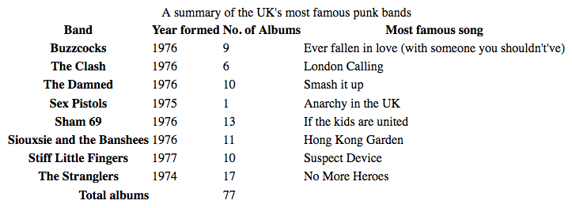

# Learn CSS:

This will be a walkthrough of different CSS concepts and the models within CSS

# Getting Started With CSS

- You should include the line `<link rel="stylesheet" href="styles.css">` within `index.html`
- `<link>` element tells the browser that we have a stylesheet
  - `rel` attribute set to `stylesheet` indicates you have a stylsheet
  - `href` tells you the location of the stylesheet

## Changing the default behavior of elements

- Browsers have an internal stylesheet, but sometimes you might want to change it to your own desired setting
- To do this, you will need to specify your own CSS rules to override them
  - Ex: `li { list-style-type: none; }`

## Adding a Class

- So far, we've styled elements based on their names, but that's only if want all of them to be exactly the same
- Here, we need to add a `class` attribute
- In the CSS, you target the `class` by creating a selector that starts with `.`
- Somtimes, you can chain the selectors:
  - `.li.special {}`
  - This means target any `li` elements that has the class `special`
- Specifying other elements requires you to chain the selectors again:
  - `li.special, span.special {}`

## Styling things based on their location in a document

- For example, in the CSS for this section, we have an `<em>` element within an `li` element
  - To specify that, we can use `li em`
- This is called a **descendant combinator**, and takes the form of a space between two other selectors
- Something else that might also be common is to style a paragraph that comes directly after a heading
  - To do so, use `h1 + p {}`
- This is called an **adjacent sibling combinator**

## Styling things based on state

- Straight-forward example of this is styling links
- Links have different state depending whether it's been visited or not, being hovered over, focused via keyboard, etc.
- You can use CSS to target these different states
- Examples in the CSS file:
  - `a:link`, `a:visited`, `a:hover`

## Combining selectors and combinators

- You can also combine selectors and combinators
- Ex: `article p span {}`, selects any span that's inside a paragraph that's inside an article
- Ex: `h1 + ul + p`, selects any `p` tags that are after a `ul` that's after an `h1`
- `body h1 + p .special {}`, any `.special` classes that's within a `p` tag that follows an `h1` that's within the body.

# How is CSS structured?

## Applying CSS to HTML

There are three ways to apply CSS to HTML:

- External stylesheet
  - Contains CSS in a separate file with `.css` extension
  - Reference an external CSS stylesheet with `<link>` tag
  - Ex: `<link rel="stylesheet" href="styles.css" />`
  - `href` needs to be reference a file on your file system
- Internal stylesheet
  - Resides within an HTML document
  - Place CSS inside `<style>` element contained inside HTML `<head>`
  - Internal CSS might be useful in some circumstances, such as a content management system where you can't access the external CSS files
  - However, for sites with more than one page, it's not a good idea to use internal styling because you will need internal styling for every web page.
- Inline styles
  - CSS declaratons that affect a single element
  - Contained within a `style` attributev
  - **Avoid using CSS in this way, when possible.**
  - Least efficient implementation of CSS for maintenance
  - There are few circumstances where this is common:
    - Ex: HTML email to achieve compatibility with as many clients as possible
    - Ex: CMS only allows you edit the HTML body

### Selectors

Selector targets HTML to apply styles to content. If CSS is not applying the way you expected, then your selector may not match the way you think it should match.

- `h1`
- `a:link`
- `.manythings`
- `#onething`
- `*`
- `.box p`
- `.box p:first-child`
- `h1, h2, .intro`

#### Specificity

- Two selectors might select the same HTML element

```
.special {
  color: red;
}

p {
  color: blue;
}
```

- In our HTML, we have the following element: `<p> class="special">What color am I?</p>`
- We're unsure of whether the paragraph should be blue or red
- CSS language has rules that controls which selector is stronger
  - Called **casacde** and **specificity**
- In the example above, the paragraph will be blue, because the declaration that sets the text to blue appears layer in the stylesheet.
- **Cascading**: Later styles replace conflicting styles that appear earlier in the stylesheet
- **Specificity**: Class is rated as more specific than the element selector, so it cancels the other conflicting style declaration

```
p {
  color: red;
}

p {
  color: blue;
}
```

### Properties and Values

- Properties:
  - Human readable identifiers that indicate which stylistic features you want to modify
  - Ex: `font-size`, `width`, `background-color`
- Values:
  - Each property is assigned a value, this value indicates how to style the property
- When a property is paired with a value, this pairing is called a _CSS declaration_
- _CSS declarations_ are found within _CSS declaration blocks_
- _CSS declaration blocks_ are paired with _selectors_ to produce _CSS rulesets_ or _CSS rules_
- CSS properties and values are case-insensitive, and the pair is separated by a colon (`:`)

#### Functions

- There are some values that take the form of a function
- Ex: `calc()`

HTML:

```
<div class="outer">
 <div class="box">
   The inner box is 90% - 30px.
 </div>
</div>
```

CSS:

```
.outer {
  border: 5px solid black;
}

.box {
  padding: 10px;
  width: calc(90% - 30px);
  background-color: rebeccapurple;
  color: white;
}
```

- Function consists of the function name, and parentheses to enclose the values for the function.
- In the example, it's defined as 90% of the containing block width minus 30 pixels.

#### Transform Functions

- Ex: rotate()

HTML:

```
<div class="box"></div>
```

CSS:

```
.box {
  margin: 30px;
  width: 100px;
  height: 100px;
  background-color: rebeccapurple;
  transform: rotate(0.8turn);
}
```

### @rules

- Pronounced "at-rules", provide instructions for what the CSS should perform or how it should behave.
- Ex: `@import` imports a stylesheet into another CSS stylesheet

  - `@import "styles2.css"`
    One common @rule is `@media`, which is used to create media queries, which use conditional logic for applying CSS styling

- The stylesheet below defines a pink background for the `<body>` element, but the media query defines a blue background if the viewport is wider than 30em

CSS:

```
body {
  background-color: pink;
}

@media (min-width: 30em) {
  body {
    background-color: blue;
  }
}
```

### Shorthands

- Some properties are called **shorthand properties**, because we can set several values in a single line

- Padding and margin, shorthand is applied in the order top, right, bottom, left (clockwise from the top)
- There are also two-value shorthands, which set for top/bottom, left/right
  - Ex: `padding: 10px 15px 15px 5px;`

### Comments

- As with any coding work, it's best practice to write comments along the CSS, begins with `/*` and ends with `*/`

### White space

- White space means actual spaces, tabs, and new lines
- Browsers will ignore white space inside CSS, its value is in improving readability
- Each declaration (and rule start/end) has its own line. This is arguably a good way to write CSS.
- **Property names never have white spaces**

## How CSS works?

We will consider how the browser takes CSS and HTML and turns it into a webpage.

### How does CSS actually work?

- The browser must combine the document's content with its styling information

Below is a very simplified version of what actually happens in the background:

1. The browser loads HTML (e.g. receives from the network)
2. Converts the HTML into a DOM (Document Object Model). The DOM represents the document in the computer's memory.
3. The browser fetches most of the resources that are linked to by the HTML document, such as embedded images, videos, and even linked CSS, but JavaScript is handled a bit later.
4. The browser parses the fetched CSS, and sorts the different rules by their selector types into different "buckets", e.g. element, class, ID, and so on. Based on the selectors it finds, it works out which rules should be applied to which nodes in the DOM, and attaches style to them as required (this intermediate step is called a render tree).
5. The render tree is laid out in the structure it should appear in after the rules have been applied to it.
6. The visual display of the page is shown on the screen (this stage is called painting).


### About the DOM

- DOM has a tree like structure. Each element, attribute, and piece of text in the markup language becomes a DOM node in the tree structure. The nodes are defined by their relationship to other DOM nodes. Some elements are parents of child nodes, and child nodes have siblings.
- The DOM is where your CSS and the document's content meet up.
- When you start working with browser DevTools you will be navigating the DOM as you select items in order to see which rules apply.

### A real DOM representation

- This is an example that converts HTML to a DOM representation

```
<p>
  Let's use:
  <span>Cascading</span>
  <span>Style</span>
  <span>Sheets</span>
</p>
```

- In the DOM, the node corresponding to `<p>` is the parent, and the children are a text node and three nodes corresponding to `<span>` element

```
P
├─ "Let's use:"
├─ SPAN
|  └─ "Cascading"
├─ SPAN
|  └─ "Style"
└─ SPAN
    └─ "Sheets"
```

### Applying CSS to the DOM

- Looking at the same HTML as above, and we want to apply the following CSS to the document

```
span {
  border: 1px solid black;
  background-color: lime;
}
```

- The browser parses the HTML and creates a DOM from it, then it parses the CSS
- Since the only rule available in the CSS has a span selector, the browser sorts the CSS very quickly! It applies that rule to each one of the three <span>s, then paints the final visual representation to the screen

### What happens if a browser encounters CSS it doesn't understand?

- The answer is that it does nothing and simply moves onto the next declaration
- Similarly, if a browser encounters a selector that it doesn't understand, it will just ignore the whole rule and move on to the next one.
- In the following example, the word color is spelled with British spelling, but only that specific line will marked as invalid

```
p {
  font-weight: bold;
  colour: blue; /* incorrect spelling of the color property */
  font-size: 200%;
}
```

- This behavior is very useful. It means that you can use new CSS as an enhancement, knowing that no error will occur if it is not understood — the browser will either get the new feature or not. This enables basic fallback styling.

- This is a good example with `calc()` function, which some browsers do not understand, and this works particularly well when you want to use a value that is quite new and not supported everywhere.
- For example, some older browsers do not support calc() as a value. I might give a fallback width for a box in pixels, then go on to give a width with a calc() value of 100% - 50px. Old browsers will use the pixel version, ignoring the line about calc() as they don't understand it. New browsers will interpret the line using pixels, but then override it with the line using calc() as that line appears later in the cascade.

```
.box {
  width: 500px;
  width: calc(100% - 50px);
}
```

### Assessment: Styling a Biography Page

-Make the level one heading pink, using the CSS color keyword hotpink.
-Give the heading a 10px dotted border-bottom which uses the CSS color keyword purple.
-Make the level 2 heading italic.
-Give the ul used for the contact details a background-color of #eeeeee, and a 5px solid purple border. Use some padding to push the content away from the border.
-Make the links green on hover.

# CSS Building Blocks

We will look at cacscade and inheritance, all the selector types that are available, units, sizing, styling backgrounds and borders, debugging, and more.

## Cascade and Inheritance

This controls how CSS is applied to HTML and how conflicts between style declarations are resolved.

### Conflicting Rules

- CSS stands for Cascading Style Sheets, and cascading is really important to understand
- Oftentimes when CSS is not working, it's probably because you've written a rule that overwrote one of the rules
- **Casacde** and **specificity** are mechanisms that control which rule applies when there is such a conflict. The rule that's styling your element may not be the one you expect, so you need to understand how these mechanisms work.
- Also important is the concept of **inheritance**, where elements might take the default values from its parent, but some other elements might not

### Cascade

- Stylesheets **cascade** — at a very simple level, this means that the origin, the cascade layer, and the order of CSS rules matter.
- As an example:

```
<h1>This is my heading.</h1>
```

The CSS are:

```
h1 {
    color: red;
}
h1 {
    color: blue;
}

```

- We have two rules that both apply to the `h1` element, but it ends up being colored blue, because both rules are from the same source, have an identical element selector, and therefore carries the same specificity, but the last one in the source order wins.

### Specificity

- **Specificity** is the algorithm that the browser uses to decide which property value is applied to an element.
- If multiple style blocks have different selectors that configure the same property with different values and target the same values, specificity decides the property value that gets applied to the element
- Basically a measure of how the selector's selection will be :
  - An element selector is less specific; it will select all elements of that type that appear on a page, so it has less weight.
  - A class selector is more specific; it will select only the elements on a page that have a specific class attribute value, so it has more weight.
- As an example:

```
.main-heading {
    color: red;
}

h1 {
    color: blue;
}
```

```
<h1 class="main-heading">This is my heading.</h1>
```

- The `h1` will be colored red because the class selector is more specific than an element selector, despite the element selector being lower than the class selector

### Inheritance

- This is important to understand because some CSS property values set on parent elements are inherited by their child elements, and some aren't.
- For example, if you set `color` attribute on `font-family` of an element, every element inside it will also be styled with that color and font, unless you've applied different color and font values directly to them
- Ex:

```
body {
    color: blue;
}

span {
    color: black;
}
```

```
<p>As the body has been set to have a color of blue this is inherited through the descendants.</p>
<p>We can change the color by targeting the element with a selector, such as this <span>span</span>.</p>
```

- Some values don't inherit, such as `width`. If you set `width` to 50%, all of its descendants don't get a width of 50%
- You will need to check each property's `Formal Definition` to check if it's inherited or not

### Understanding how the concepts work together

- You can use the browser's web tools to inspect a page's specificity, cascade, and more
- Firefox's DevTools are pretty similar to the ones in Chrome, the HTML is basically the DOM structure
- The rules panel is where you see these inheritance rules, etc.
- Cascade works by giving every selector and property a weight, and the weight in combination is what we call specificity
- The first is usually inline styles, which is applied directly to the element
- Then we have the selector block, which has less weight
- If there's a conflict, the one higher up on the list will override the ones lower in the list
- The `id` selector is also more specific than `class` selectors, so they are higher up in the selector
- There are also inherited styles a little lower
  - Main appears before HTML
  - These inherited values will be in the order of distance
- We can also see the browser styles that can be applied, go to settings to enable that, aka _user agent_ styles
- You can also turn on different states like hover, or add additional classes and add it through there
- There's also the computed tab
  - Just the properties that are applied, and for each property, where it came from, and what they are set to

### Understanding inheritance

- We will analyze the following example, the `color` property is an inherited property, so it is applied to direct children as well as indirect children
- Properties like `width`, `margin`, `padding`, and `border` are not inherited, and the reason is because if we increase the border for one element, then every single list and list item will also gain a border, which is definitely not intended

```
.main {
    color: rebeccapurple;
    border: 2px solid #ccc;
    padding: 1em;
}

.special {
    color: black;
    font-weight: bold;
}
```

```
<ul class="main">
    <li>Item One</li>
    <li>Item Two
        <ul>
            <li>2.1</li>
            <li>2.2</li>
        </ul>
    </li>
    <li>Item Three
        <ul class="special">
            <li>3.1
                <ul>
                    <li>3.1.1</li>
                    <li>3.1.2</li>
                </ul>
            </li>
            <li>3.2</li>
        </ul>
    </li>
</ul>

```

#### Controlling inheritance

- `inherit`: Sets the property value applied to a selected element to be the same as that of its parent element. Effectively, this "turns on inheritance".
- `initial`: Sets the property value applied to a selected element to the initial value of that property.
- `revert`: Resets the property value applied to a selected element to the browser's default styling rather than the defaults applied to that property. This value acts like unset in many cases.
- `revert-layer`: Resets the property value applied to a selected element to the value established in a previous cascade layer.
- `unset`: Resets the property to its natural value, which means that if the property is naturally inherited it acts like inherit, otherwise it acts like initial.

#### Resetting all property values

- The CSS shorthand property `all` can be used to apply one of these inheritance values to (almost) all properties at once. Its value can be any one of the inheritance values (`inherit`, `initial`, `revert`, `revert-layer`, or `unset`). It's a convenient way to undo changes made to styles so that you can get back to a known starting point before beginning new changes.

### Understanding the cascade

- We will now look at how cascade defines which CSS rules apply when more than one style block apply the same propety, but with different values, to the same element.
- There are three elements to soncider
  1. Source Order
  2. Specificity
  3. Importance

#### Source Order

- If you have more than one rule, all of which have exactly the same weight, then the one that comes last in the CSS will win.
- You can think of this as the rule that is nearer the element itself overwrites the earlier ones until the last one wins and gets to style the element.
- Source order only matters when the specificty weight of the rules is the same

#### Specificity

- You will often run into a situation where you know that a rule comes later in the stylesheet, but an earlier, conflicting rule is applied. This happens because the earlier rule has a **higher specificity** — it is more specific, and therefore, is being chosen by the browser as the one that should style the element.
- Although we are thinking about selectors and the rules that are applied, it isn't the entire rule that's overwritten, only the properties that are declared in multiple places.
- This behavior helps to avoid repetition in your CSS
  - A common practice is to definte generic styles for the basic elements, and then create classes for those that are different.
- As an example, we will `h1` with a generic styling, and then style the others with classes selectors

```
h2 {
    font-size: 2em;
    color: #000;
    font-family: Georgia, 'Times New Roman', Times, serif;
}

.small {
    font-size: 1em;
}

.bright {
    color: rebeccapurple;
}
```

```
<h2>Heading with no class</h2>
<h2 class="small">Heading with class of small</h2>
<h2 class="bright">Heading with class of bright</h2>
```

- How does a browser calculate specificity. Essentially, a value in points is awarded to different types of selectors, and adding these up gives you the weight of that particular selector, which can then be assessed against other potential matches.
- The amount of sepcificity a selector has is measured using three different values (or components), which can thought of as ID, CLASS, and ELEMENT columns in the hundreds, tens, and ones place:
  - **Identifiers**: Score one in this column for each ID selector contained inside the overall selector.
  - **Classes**: Score one in this column for each class selector, attribute selector, or pseudo-class contained inside the overall selector.
  - **Elements**: Score one in this column for each element selector or pseudo-element contained inside the overall selector.

| Selector               | Identifiers | Classes | Elements | Total Specificity |
| ---------------------- | ----------- | ------- | -------- | ----------------- |
| `h1 + p::first-letter` | 0           | 0       | 1        | 0-0-1             |

#### Inline styles

- Inlines styles take precedence over all normal styles, no matter the specificity. Their specificity can be continued as 1-0-0-0.

#### !important

- There's a special piece of CSS that you can use to overrule all of the above calculations, even the inline styles, the `!important` flag.
- You should be careful when using it, it is used to make an individual property and value pair the most specific rule, thereby overriding the normal rules of the cascade.
- The only way to override an important declaration is to include another important declaration with the _same specificity_ later in the source order, or one with higher specificity.
- One use case is when you're working on a CMS where you can't edit the CSS modules.

### The effect of CSS location

- It's possible to set custom stylesheets to override the developer's styles.
- It's also possible to declare developer styles in casacde layers: you can make non-layered styles override styles declared in layers or you can make styles declared in later layers override styles from earlier declared layers.
- As a developer, you may not be able to edit a third-party stylesheet, but you can import the external stylesheet into a cascade layer so that all your styles easily override the imported styles without worrying about third-party selector specificity.

#### Order of overriding declarations

Conflicting declarations will be applied in the following order, which later ones overriding earlier ones:

1. Declarations in user agent style sheets (e.g., the browser's default styles, used when no other styling is set).
2. Normal declarations in user style sheets (custom styles set by a user).
3. Normal declarations in author style sheets (these are the styles set by us, the web developers).
4. Important declarations in author style sheets.
5. Important declarations in user style sheets.
6. Important declarations in user agent style sheets.

- Note that the order of precedence is inverted for styles flagged with `!important`

#### Order of cascade layers

- When you declare CSS in cascade layers, the order of precedence is determined by the order in which the layers are declared.
- CSS styles declared outside of any layer are combined together, in the order in which those styles are declared, into an unnamed layer, as if it were the last declared layer.
- With competing normal styles, layer layers take precedence over earlier defined layers, but `!important` flag reverses the order
- Example:

```
@layer firstLayer, secondLayer;

p { /* 0-0-1 */
  background-color: red;
  color: grey !important;
  border: 5px inset purple;
}
p#addSpecificity { /* 1-0-1 */
  border-style: solid !important;
}

@layer firstLayer {
  #addSpecificity { /* 1-0-0 */
    background-color: blue;
    color: white !important;
    border-width: 5px;
    border-style: dashed !important;
  }
}

@layer secondLayer {
  p#addSpecificity { /* 1-0-1 */
    background-color: green;
    color: orange !important;
    border-width: 10px;
    border-style: dotted !important;
  }
}
```

```
<p id="addSpecificity">
  A paragraph with a border and background
</p>
```

- In here, two layers are defined, `firstLayer` and `secondLayer`
- Even though secondLayer is the highest, no properties from that declarations are used, because non-layered normal styles take precedence over layered normal styles, no matter the specificity, and important layered styles take precedence over important styles declared in layer layers.
-

# CSS Selectors

- CSS selectors are used to target HTML elements on the web page, there are a wide variety of CSS selectors available, allowing for fine-grained precision when selecting elements to style

## What is a selector?

- It's the first part of the CSS rule, a pattern of elements and other terms that tell the browser which HTML elements should be selected.
- The element or elements which are selected by the selector are referred to as the _subject of the selector_.
- In CSS, selectors are defined in the CSS Selectors specification; like any other part of CSS they need to have support in browsers for them to work. The majority of selectors that you will come across are defined in the [Level 3 Selectors specification](https://www.w3.org/TR/selectors-3/).

## Selector lists

- If you have more than one thing which uses the same CSS then the individual selectors can be combined into a selector list so that the rule is applied to all of the individual selectors.
- Ex:

```
h1 {
  color: blue;
}

.special {
  color: blue;
}
```

- Can be combined into:

```
h1,
.special {
  color: blue;
}
```

- In the following example, the invalid class selector rule will be ignored, whereas the h1 would still be styled.

```
h1 {
  color: blue;
}

..special {
  color: blue;
}
```

- When combined however, neither the h1 nor the class will be styled as the entire rule is deemed invalid.

```
h1, ..special {
  color: blue;
}
```

## Types of selectors

- There are a few different groupings of selectors, and knowing which type of selector you might need will help you to find the right tool for the job.

### Type, class, and ID selectors

- This group includes selectors that target an HTML element such as an `<h1>`.

```
h1 {
}
```

- It also includes selectors which target a class:

```
.box {
}
```

- or, an ID:

```
#unique {
}
```

### Attribute selectors

- This group of selectors give you different ways to select elements based on the presence of a certain attribute on an element

```
a[title] {
}
```

- Or even make a selection based on the presence of an attribute with a particular value:

```
a[href="https://example.com"]
{
}
```

### Pseudo-classes and pseudo-elements:

- This group of selectors includes pseudo-classes, which style certain states of an element. The :hover pseudo-class for example selects an element only when it is being hovered over by the mouse pointer:

```
a:hover {
}
```

- It also includes pseudo-elements, which select a certain part of an element rather than the element itself. For example, `::first-line` always selects the first line of text inside an element (a `<p>` in the below case), acting as if a `<span>` was wrapped around the first formatted line and then selected.

```
p::first-line {
}
```

### Combinators

The final group of selectors combine other selectors in order to target elements within our documents. The following, for example, selects paragraphs that are direct children of `<article>` elements using the child combinator (`>`):

```
article > p {
}
```

# The box model

- Everything in CSS has a box around it, and understanding these boxes is key to being able to create more complex layouts with CSS, or to align items with other items.

## Block and inline boxes

- In CSS we broadly have two types of boxes — **block boxes** and **inline boxes**. The type refers to how the box behaves in terms of page flow and in relation to other boxes on the page. Boxes have an **inner display type** and an **outer display type**.
- In general, you can set various values for the display type using the `display` property, which can have various values.

## Outer display type

- If a box has an outer display type of `block`, then:
  - The box will break onto a new line.
  - The `width` and `height` properties are respected.
  - Padding, margin, and border will cause other elements to be pushed away from the box.
  - The box will extend in the inline direction to fill the space available in its container. In most cases, the box will become as wide as its container, filling up 100% of the space available.
- Some HTML elements such as `<h1>` and `<p>` use `block` as their outer display type by default.

- If a box has an outer display type of `inline`, then:
  - The box will not break onto a new line.
  - The width and height properties will not apply.
  - Vertical padding, margins, and borders will apply but will not cause other inline boxes to move away from the box.
  - Horizontal padding, margins, and borders will apply and will cause other inline boxes to move away from the box.
- Some HTML elements, such as `<a>`, `<span>`, `<em>` and `<strong>` use inline as their outer display type by default.

## Inner display type

- Boxes also have an inner display type, which dictates how elements inside that box are laid out.
- Block and inline layout is the default way things behave on the web. By default and without any other instruction, the elements inside a box are also laid out in `normal flow` and behave as block or inline boxes.
- You can change the inner display type by setting `display: flex` for example.
- The element will still use the outer display type `block` but this changes the inner display type to `flex`.
- Any direct children of this box will become flex items and behave according to the Flexbox specification.
- Another inner display type is `grid`.

## Examples of different display types

- Here are three exampels:
  - A paragraph with a border added in CSS. The browser renders this as a block box. The paragraph starts on a new line and extends the entire available width.
  - A list, which is laid out using `display: flex`. This establishes flex layout for the children of the container, which are flex items. The list itself is a block box and — like the paragraph — expands to the full container width and breaks onto a new line.
  - A block-level paragraph, inside which are two `<span>` elements. These elements would normally be `inline`, however, one of the elements has a class of "block" which gets set to display: block.

```
p,
ul {
  border: 2px solid rebeccapurple;
  padding: .5em;
}

.block,
li {
  border: 2px solid blue;
  padding: .5em;
}

ul {
  display: flex;
  list-style: none;
}

.block {
  display: block;
}
```

```
<p>I am a paragraph. A short one.</p>
<ul>
  <li>Item One</li>
  <li>Item Two</li>
  <li>Item Three</li>
</ul>
<p>I am another paragraph. Some of the <span class="block">words</span> have been wrapped in a <span>span element</span>.</p>
```

- Here's an example of how `inline` elements behave:
  - The `<span>` elements in the first paragraph are inline by default and so do not force line breaks.
  - The `<ul>` element that is set to `display: inline-flex` creates an inline box containing some flex items.
  - The two paragraphs are both set to `display: inline`. The inline flex container and paragraphs all run together on one line rather than breaking onto new lines (as they would do if they were displaying as block-level elements).

```
p,
ul {
  border: 2px solid rebeccapurple;
}

span,
li {
  border: 2px solid blue;
}

ul {
  display: inline-flex;
  list-style: none;
  padding: 0;
}

.inline {
  display: inline;
}
```

```
<p>
    I am a paragraph. Some of the
    <span>words</span> have been wrapped in a
    <span>span element</span>.
</p>
<ul>
  <li>Item One</li>
  <li>Item Two</li>
  <li>Item Three</li>
</ul>
<p class="inline">I am a paragraph. A short one.</p>
<p class="inline">I am another paragraph. Also a short one.</p>
```

- The key thing to remember for now is: Changing the value of the `display` property can change wehther the outer display type of a box is block or inline. THis changes the way it displays alongside other elements in the layout

## What is the CSS box model?

- The CSS box model as a whole applies to block boxes and defines how the different parts of a box — margin, border, padding, and content — work together to create a box that you can see on a page. Inline boxes use just some of the behavior defined in the box model.
- To add complexity, there is a standard and an alternate box model. By default, browsers use the standard box model.

### Parts of a box

Making up a block box in CSS we have the:

- **Content box**: The area where your content is displayed; size it using properties like `inline-size` and `block-size` or `width` and `height`.
- **Padding box**: The padding sits around the content as white space; size it using `padding` and related properties.
- **Border box**: The border box wraps the content and any padding; size it using `border` and related properties.
- **Margin box**: The margin is the outermost layer, wrapping the content, padding, and border as whitespace between this box and other elements; size it using `margin` and related properties.

Here's a diagram that shows these layers:


### The Standard Box Model

- In the standard box model, if you give a box an `inline-size` and a `block-size` (or `width` and a `height`) attributes, this defines the inline-size and block-size (width and height in horizontal languages) of the _content_ box. Any padding and border is then added to those dimensions to get the total size taken up by the box (see image below).
- Example:

```
.box {
  width: 350px;
  height: 150px;
  margin: 10px;
  padding: 25px;
  border: 5px solid black;
}
```


The actual space taken up by the box will be 410px wide (350 + 25 + 25 + 5 + 5) and 210px high (150 + 25 + 25 + 5 + 5).

### The alternative CSS box model

- In the alternative box model, any width is the width of the visible box on the page. The content area width is that width minus the width for the padding and border (see image below). No need to add up the border and padding to get the real size of the box.

- To turn on the alternative model for an element, set `box-sizing: border-box` on it:

```
.box {
  box-sizing: border-box;
}
```

- Same as the example in the standard box model, the _actual_ space taken up by the box will be 350px in the inline direction and 150px in the block direction.
- To use the alternative box model for all of your elements (which is a common choice among developers), set the `box-sizing` property on the `<html>` element and set all other elements to inherit that value:

```
html {
  box-sizing: border-box;
}
*,
*::before,
*::after {
  box-sizing: inherit;
}
```

### Playing with box models

- The actual width will be simply determined by the surrounding sizes

```
.box {
  border: 5px solid rebeccapurple;
  background-color: lightgray;
  padding: 40px;
  margin: 40px;
  width: 300px;
  height: 150px;
}

.alternate {
  box-sizing: border-box;
  width: 390px;
  height: 240px;
}
```

```
<div class="box">I use the standard box model.</div>
<div class="box alternate">I use the alternate box model.</div>
```

#### Use the browser DevTools to view the box model

- You can see the size of the element plus its margin, padding, and border.

## Margin, padding, and borders

- The properties used in the above example are **shorthands** and allow us to set all four sides of the box at once.
- These shorthands also have equivalent longhand properties, which allow control over the different sides of the box individually.

### Margin

- The margin is an invisible space around your box. It pushes other elements away from the box. Margins can have positive or negative values. Setting a negative margin on one side of your box can cause it to overlap other things on the page. Whether you are using the standard or alternative box model, the margin is always added after the size of the visible box has been calculated.
- We can control all margins of an element at once using the margin property, or each side individually using the equivalent longhand properties:
  - `margin-top`
  - `margin-right`
  - `margin-left`
  - `margin-bottom`

#### Margin collapsing

- Depending on whether two elements whose margins touch have positive or negative margins, the results will be different:
  - Two positive margins will combine to become one margin. Its size will be equal to the largest individual margin.
  - Two negative margins will collapse and the smallest (furthest from zero) value will be used.
  - If one margin is negative, its value will be subtracted from the total.
- Example:

```
.one {
  margin-bottom: 50px;
}

.two {
  margin-top: 30px;
}
```

```
<div class="container">
  <p class="one">I am paragraph one.</p>
  <p class="two">I am paragraph two.</p>
</div>
```

- The main thing to remember is that margin collapsing is a thing that happens if you are creating space with margins and don't get the space you expect.

### Borders

- The border is drawn between the margin and the padding of a box. If you are using the standard box model, the size of the border is added to the `width` and `height` of the box. If you are using the alternative box model then the size of the border makes the content box smaller as it takes up some of that available `width` and `height`.
- For styling borders, there are a large number of properties — there are four borders, and each border has a style, width, and color that we might want to manipulate.
- You can set the width, style, or color of all four borders at once using the border property.

- To set the properties of each side individually, use:
  - border-top
  - border-right
  - border-bottom
  - border-left
- To set the width, style, or color of all sides, use:

  - border-width
  - border-style
  - border-color

- The shorthand uses them in this order

### Padding

- The padding sits between the border and the content area and is used to push the content away from the border. Unlike margins, you cannot have a negative padding. Any background applied to your element will display behind the padding.
- The padding property controls the padding on all sides of an element.
- To control each side individually, use these longhand properties:
  - padding-top
  - padding-right
  - padding-bottom
  - padding-left

## The box model and inline boxes

- All of the above fully applies to block boxes. Some of the properties can apply to inline boxes too, such as those created by a `<span>` element.

```
span {
  margin: 100px;
  padding: 20px;
  width: 20px;
  height: 70px;
  background-color: lightblue;
  border: 2px solid blue;'
}
```

```
<p>
    I am a paragraph and this is a <span>span</span> inside that paragraph. A span is an inline element and so does not respect width and height.
</p>
```

### Using display: inline-block

- `display: inline-block` is a special value of `display`, which provides a middle ground between `inline` and `block`. Use it if you do not want an item to break onto a new line, but do want it to respect `width` and `height` and avoid the overlapping seen above.
- An element with display: inline-block does a subset of the block things we already know about:
  - The width and height properties are respected.
  - `padding`, `margin`, and `border` will cause other elements to be pushed away from the box.
- It does not, however, break onto a new line, and will only become larger than its content if you explicitly add `width` and `height` properties.
- Simply add the line `display: inline-block` to above the see the differences
- Where this can be useful is when you want to give a link a larger hit area by adding `padding`. `<a>` is an inline element like `<span>`; you can use `display: inline-block` to allow `padding` to be set on it, making it easier for a user to click the link.
  - You see this fairly frequently in navigation bars. The navigation below is displayed in a row using flexbox and we have added padding to the `<a>` element as we want to be able to change the `background-color` when the `<a>` is hovered. The padding appears to overlap the border on the `<ul>` element. This is because the `<a>` is an inline element.

```
.links-list a {
  background-color: rgb(179,57,81);
  color: #fff;
  text-decoration: none;
  padding: 1em 2em;
  display: inline-block;
}

.links-list a:hover {
  background-color: rgb(66, 28, 40);
  color: #fff;
}
```

```
<nav>
  <ul class="links-list">
    <li><a href="">Link one</a></li>
    <li><a href="">Link two</a></li>
    <li><a href="">Link three</a></li>
  </ul>
</nav>
```

# Background and borders

- We will take a look at the creative things you can do with CSS and backgrounds and borders. From adding gradients, background images, and rounded corners, backgrounds and borders are the answer to a lot of styling questions in CSS.

## Styling backgrounds in CSS

- The CSS background property is a shorthand for a number of background longhand properties that we will meet in this lesson. If you discover a complex background property in a stylesheet, it might seem a little hard to understand as so many values can be passed in at once.
- As seen in the following example:

```
.box {
  background: linear-gradient(
        105deg,
        rgba(255, 255, 255, 0.2) 39%,
        rgba(51, 56, 57, 1) 96%
      ) center center / 400px 200px no-repeat, url(big-star.png) center
      no-repeat, rebeccapurple;
}
```

### Background colors

- The `background-color` rropety defines the background color of any element in CSS.
- The property accepts any valid `<color>`. A background-color extends underneath the content and padding box of the element.
- Example:

```
.box {
  background-color: #567895;
}

h2 {
  background-color: black;
  color: white;
}
span {
  background-color: rgba(255,255,255,.5);
}
```

```
<div class="box">
  <h2>Background Colors</h2>
  <p>Try changing the background <span>colors</span>.</p>
</div>
```

### Background images

- The `background-image` property enables the display of an image in the background of an element.
- In the example, there are have two boxes — one has a background image which is larger than the box (balloons.jpg), the other has a small image of a single star (star.png).
- By default, the large image is not scaled down to fit the box, so we only see a small corner of it, whereas the small image is tiled to fill the box.
- If you also specify a background color, then the image displays on top of the color.

### Controlling background-repeat

- The `background-repeat` propety is used to control the tiling behavior of images. Available values are:
  - `no-repeat` — stop the background from repeating altogether.
  - `repeat-x` — repeat horizontally.
  - `repeat-y` — repeat vertically.
  - `repeat` — the default; repeat in both directions.

### Sizing the background image

- The background image might sometimes be too large and as a result, the image will get cropped as the background. In this case, we can ues `background-size` property, which can take length of percentage values.
- You can also use keywords:
  - `cover`: the browser will make the image just large enough so that it completely covers the box area while retaining its aspect ratio. In this case, part of the image is likely to end up outside the box.
  - `contain`: the browser will make the image the right size to fit inside the box. In this case, you may end up gaps on either side or on the top and bottom of the image, if the aspect ratio of the image is different from that of the box.

### Positioning the background image

- The `background-position` property allows you to choose the position in which the background image appears on the box it is applied to. This uses a coordinate system in which the top-left-hand corner of the box is `(0,0)`, and the box is positioned along the horizontal (`x`) and vertical (`y`) axes.
- The default background-position value is `(0,0)`.
- The most common `background-position` values take two individual values — a horizontal value followed by a vertical value.
- You can use keywords such as `top` and `right`, or length and percentages to achieve the same thing, and you can also mix them up

```
.box {
  background-image: url(star.png);
  background-repeat: no-repeat;
  background-position: 20px top;
}
```

- You can also use a 4-value syntax in order to indicate a distance from certain edges of the box: the length unit is an offset from the value that precedes it.

```
.box {
  background-image: url(star.png);
  background-repeat: no-repeat;
  background-position: top 20px right 10px;
}
```

- `background-position` is a shorthand for `background-position-x` and `background-position-y`, which allow you to set the different axis position values individually.

### Gradient backgrounds

- A gradient — when used for a background — acts just like an image and is also set by using the `background-image` property.
- There are many CSS gradient generators that we can use to generate the gradeent

### Multiple background images

- It is also possible to have multiple background images — you specify multiple `background-image` values in a single property value, separating each one with a comma.
- When you do this you may end up with background images overlapping each other. The backgrounds will layer with the last listed background image at the bottom of the stack, and each previous image stacking on top of the one that follows it in the code.
- The other `background-*` properties can also have comma-separated values in the same way as `background-image`:

```
background-image: url(image1.png), url(image2.png), url(image3.png),
  url(image4.png);
background-repeat: no-repeat, repeat-x, repeat;
background-position: 10px 20px, top right;
```

- Each value of the different properties will match up to the values in the same position in the other properties. Above, for example, `image1`'s `background-repeat` value will be `no-repeat`. However, what happens when different properties have different numbers of values? The answer is that the smaller numbers of values will cycle — in the above example there are four background images but only two `background-position` values. The first two position values will be applied to the first two images, then they will cycle back around again — `image3` will be given the first position value, and `image4` will be given the second position value.

### Background attachment

- Another option we have available for backgrounds is specifying how they scroll when the content scrolls. This is controlled using the `background-attachment` property, which can take the following values:
  - `scroll`: causes the element's background to scroll when the page is scrolled. If the element content is scrolled, the background does not move. In effect, the background is fixed to the same position on the page, so it scrolls as the page scrolls.
  - `fixed`: causes an element's background to be fixed to the viewport so that it doesn't scroll when the page or element content is scrolled. It will always remain in the same position on the screen.
  - `local`: fixes the background to the element it is set on, so when you scroll the element, the background scrolls with it.
- A good example of this: [background-attachment](https://mdn.github.io/learning-area/css/styling-boxes/backgrounds/background-attachment.html)

### Using the background shorthand property

- You will often see backgrounds specified using the `background` property. This shorthand lets you set all of the different properties at once.
- If using multiple backgrounds, you need to specify all of the properties for the first background, then add your next background after a comma. In the example below we have a gradient with a size and position, then an image background with `no-repeat` and a position, then a color.
- There are a few rules that need to be followed when writing background image shorthand values, for example:
  - A `background-color` may only be specified after the final comma.
  - The value of `background-size` may only be included immediately after `background-position`, separated with the '/' character, like this: `center/80%`.

```
.box {
  background:
    linear-gradient(105deg, rgba(255,255,255,.2) 39%, rgba(51,56,57,1) 96%) center center / 400px 200px no-repeat,
url(big-star.png) center no-repeat,
    rebeccapurple;
}
```

```
<div class="box"></div>
```

### Accessibility considerations with backgrounds

- When placing text on top of a background image or color, you should take care that you have enough contrast for the text to be legible for your visitors. If specifying an image, and if text will be placed on top of that image, you should also specify a `background-color` that will allow the text to be legible if the image does not load.
- Screen readers cannot parse background images; therefore, they should be purely decoration. Any important content should be part of the HTML page and not contained in a background.

## Borders

- When learning about the Box Model, we discovered how borders affect the size of our box. In this lesson we will look at how to use borders creatively. Typically when we add borders to an element with CSS we use a shorthand property that sets the color, width, and style of the border in one line of CSS.
- We can set a border for all four sides of a box with `border`:

```
.box {
  border: 1px solid black;
}
```

- Or we can target one edge of the box, for example:

```
.box {
  border-top: 1px solid black;
}
```

- The individual properties for these shorthands would be:

```
.box {
  border-width: 1px;
  border-style: solid;
  border-color: black;
}
```

- And the longhands:

```
.box {
  border-top-width: 1px;
  border-top-style: solid;
  border-top-color: black;
}
```

### Rounded corners

- Rounding corners on a box is achieved by using the border-radius property and associated longhands which relate to each corner of the box. Two lengths or percentages may be used as a value, the first value defining the horizontal radius, and the second the vertical radius. In a lot of cases, you will only pass in one value, which will be used for both.
- For example, to make all four corners of a box have a 10px radius:

```
.box {
  border-radius: 10px;
}
```

- Or to make the top right corner have a horizontal radius of 1em, and a vertical radius of 10%:

```
.box {
  border-top-right-radius: 1em 10%;
}
```

# Handling different text directions

- Many of the properties and values that we have encountered so far in our CSS learning have been tied to the physical dimensions of our screen. We create borders on the top, right, bottom, and left of a box, for example. These physical dimensions map very neatly to content that is viewed horizontally, and by default the web tends to support left-to-right languages (e.g. English or French) better than right-to-left languages (such as Arabic).
- In recent years however, CSS has evolved in order to better support different directionality of content, including right-to-left but also top-to-bottom content (such as Japanese) — these different directionalities are called **writing modes**.

## What are writing modes?

- A writing mode in CSS refers to whether the text is running horizontally or vertically. The `writing-mode` property lets us switch from one writing mode to another. You don't need to be working in a language which uses a vertical writing mode to want to do this — you could also change the writing mode of parts of your layout for creative purposes.
- Here's an example of text running vertically:

```
h1 {
  writing-mode: vertical-rl;
}
```

```
<h1>Play with writing modes</h1>
```

- The three possible values for writing modes are:
  - `horizontal-tb`: Top-to-bottom block flow direction. Sentences run horizontally.
  - `vertical-rl`: Right-to-left block flow direction. Sentences run vertically.
  - `vertical-lr`: Left-to-right block flow direction. Sentences run vertically.

## Writing modes and block and inline layout

- Block and inline styles are tied to the writing mode of the document, and not the physical screen. Blocks are only displayed from the top to the bottom of the page if you are using a writing mode that displays text horizontally, such as English.
- When we switch the writing mode, we are changing which direction is block and which is inline. In a `horizontal-tb` writing mode the block direction runs from top to bottom; in a `vertical-rl` writing mode the block direction runs right-to-left horizontally. So the **block dimension** is always the direction blocks are displayed on the page in the writing mode in use. The **inline dimension** is always the direction a sentence flows.
- This figure shows the two dimensions in a horizontal writing mode:


- This figure shows the two dimensions in a vertical writing mode:


### Direction

- In addition to writing mode we also have text direction. As mentioned above, some languages such as Arabic are written horizontally, but right-to-left. This is not something you are likely to use in a creative sense — if you want to line something up on the right there are other ways to do so — however it is important to understand this as part of the nature of CSS. The web is not just for languages that are displayed left-to-right!
- Due to the fact that writing mode and direction of text can change, newer CSS layout methods do not refer to left and right, and top and bottom. Instead they will talk about start and end along with this idea of inline and block. Don't worry too much about that right now, but keep these ideas in mind as you start to look at layout; you will find it really helpful in your understanding of CSS.

## Logical properties and values

- The reason to talk about writing modes and direction at this point in your learning is that we have already looked at a lot of properties that are tied to the physical dimensions of the screen, and these make more sense when in a horizontal writing mode.
- In the following example, you will see that the vertical width is not wide enough and causes the text to overflow:

```
.box {
  width: 150px;
}

.horizontal {
  writing-mode: horizontal-tb;
}

.vertical {
  writing-mode: vertical-rl;
}
```

```
<div class="wrapper">
  <div class="box horizontal">
    <h2>Heading</h2>
    <p>A paragraph. Demonstrating Writing Modes in CSS.</p>
    <p>These boxes have a width.</p>
  </div>
  <div class="box vertical">
    <h2>Heading</h2>
    <p>A paragraph. Demonstrating Writing Modes in CSS.</p>
    <p>These boxes have a width.</p>
  </div>
</div>
```

- What we really want in this scenario is to essentially swap height with width in accordance to the writing mode. When we're in a vertical writing mode we want the box to expand in the block dimension just like it does in the horizontal mode.
- To make this easier, CSS has recently developed a set of mapped properties. These essentially replace physical properties — things like `width` and `height` — with logical, or flow relative versions.
- The property mapped to width when in a horizontal writing mode is called `inline-size` — it refers to the size in the inline dimension. The property for height is named `block-size` and is the size in the block dimension. You can see how this works in the example below where we have replaced `width` with `inline-size`:

```
.box {
  inline-size: 150px;
}

.horizontal {
  writing-mode: horizontal-tb;
}

.vertical {
  writing-mode: vertical-rl;
}
```

### Logical margin, border, and padding properties

- In the same way that we have mappings for width and height there are mappings for these properties.
- The margin-top property is mapped to `margin-block-start` — this will always refer to the margin at the start of the block dimension.
- The `padding-left` property maps to `padding-inline-start`, the padding that is applied to the start of the inline direction. This will be where sentences start in that writing mode. The `border-bottom` property maps to `border-block-end`, which is the border at the end of the block dimension.
- You can see a comparison between physical and logical properties below:
  - Specifically: **If you change the writing mode of the boxes by switching the `writing-mode` property on `.box` to `vertical-rl`, you will see how the physical properties stay tied to their physical direction, whereas the logical properties switch with the writing mode.**

### Logical values

- We have so far looked at logical property names. There are also some properties that take physical values of `top`, `right`, `bottom`, and `left`. These values also have mappings, to logical values — `block-start`, `inline-end`, `block-end`, and `inline-start`.

### Should you use physical or logical values?

- The logical properties and values are newer than their physical equivalents, and therefore have only recently been implemented in browsers. You can check any property page on MDN to see how far back the browser support goes. If you are not using multiple writing modes then for now you might prefer to use the physical versions. However, ultimately we expect that people will transition to the logical versions for most things, as they make a lot of sense once you start also dealing with layout methods such as flexbox and grid.

# Overflowing content

- Overflow is what happens when there is too much content to fit in a container.

## What is overflow?

- Everything in CSS is a box. You can constrain the size of these boxes by assigning values of `width` and `height` (or `inline-size` and `block-size`). Overflow happens when there is too much content to fit in a box. CSS provides various tools to manage overflow. As you go further with CSS layout and writing CSS, you will encounter more overflow situations.

## CSS tries to avoid "data loss"

- The first example is a box that has been restricted by setting a `height`. Then we add content that exceeds the allocated space. The content overflows the box and falls into the paragraph below.

```
.box {
  border: 1px solid #333333;
  width: 200px;
  height: 100px;
}
```

```
<div class="box">This box has a height and a width. This means that if there is too much content to be displayed within the assigned height, there will be an overflow situation. If overflow is set to hidden then any overflow will not be visible.</div>

<p>This content is outside of the box.</p>
```

- This is an example of a word in the box, the box has been made too small for the word so it breaks out of the box:

```
.word {
  border: 1px solid #333333;
  width: 100px;
  font-size: 250%;
}
```

```
<div class="word">Overflow</div>
```

- You might wonder why CSS works in such a messy way, displaying content outside of its intended container. Why not hide overflowing content? Why not scale the size of the container to fit all the content?
- Wherever possible, CSS does not hide content. This would cause data loss. The problem with data loss is that you might not notice. Website visitors may not notice. If the submit button on a form disappears and no one can complete the form, this could be a big problem! Instead, CSS overflows in visible ways. You are more likely to see there is a problem. At worst, a site visitor will let you know that content is overlapping.
- If you restrict a box with a `width` or a `height`, CSS trusts you to know what you are doing. CSS assumes that you are managing the potential for overflow. In general, restricting the block dimension is problematic when the box contains text. There may be more text than you expected when designing the site, or the text may be larger (for example, if the user has increased their font size).
- There are ways to work with different units to have ways that are less prone to overflow. However, if you need a fixed size, you can also control how the overflow behaves.

## The overflow property

- The `overflow` property is how you take control of an element's overflow. It is the way you instruct the browser how it should behave. The default value of overflow is `visible`. With this default, we can see content when it overflows.
- To crop content when it overflows, you can set overflow: hidden. This does exactly what it says: it hides overflow. Beware that this can make some content invisible. You should only do this if hiding content won't cause problems.
- In here, you'll see that the text is no longer outside of the box:

```
.box {
  border: 1px solid #333333;
  width: 200px;
  height: 100px;
  overflow: hidden;
}
```

```
<div class="box">This box has a height and a width. This means that if there is too much content to be displayed within the assigned height, there will be an overflow situation. If overflow is set to hidden then any overflow will not be visible.</div>

<p>This content is outside of the box.</p>
```

- Instead, perhaps you would like to add scrollbars when content overflows? Using `overflow: scroll`, browsers with visible scrollbars will always display them—even if there is not enough content to overflow. This offers the advantage of keeping the layout consistent, instead of scrollbars appearing or disappearing, depending upon the amount of content in the container.

- You can also control which axis to which you want the scrollbars:

```
.box {
  border: 1px solid #333333;
  width: 200px;
  height: 100px;
  overflow-y: scroll;
}
```

```
<div class="box">This box has a height and a width. This means that if there is too much content to be displayed within the assigned height, there will be an overflow situation. If overflow is set to hidden then any overflow will not be visible.</div>

<p>This content is outside of the box.</p>
```

- You can also scroll on the x axis using `overflow-x`, although this is not a recommended way to accommodate long words! If you have a long word in a small box, you might consider using the `word-break` or `overflow-wrap` properties.
- You can specify x and y scrolling using the `overflow` property, passing two values. If two keywords are specified, the first applies to `overflow-x` and the second applies to `overflow-y`.

## Overflow establishes a Block Formatting Context

- When you use a value of overflow such as `scroll` or `auto`, you create a **Block Formatting Context** (BFC). The content of the box that you have changed the value of `overflow` for acquires a self-contained layout.
- Content outside the container cannot poke into the container, and nothing can poke out of that container into the surrounding layout. This enables scrolling behavior, as all box content needs to be contained and not overlap, in order to create a consistent scrolling experience.

## Unwanted overflow in web design

- Modern layout methods (described in CSS layout) manage overflow. They largely work without assumptions or dependencies for how much content there will be on a web page.
- This has not always been the norm. In the past, some sites were built with fixed-height containers to align bottoms of boxes. These boxes may otherwise have no relationship to each other. This was fragile. In a legacy application, you may encounter a box where content is overlaying other content on the page. Now you can recognize that this happens with overflow. Ideally, you will refactor the layout to not rely on fixed-height containers.

# CSS values and units

- Every property used in CSS has a value type defining the set of values that are allowed for that property. Taking a look at any property page on MDN will help you understand the values associated with a value type that are valid for any particular property.

## What is a CSS value?

- In CSS specifications and on the property pages here on MDN you will be able to spot value types as they will be surrounded by angle brackets, such as `<color>` or `<length>`.
- When you see the value type `<color>` as valid for a particular property, that means you can use any valid color as a value for that property, as listed on the `<color>` reference page.
- We can also define ou rown color with the `rgb()` function:

```
h1 {
  color: black;
  background-color: rgb(197, 93, 161);
}
```

- A value type in CSS is a way to define a collection of allowable values. This means that if you see `<color>` as valid you don't need to wonder which of the different types of color value can be used — keywords, hex values, `rgb()` functions, etc. You can use any available `<color>` values, assuming they are supported by your browser. The page on MDN for each value will give you information about browser support. For example, if you look at the page for `<color>` you will see that the browser compatibility section lists different types of color values and support for them.

## Numbers, length, and percentages

- There are various numeric value types that you might find yourself using in CSS. The following are all classed as numeric:
  - `<integer>`: An `<integer>` is a whole number such as 1024 or -55.
  - `<number>`: A `<number>` represents a decimal number — it may or may not have a decimal point with a fractional component. For example, 0.255, 128, or -1.2.
  - `<dimension>`: A `<dimension>` is a `<number>` with a unit attached to it. For example, 45deg, 5s, or 10px. `<dimension>` is an umbrella category that includes the `<length>`, `<angle>`, `<time>`, and `<resolution>` types.
  - `<percentage>`: A `<percentage>` represents a fraction of some other value. For example, 50%. Percentage values are always relative to another quantity. For example, an element's length is relative to its parent element's length.

### Lengths

- The numeric type you will come across most frequently is `<length>`. For example, `10px` (pixels) or `30em`. There are two types of lengths used in CSS — relative and absolute. It's important to know the difference in order to understand how big things will become.

#### Absolute length units

- The following are all absolute length units — they are not relative to anything else, and are generally considered to always be the same size.

| Unit | Name                | Equivalent to            |
| ---- | ------------------- | ------------------------ |
| cm   | Centimeters         | 1cm = 37.8px = 25.2/64in |
| mm   | Millimeters         | 1mm = 1/10th of 1cm      |
| Q    | Quarter-millimeters | 1Q = 1/40th of 1cm       |
| in   | Inches              | 1in = 2.54cm = 96px      |
| pc   | Picas               | 1pc = 1/6th of 1in       |
| pt   | Points              | 1pt = 1/72nd of 1in      |
| px   | Pixels              | 1px = 1/96th of 1in      |

- Most of these units are more useful when used for print, rather than screen output. For example, we don't typically use cm (centimeters) on screen. The only value that you will commonly use is px (pixels).

### Relative length units

- Relative length units are relative to something else, perhaps the size of the parent element's font, or the size of the viewport. The benefit of using relative units is that with some careful planning you can make it so the size of text or other elements scales relative to everything else on the page. Some of the most useful units for web development are listed in the table below.

| Unit      | Relative to                                                                                                                                                       |
| --------- | ----------------------------------------------------------------------------------------------------------------------------------------------------------------- |
| em        | Font size of the parent, in the case of typographical properties like font-size, and font size of the element itself, in the case of other properties like width. |
| ex        | x-height of the element's font.                                                                                                                                   |
| ch        | The advance measure (width) of the glyph "0" of the element's font.                                                                                               |
| rem       | Font size of the root element.                                                                                                                                    |
| lh        | Line height of the element.                                                                                                                                       |
| rlh       | Line height of the root element. When used on the font-size or line-height properties of the root element, it refers to the properties' initial value.            |
| vw        | 1% of the viewport's width.                                                                                                                                       |
| vh        | 1% of the viewport's height.                                                                                                                                      |
| vmin      | 1% of the viewport's smaller dimension.                                                                                                                           |
| vmax      | 1% of the viewport's larger dimension.                                                                                                                            |
| vb        | 1% of the size of the initial containing block in the direction of the root element's block axis.                                                                 |
| vi        | 1% of the size of the initial containing block in the direction of the root element's inline axis.                                                                |
| svw , svh | 1% of the small viewport's width and height, respectively.                                                                                                        |
| lvw , lvh | 1% of the large viewport's width and height, respectively.                                                                                                        |
| dvw , dvh | 1% of the dynamic viewport's width and height, respectively.                                                                                                      |

### Exploring an example

- In the example below, you can see how some relative and absolute length units behave. The first box has a width set in pixels. As an absolute unit, this width will remain the same no matter what else changes.
- The second box has a width set in `vw` (viewport width) units. This value is relative to the viewport width, and so 10vw is 10 percent of the width of the viewport. If you change the width of your browser window, the size of the box should change. However this example is embedded into the page using an `<iframe>`, so this won't work. To see this in action you'll have to try the example after opening it in its own browser tab.
- The third box uses `em` units. These are relative to the font size. A font size of `1em` was set on the containing `<div>`, which has a class of `.wrapper`. Change this value to `1.5em` and you will see that the font size of all the elements increases, but only the last item will get wider, as its width is relative to that font size.

```
.wrapper {
  font-size: 1em;
}

.px {
  width: 200px;
}

.vw {
  width: 10vw;
}

.em {
  width: 10em;
}
```

```
<div class="wrapper">
  <div class="box px">I am 200px wide</div>
  <div class="box vw">I am 10vw wide</div>
  <div class="box em">I am 10em wide</div>
</div>
```

### ems and rems

- `em` and `rem` are the two relative lengths you are likely to encounter most frequently when sizing anything from boxes to text.
- The HTML illustrated below is a set of nested lists — we have three lists in total and both examples have the same HTML. The only difference is that the first has a class of _ems_ and the second a class of _rems_.
- To start, `16px` is the font size on the `<html>` element
- **To recap, the em unit means "my parent element's font-size"** in the case of typography. The `<li>` elements inside the `<ul>` with a class of `ems` take their sizing from their parent. So each successive level of nesting gets progressively larger, as each has its font size set to `1.3em` — 1.3 times its parent's font size.

- **To recap, the rem unit means "The root element's font-size" (rem stands for "root em")**. The `<li>` elements inside the `<ul>` with a class of `rems` take their sizing from the root element (`<html>`). This means that each successive level of nesting does not keep getting larger.

```
html {
  font-size: 16px;
}

.ems li {
  font-size: 1.3em;
}

.rems li {
  font-size: 1.3rem;
}
```

```
<ul class="ems">
  <li>One</li>
  <li>Two</li>
  <li>Three
    <ul>
      <li>Three A</li>
      <li>Three B
        <ul>
          <li>Three B 2</li>
        </ul>
      </li>
    </ul>
  </li>
</ul>

<ul class="rems">
  <li>One</li>
  <li>Two</li>
  <li>Three
    <ul>
      <li>Three A</li>
      <li>Three B
        <ul>
          <li>Three B 2</li>
        </ul>
      </li>
    </ul>
  </li>
</ul>
```

### Percentages

- In a lot of cases, a percentage is treated in the same way as a length. The thing with percentages is that they are always set relative to some other value. For example, if you set an element's `font-size` as a percentage, it will be a percentage of the `font-size` of the element's parent. If you use a percentage for a `width` value, it will be a percentage of the `width` of the parent.
- In the below example the two percentage-sized boxes and the two pixel-sized boxes have the same class names. The sets are 40% and 200px wide respectively.
- The difference is that the second set of two boxes is inside a wrapper that is 400 pixels wide. The second 200px wide box is the same width as the first one, but the second 40% box is now 40% of 400px — a lot narrower than the first one!

```
.wrapper {
  width: 400px;
  border: 5px solid rebeccapurple;
}

.px {
  width: 200px;
}

.percent {
  width: 40%;
}
```

```
<div class="box px">I am 200px wide</div>
<div class="box percent">I am 40% wide</div>
<div class="wrapper">
  <div class="box px">I am 200px wide</div>
  <div class="box percent">I am 40% wide</div>
</div>
```

- The next example has font sizes set in percentages. Each `<li>` has a `font-size` of 80%; therefore, the nested list items become progressively smaller as they inherit their sizing from their parent.

```
li {
  font-size: 80%;
}
```

```
<ul>
  <li>One</li>
  <li>Two</li>
  <li>Three
    <ul>
      <li>Three A</li>
      <li>Three B
        <ul>
          <li>Three B 2</li>
        </ul>
      </li>
    </ul>
  </li>
</ul>
```

- Note that, while many value types accept a length or a percentage, there are some that only accept length. You can see which values are accepted on the MDN property reference pages. If the allowed value includes `<length-percentage>` then you can use a length or a percentage. If the allowed value only includes `<length>`, it is not possible to use a percentage.

#### Numbers

- Some value types accept numbers, without any unit added to them. An example of a property which accepts a unitless number is the `opacity` property, which controls the opacity of an element (how transparent it is). This property accepts a number between `0` (fully transparent) and `1` (fully opaque).

## Color

- There are many ways to specify color in CSS, some of which are more recently implemented than others. The same color values can be used everywhere in CSS, whether you are specifying text color, background color, or whatever else.
- The standard color system available in modern computers supports 24-bit colors, which allows the display of about 16.7 million distinct colors via a combination of different red, green and blue channels with 256 different values per channel (256 x 256 x 256 = 16,777,216).

### Color keywords

- Quite often in examples here in the learn section or elsewhere on MDN you will see the color keywords used, as they are a simple and understandable way of specifying color. There are a number of these keywords, some of which have fairly entertaining names! You can see a full list on the page for the `<color>` value type.
- Ex:

```
.one {
  background-color: antiquewhite;
}

.two {
  background-color: blueviolet;
}

.three {
  background-color: greenyellow;
}
```

```
<div class="wrapper">
  <div class="box one">antiquewhite</div>
  <div class="box two">blueviolet</div>
  <div class="box three">greenyellow</div>
</div>
```

### Hexadecimal RGB values

- The next type of color value you are likely to encounter is hexadecimal codes. Each hex value consists of a hash/pound symbol (#) followed by six hexadecimal numbers, each of which can take one of 16 values between 0 and f (which represents 15) — so `0123456789abcdef`. Each pair of values represents one of the channels — red, green and blue — and allows us to specify any of the 256 available values for each (16 x 16 = 256).
- These values are a bit more complex and less easy to understand, but they are a lot more versatile than keywords — you can use hex values to represent any color you want to use in your color scheme.
- Ex:

```
.one {
  background-color: #02798b;
}

.two {
  background-color: #c55da1;
}

.three {
  background-color: #128a7d;
}
```

### RGB and RGBA values

- The third scheme we'll talk about here is RGB. An RGB value is a function — `rgb()` — which is given three parameters that represent the red, green, and blue channel values of the colors, in much the same way as hex values. The difference with RGB is that each channel is represented not by two hex digits, but by a decimal number between 0 and 255 — somewhat easier to understand.
- Ex:

```
.one {
  background-color: rgb(2, 121, 139);
}

.two {
  background-color: rgb(197, 93, 161);
}

.three {
  background-color: rgb(18, 138, 125);
}
```

- You can also use RGBA colors — these work in exactly the same way as RGB colors, and so you can use any RGB values. However, there is a fourth value that represents the alpha channel of the color, which controls opacity. If you set this value to `0` it will make the color fully transparent, whereas `1` will make it fully opaque. Values in between give you different levels of transparency.
- Ex (although you do need to include a background image to note the difference):

```
.one {
  background-color: rgba(2, 121, 139, .3);
}

.two {
  background-color: rgba(197, 93, 161, .7);
}

.three {
  background-color: rgba(18, 138, 125, .9);
}
```

- Note: As of CSS Colors Level 4, `rgba()` is an alias for `rgb()` and `hsla()` is an alias for `hsl()` (see below). In browsers that implement the Level 4 standard, they accept the same parameters and behave the same way. So for example both `rgba()` and `rgb()` accept colors with and without alpha channel values. Try changing the above example's `rgba()` functions to `rgb()` and see if the colors still work! Which style you use is up to you, but separating out non-transparent and transparent color definitions to use the different functions gives (very) slightly better browser support and can act as a visual indicator of where transparent colors are being defined in your code.

### HSL and HSLA values

- Slightly less well-supported than RGB is the HSL color model (not supported on old versions of IE), which was implemented after much interest from designers. Instead of red, green, and blue values, the `hsl()` function accepts hue, saturation, and lightness values, which are used to distinguish between the 16.7 million colors, but in a different way:

- **Hue**: The base shade of the color. This takes a value between 0 and 360, representing the angles around a color wheel.
- **Saturation**: How saturated is the color? This takes a value from 0–100%, where 0 is no color (it will appear as a shade of grey), and 100% is full color saturation
- **Lightness**: How light or bright is the color? This takes a value from 0–100%, where 0 is no light (it will appear completely black) and 100% is full light (it will appear completely white)

- Ex:

```
.one {
  background-color: hsl(188, 97%, 28%);
}

.two {
  background-color: hsl(321, 47%, 57%);
}

.three {
  background-color: hsl(174, 77%, 31%);
}
```

- Just as RGB has RGBA, HSL has an HSLA equivalent, which gives you the same ability to specify the alpha channel.
- You can use any of these color values in your projects. It is likely that for most projects you will decide on a color palette and then use those colors — and your chosen method of specifying color — throughout the whole project. You can mix and match color models, however for consistency it is usually best if your entire project uses the same one!

## Images

- The `<image>` value type is used wherever an image is a valid value. This can be an actual image file pointed to via a `url()` function, or a gradient.
- Ex:

```
.image {
  background-image: url(star.png);
}

.gradient {
  background-image: linear-gradient(90deg, rgba(119,0,255,1) 39%, rgba(0,212,255,1) 100%);
}
```

```
<div class="box image"></div>
<div class="box gradient"></div>
```

## Position

- The `<position>` value type represents a set of 2D coordinates, used to position an item such as a background image (via `background-position`). It can take keywords such as `top`, `left`, `bottom`, `right`, and `center` to align items with specific bounds of a 2D box, along with lengths, which represent offsets from the top and left-hand edges of the box.
- A typical position value consists of two values — the first sets the position horizontally, the second vertically. If you only specify values for one axis the other will default to `center`.

## Strings and identifiers

- Throughout the examples above, we've seen places where keywords are used as a value (for example `<color>` keywords like `red`, `black`, `rebeccapurple`, and `goldenrod`). These keywords are more accurately described as identifiers, a special value that CSS understands. As such they are not quoted — they are not treated as strings.
- There are places where you use strings in CSS. For example, when specifying generated content. In this case, the value is quoted to demonstrate that it is a string. In the below example we use unquoted color keywords along with a quoted generated content string.
- Ex:

```
.box {
  width:400px;
  padding: 1em;
  border-radius: .5em;
  border: 5px solid rebeccapurple;
  background-color: lightblue;
}

.box::after {
  content: "This is a string. I know because it is quoted in the CSS."
}
```

```
<div class="box"></div>
```

## Functions

- The final type of value we will take a look at is the group of values known as functions. In programming, a function is a reusable section of code that can be run multiple times to complete a repetitive task with minimum effort on the part of both the developer and the computer. Functions are usually associated with languages like JavaScript, Python, or C++, but they do exist in CSS too, as property values. We've already seen functions in action in the Colors section — `rgb()`, `hsl()`, etc. The value used to return an image from a file — `url()` — is also a function.
- A value that behaves more like something you might find in a traditional programming language is the `calc()` CSS function. This function gives you the ability to do simple calculations inside your CSS. It's particularly useful if you want to work out values that you can't define when writing the CSS for your project, and need the browser to work out for you at runtime.
- For example, below we are using `calc()` to make the box `20% + 100px` wide. The 20% is calculated from the width of the parent container `.wrapper` and so will change if that width changes. We can't do this calculation beforehand because we don't know what 20% of the parent will be, so we use `calc()` to tell the browser to do it for us.

```
.wrapper {
  width: 400px;
}

.box {
  width: calc(20% + 100px);
}
```

```
<div class="wrapper">
  <div class="box">My width is calculated.</div>
</div>
```

# Sizing items in CSS

- In this lesson we will summarize the various ways elements get a size via CSS and define a few terms about sizing that will help you in the future.

## The natural or intrinsic size of things

- HTML Elements have a natural size, set before they are affected by any CSS. A straightforward example is an image. An image file contains sizing information, described as its **intrinsic size**. This size is determined by the image itself, not by any formatting we happen to apply.
- If you place an image on a page and do not change its height or width, either by using attributes on the `` tag or else by CSS, it will be displayed using that intrinsic size. We have given the image in the example below a border so that you can see the extent of its size as defined in its file.
- An empty `<div>`, on the other hand, has no size of its own. If you add a `<div>` to your HTML with no content, then give it a border as we did with the image, you will see a line on the page. This is the collapsed border on the element — there is no content to hold it open. In our example below, that border stretches to the width of the container, because it is a block level element, a behavior that should be starting to become familiar to you. It has no height (or size in the block dimension) because there is no content.

```
.box {
  border: 5px solid darkblue;
}
```

```
<div class="box"></div>
```

## Setting a specific size

- We can, of course, give elements in our design a specific size. When a size is given to an element (the content of which then needs to fit into that size) we refer to it as an **extrinsic size**. Take our `<div>` from the example above — we can give it specific `width` and `height` values, and it will now have that size no matter what content is placed into it. As we discovered in our previous lesson on overflow, a set height can cause content to overflow if there is more content than the element has space to fit inside it.

```
.box {
  border: 5px solid darkblue;
  height: 150px;
  width: 200px;
}
```

```
<div class="wrapper">
  <div class="box"></div>
  <div class="box">These boxes both have a height set, this box has content in it which will need more space than the assigned height, and so we get overflow. </div>
</div>
```

### Using percentages

- In many ways, percentages act like length units, they can often be used interchangeably with lengths. When using a percentage you need to be aware what it is a percentage _of_. In the case of a box inside another container, if you give the child box a percentage width it will be a percentage of the width of the parent container.

```
.box {
  border: 5px solid darkblue;
  width: 50%;
}
```

```
<div class="box">
  I have a percentage width.
</div>
```

- This is because percentages resolve against the size of the containing block. With no percentage applied our `<div>` would take up 100% of the available space, as it is a block level element. If we give it a percentage width, this becomes a percentage of the space it would normally fill.

### Percentage margins and padding

- If you set `margins` and `padding` as a percentage, you may notice some strange behavior. In the below example we have a box. We have given the inner box a `margin` of 10% and a `padding` of 10%. The padding and margin on the top and bottom of the box are the same size as the margin on the left and right.

```
.box {
  border: 5px solid darkblue;
  width: 300px;
  margin: 10%;
  padding: 10%;
}
```

```
<div class="box">
  I have margin and padding set to 10% on all sides.
</div>
```

- You might expect for example the percentage top and bottom margins to be a percentage of the element's height, and the percentage left and right margins to be a percentage of the element's width. However, this is not the case!
- When you use margin and padding set in percentages, the value is calculated from the **inline size** of the containing block — therefore the width when working in a horizontal language. In our example, all of the margins and padding are 10% of the width. This means you can have equal-sized margins and padding all around the box. This is a fact worth remembering if you do use percentages in this way.

## min- and max- sizes

- In addition to giving things a fixed size, we can ask CSS to give an element a minimum or a maximum size. If you have a box that might contain a variable amount of content, and you always want it to be _at least_ a certain height, you could set the `min-height` property on it. The box will always be at least this height, but will then grow taller if there is more content than the box has space for at its minimum height.

- In the example below you can see two boxes, both with a defined `min-height` of 150 pixels. The box on the left is 150 pixels tall; the box on the right has content that needs more room, and so it has grown taller than 150 pixels.

```
.box {
  border: 5px solid darkblue;
  min-height: 150px;
  width: 200px;
}
```

```
<div class="wrapper">
  <div class="box"></div>
  <div class="box">These boxes both have a min-height set, this box has content in it which will need more space than the assigned height, and so it grows from the minimum.</div>
</div>
```

- This is very useful for dealing with variable amounts of content while avoiding overflow.
- A common use of `max-width` is to cause images to scale down if there is not enough space to display them at their intrinsic width while making sure they don't become larger than that width.
- As an example, if you were to set `width: 100%` on an image, and its intrinsic width was smaller than its container, the image would be forced to stretch and become larger, causing it to look pixelated.
- If you instead use `max-width: 100%`, and its intrinsic width is smaller than its container, the image will not be forced to stretch and become larger, thus preventing pixelation.
- This technique is used to make images _responsive_, so that when viewed on a smaller device they scale down appropriately. You should, however, not use this technique to load really large images and then scale them down in the browser. Images should be appropriately sized to be no larger than they need to be for the largest size they are displayed in the design. Downloading overly large images will cause your site to become slow, and it can cost users more money if they are on a metered connection.

## Viewport Units

- The viewport — which is the visible area of your page in the browser you are using to view a site — also has a size. In CSS we have units which relate to the size of the viewport — the `vw` unit for viewport width, and `vh` for viewport height. Using these units you can size something relative to the viewport of the user.
- `1vh` is equal to 1% of the viewport height, and `1vw` is equal to 1% of the viewport width. You can use these units to size boxes, but also text. In the example below we have a box which is sized as 20vh and 20vw. The box contains a letter A, which has been given a font-size of 10vh.

```
.box {
  border: 5px solid darkblue;
  width: 20vw;
  height: 20vh;
  font-size: 10vh;
}
```

```
<div class="box">
  A
</div>
```

- Sizing things according to the viewport can be useful in your designs. For example, if you want a full-page hero section to show before the rest of your content, making that part of your page 100vh high will push the rest of the content below the viewport, meaning that it will only appear once the document is scrolled.

# Images, media, and form elements

- In this lesson we will take a look at how certain special elements are treated in CSS. Images, other media, and form elements behave a little differently from regular boxes in terms of your ability to style them with CSS. Understanding what is and isn't possible can save some frustration, and this lesson will highlight some of the main things that you need to know.

## Replaced elements

- Images and video are described as **replaced elements**. This means that CSS cannot affect the internal layout of these elements — only their position on the page amongst other elements. As we will see however, there are various things that CSS can do with an image.
- Certain replaced elements, such as images and video, are also described as having an **aspect ratio**. This means that it has a size in both the horizontal (x) and vertical (y) dimensions, and will be displayed using the intrinsic dimensions of the file by default.

## Sizing images

- Everything in CSS generates a box. If you place an image inside a box that is smaller or larger than the intrinsic dimensions of the image file in either direction, it will either appear smaller than the box, or overflow the box. You need to make a decision about what happens with the overflow.
- As an example: consider an image that's smaller than the box and another image that's overflowing. This begs the question of what we can do about the overflow.

  - A common technique is to make the max-width of an image 100%. This will enable the image to become smaller in size than the box but not larger. This technique will also work with other replaced elements such as `<video>`s, or `<iframe>`s.

- You can make other choices about images inside containers. For example, you may want to size an image so it completely covers a box.

  - The `object-fit` property can help you here. When using object-fit the replaced element can be sized to fit a box in a variety of ways.

- Using value `cover` for `object-fit` will size the image down, maintaining the aspect ratio so that it neatly fills the box. As the aspect ratio is maintained, some parts of the image will be cropped by the box.
- If we use `contain` as a value, the image will be scaled down until it is small enough to fit inside the box. This will result in "letterboxing" if it is not the same aspect ratio as the box.
- You could also try the value of `fill`, which will fill the box but not maintain the aspect ratio.

## Replaced elements in layout

- When using various CSS layout techniques on replaced elements, you may well find that they behave slightly differently from other elements. For example, in a flex or grid layout elements are stretched by default to fill the entire area. Images will not stretch, and instead will be aligned to the start of the grid area or flex container.
- We also need to remember that replaced elements, when they become part of a grid or flex layout, have different default behaviors, essentially to avoid them being stretched strangely by the layout.
- To force the image to stretch to fill the grid cell it is in, you'd have to do something like the following:

```
img {
  width: 100%;
  height: 100%;
}
```

## Form elements

- Form elements can be a tricky issue when it comes to styling with CSS. The Web Forms module contains detailed guides to the trickier aspects of styling these. There are, however, a few key basics worth highlighting in this section.
- Many form controls are added to your page by way of the `<input>` element — this defines simple form fields such as text inputs, through to more complex fields such as color and date pickers. There are some additional elements, such as `<textarea>` for multiline text input, and also elements used to contain and label parts of forms such as `<fieldset>` and `<legend>`.
- HTML also contains attributes that enable web developers to indicate which fields are required, and even the type of content that needs to be entered. If the user enters something unexpected, or leaves a required field blank, the browser can show an error message. Different browsers vary with one another in how much styling and customization they allow for such items.

### Styling text input elements

- Elements that allow for text input, such as `<input type="text">`, and the more specific `<input type="email">`, and the `<textarea>` element are quite easy to style and tend to behave just like other boxes on your page. The default styling of these elements will differ, however, based on the operating system and browser that your user visits the site with.
- In the example below we have styled some text inputs using CSS — you can see that things such as borders, margins and padding all apply as you would expect. We are using attribute selectors to target the different input types:

```
input[type="text"],
input[type="email"] {
  border: 2px solid #000;
  margin: 0 0 1em 0;
  padding: 10px;
  width: 100%;
}

input[type="submit"] {
  border: 3px solid #333;
  background-color: #999;
  border-radius: 5px;
  padding: 10px 2em;
  font-weight: bold;
  color: #fff;
}

input[type="submit"]:hover {
  background-color: #333;
}
```

```
<form>
  <div><label for="name">Name</label>
  <input type="text" id="name"></div>
  <div><label for="email">Email</label>
  <input type="email" id="email"></div>
  <div class="buttons"><input type="submit" value="Submit"></div>
</form>
```

- As explained in the lessons on form styling in the HTML part of this course, many of the more complex input types are rendered by the operating system and are inaccessible to styling. You should therefore always assume that forms are going to look quite different for different visitors and test complex forms in a number of browsers.

### Inheritance and form elements

- In some browsers, form elements do not inherit font styling by default. Therefore, if you want to be sure that your form fields use the font defined on the body, or on a parent element, you should add this rule to your CSS.

```
button,
input,
select,
textarea {
  font-family: inherit;
  font-size: 100%;
}
```

### Form elements and box-sizing

- Across browsers, form elements use different box sizing rules for different widgets. You learned about the `box-sizing` property in our box model lesson and you can use this knowledge when styling forms to ensure a consistent experience when setting widths and heights on form elements.
- For consistency, it is a good idea to set margins and padding to `0` on all elements, then add these back in when styling particular controls:

```
button,
input,
select,
textarea {
  box-sizing: border-box;
  padding: 0;
  margin: 0;
}
```

### Other useful settings

- In addition to the rules mentioned above, you should also set `overflow: auto` on `<textarea>`s to stop IE showing a scrollbar when there is no need for one:

```
textarea {
  overflow: auto;
}
```

### Putting it all together into a "reset"

- As a final step, we can wrap up the various properties discussed above into the following "form reset" to provide a consistent base to work from. This includes all the items mentioned in the last three sections:

```
button,
input,
select,
textarea {
  font-family: inherit;
  font-size: 100%;
  box-sizing: border-box;
  padding: 0;
  margin: 0;
}

textarea {
  overflow: auto;
}
```

- Note: Normalizing stylesheets are used by many developers to create a set of baseline styles to use on all projects. Typically these do similar things to those described above, making sure that anything different across browsers is set to a consistent default before you do your own work on the CSS. They are not as important as they once were, as browsers are typically more consistent than in the past. However if you want to take a look at one example, check out Normalize.css, which is a very popular stylesheet used as a base by many projects.

# Styling tables

- Styling an HTML table isn't the most glamorous job in the world, but sometimes we all have to do it. This article provides a guide to making HTML tables look good, with some specific table styling techniques highlighted.

## A typical HTML

- We will start by looking at a typical HTML table. These guys decided to make things more interesting by making it about famous punk bands from the UK.

```
<table>
  <caption>
    A summary of the UK's most famous punk bands
  </caption>
  <thead>
    <tr>
      <th scope="col">Band</th>
      <th scope="col">Year formed</th>
      <th scope="col">No. of Albums</th>
      <th scope="col">Most famous song</th>
    </tr>
  </thead>
  <tbody>
    <tr>
      <th scope="row">Buzzcocks</th>
      <td>1976</td>
      <td>9</td>
      <td>Ever fallen in love (with someone you shouldn't've)</td>
    </tr>
    <tr>
      <th scope="row">The Clash</th>
      <td>1976</td>
      <td>6</td>
      <td>London Calling</td>
    </tr>

    <!-- several other great bands -->

    <tr>
      <th scope="row">The Stranglers</th>
      <td>1974</td>
      <td>17</td>
      <td>No More Heroes</td>
    </tr>
  </tbody>
  <tfoot>
    <tr>
      <th scope="row" colspan="2">Total albums</th>
      <td colspan="2">77</td>
    </tr>
  </tfoot>
</table>
```



- The table is nicely marked up, easily stylable, and accessible, thanks to features such as `scope`, `<caption>`, `<thead>`, `<tbody>`, etc.

## Styling our table

The code for this can be found in `Projects/StylingTable`

### Spacing and layout

- A `table-layout` value of `fixed` is generally a good idea to set on your table, as it makes the table behave a bit more predictably by default. Normally, table columns tend to be sized according to how much content they contain, which produces some strange results. With `table-layout: fixed`, you can size your columns according to the width of their headings, and then deal with their content as appropriate. This is why we've selected the four different headings with the `thead th:nth-child(n)` (`:nth-child`) selector ("Select the n-th child that is a `<th>` element in a sequence, inside a `<thead>` element") and give them set percentage widths. The entire column width follows the width of its heading, making for a nice way to size your table columns.
- Chris Coyier discusses this technique in more detail in Fixed Table Layouts. We've coupled this with a width of 100%, meaning that the table will fill any container it is put in, and be nicely responsive (although it would still need some more work to get it looking good on narrow screen widths).
- A `border-collapse` value of `collapse` is standard best practice for any table styling effort. By default, when you set borders on table elements, they will all have spacing between them, as the below image illustrates:
  - 
- This doesn't look very nice (although it might be the look you want, who knows?). With `border-collapse: collapse;` set, the borders collapse down into one, which looks much better:
  - 
- We've put a `border` around the whole table, which is needed because we'll be putting some borders around the table header and footer later on — it looks really odd and disjointed when you don't have a border round the whole outside of the table and end up with gaps.
- We've set some padding on the `<th>` and `<td>` elements — this gives the data items some space to breathe, making the table look a lot more legible.

### Some simple typography

- First of all, we've found a font on Google Fonts that is suitable for a table about punk bands. You can go there and find a different one if you like; you'll just have to replace our provided `<link>` element and custom `font-family` declaration with the ones Google Fonts gives you.
- There is nothing really specific to tables here; we are generally tweaking the font styling to make things easier to read:
  - We have set a global sans-serif font stack; this is purely a stylistic choice. We've also set our custom font on the headings inside the `<thead>` and `<tfoot>` elements, for a nice grungy, punky look.
  - We've set some `letter-spacing` on the headings and cells, as we feel it aids readability. Again, mostly a stylistic choice.
  - We've center-aligned the text in the table cells inside the `<tbody>` so that they line up with the headings. By default, cells are given a `text-align` value of `left`, and headings are given a value of `center`, but generally it looks better to have the alignments set the same for both. The default bold weight on the heading fonts is enough to differentiate their look.
  - We've right-aligned the heading inside the `<tfoot>` so that it is visually associated better with its data point.

### Graphics and color

- Now onto graphics and colors! Because the table is full of punk and attitude, we need to give it some bright imposing styling to suit it. Don't worry, you don't have to make your tables this loud — you can opt for something more subtle and tasteful.
- It's worthwhile to note several things:
  - We've added a `background-image` to the `<thead>` and `<tfoot>`, and changed the `color` of all the text inside the header and footer to white (and given it a `text-shadow`) so it is readable. You should always make sure your text contrasts well with your background, so it is readable.
  - We've also added a linear gradient to the `<th>` and `<td>` elements inside the header and footer for a nice bit of texture, as well as giving those elements a bright purple border. It is useful to have multiple nested elements available so you can layer styles on top of one another. Yes, we could have put both the background image and the linear gradient on the `<thead>` and `<tfoot>` elements using multiple background images, but we decided to do it separately for the benefit of older browsers that don't support multiple background images or linear gradients.

### Zebra striping

- This section is dedicated to showing how to implement **zebra stripes** — alternating rows of color that make the different data rows in your table easier to parse and read.
  - Earlier on you saw the `:nth-child` selector being used to select specific child elements. It can also be given a formula as a parameter, so it will select a sequence of elements. The formula `2n-1` would select all the odd numbered children (1, 3, 5, etc.) and the formula `2n` would select all the even numbered children (2, 4, 6, etc.) We've used the `odd` and `even` keywords in our code, which do exactly the same things as the aforementioned formulae. In this case we are giving the odd and even rows different (lurid) colors.
  - We've also added a repeating background tile to all the body rows, which is just a bit of noise (a semi-transparent `.png` with a bit of visual distortion on it) to provide some texture.
  - Lastly, we've given the entire table a solid background color so that browsers that don't support the `:nth-child` selector still have a background for their body rows.

### Styling the caption

-There is one last thing to do with our table — style the caption.

- There is nothing remarkable here, except for the `caption-side` property, which has been given a value of `bottom`. This causes the caption to be positioned on the bottom of the table.

## Table stlying quick tips

- Make your table markup as simple as possible, and keep things flexible, e.g. by using percentages, so the design is more responsive.
- Use `table-layout: fixed` to create a more predictable table layout that allows you to easily set column widths by setting width on their headings (`<th>`).
- Use `border-collapse: collapse` to make table elements borders collapse into each other, producing a neater and easier to control look.
- Use `<thead>`, `<tbody>`, and `<tfoot>` to break up your table into logical chunks and provide extra places to apply CSS to, so it is easier to layer styles on top of one another if required.
- Use zebra striping to make alternative rows easier to read.
- Use `text-align` to line up your `<th>` and `<td>` text, to make things neater and easier to follow.

# Debugging CSS

- Sometimes when writing CSS you will encounter an issue where your CSS doesn't seem to be doing what you expect. Perhaps you believe that a certain selector should match an element, but nothing happens, or a box is a different size than you expected. This article will give you guidance on how to go about debugging a CSS problem, and show you how the DevTools included in all modern browsers can help you to find out what is going on.

## How to access browser DevTools

- You will also find that browsers have chosen to focus on different areas when creating their DevTools. For example, in Firefox there are some excellent tools for working visually with CSS Layout, allowing you to inspect and edit Grid Layouts, Flexbox, and Shapes. However, all of the different browsers have similar fundamental tools, e.g., for inspecting the properties and values applied to elements on your page, and making changes to them from the editor.

## The DOM versus view source

- Something that can trip up newcomers to DevTools is the difference between what you see when you view the source of a webpage, or look at the HTML file you put on the server, and what you can see in the HTML Pane of the DevTools. While it looks roughly similar to what you can see via View Source there are some differences.

- In the rendered DOM the browser may have normalized the HTML, for example by correcting some badly-written HTML for you. If you incorrectly closed an element, for instance by opening an `<h2>` but closing with an `</h3>`, the browser will figure out what you were meaning to do and the HTML in the DOM will correctly close the open `<h2>` with an `</h2>`. The DOM will also show any changes made by JavaScript.

- View Source, in comparison, is the HTML source code as stored on the server. The HTML tree in your DevTools shows exactly what the browser is rendering at any given time, so it gives you an insight into what is really going on.

## Inspecting the applied CSS

- Select an element on your page, either by right/ctrl-clicking on it and selecting Inspect, or selecting it from the HTML tree on the left of the DevTools display. Try selecting the element with the class of box1; this is the first element on the page with a bordered box drawn around it.

- If you look at the Rules view to the right of your HTML, you should be able to see the CSS properties and values applied to that element. You will see the rules directly applied to class `box1` and also the CSS that is being inherited by the box from its ancestors, in this case from `<body>`. This is useful if you are seeing some CSS being applied that you didn't expect. Perhaps it is being inherited from a parent element and you need to add a rule to overwrite it in the context of this element.

- Also useful is the ability to expand out shorthand properties. In our example the margin shorthand is used.
  - Click on the little arrow to expand the view, showing the different longhand properties and their values.
  - You can toggle values in the Rules view on and off when that panel is active — if you hold your mouse over it, checkboxes will appear. Uncheck a rule's checkbox, for example `border-radius`, and the CSS will stop applying.

## Editing values

-In addition to turning properties on and off, you can edit their values. Perhaps you want to see if another color looks better, or wish to tweak the size of something? DevTools can save you a lot of time editing a stylesheet and reloading the page.

- With box1 selected, click on the swatch (the small colored circle) that shows the color applied to the border. A color picker will open up and you can try out some different colors; these will update in real time on the page. In a similar fashion, you could change the width or style of the border.

## Adding a new property

- You can add properties using the DevTools. Perhaps you have realized that you don't want your box to inherit the `<body>` element's font size, and want to set its own specific size? You can try this out in DevTools before adding it to your CSS file.
  - You can click the closing curly brace in the rule to start entering a new declaration into it, at which point you can start typing the new property and DevTools will show you an autocomplete list of matching properties. After selecting `font-size`, enter the value you want to try. You can also click the + button to add an additional rule with the same selector, and add your new rules there.

## Understanding the box model

- In previous lessons we have discussed the Box Model, and the fact that we have an alternate box model that changes how the size of elements are calculated based on the size you give them, plus the padding and borders. DevTools can really help you to understand how the size of an element is being calculated.
- The Layout view shows you a diagram of the box model on the selected element, along with a description of the properties and values that change how the element is laid out. This includes a description of properties that you may not have explicitly used on the element, but which do have initial values set.

## Solving specificity issues

- Sometimes during development, but in particular when you need to edit the CSS on an existing site, you will find yourself having a hard time getting some CSS to apply. No matter what you do, the element just doesn't seem to take the CSS. What is generally happening here is that a more specific selector is overriding your changes, and here DevTools will really help you out.

- In our example file there are two words that have been wrapped in an `<em>` element. One is displaying as orange and the other hotpink. In the CSS we have applied:

```
em {
  color: hotpink;
  font-weight: bold;
}
```

- Above that in the stylesheet, however, is a rule with a `.special` selector:

```
.special {
  color: orange;
}
```

- As you will recall from the lesson on cascade and inheritance where we discussed specificity, class selectors are more specific than element selectors, and so this is the value that applies. DevTools can help you find such issues, especially if the information is buried somewhere in a huge stylesheet.

## Debugging problems in CSS

DevTools can be a great help when solving CSS problems, so when you find yourself in a situation where CSS isn't behaving as you expect, how should you go about solving it? The following steps should help.

### Take a step back from the problem

Any coding problem can be frustrating, especially CSS problems because you often don't get an error message to search for online to help with finding a solution. If you are becoming frustrated, take a step away from the issue for a while — go for a walk, grab a drink, chat to a co-worker, or work on some other thing for a while. Sometimes the solution magically appears when you stop thinking about the problem, and even if not, working on it when feeling refreshed will be much easier.

### Do you have valid HTML and CSS?

Browsers expect your CSS and HTML to be correctly written, however browsers are also very forgiving and will try their best to display your webpages even if you have errors in the markup or stylesheet. If you have mistakes in your code the browser needs to make a guess at what you meant, and it might make a different decision to what you had in mind. In addition, two different browsers might cope with the problem in two different ways. A good first step, therefore, is to run your HTML and CSS through a validator, to pick up and fix any errors.

- CSS Validator
- HTML validator

### Are the property and value supported by the browser you are testing in?

Browsers ignore CSS they don't understand. If the property or value you are using is not supported by the browser you are testing in then nothing will break, but that CSS won't be applied. DevTools will generally highlight unsupported properties and values in some way.

- You can also take a look at the Browser compatibility tables at the bottom of each property page on MDN. These show you browser support for that property, often broken down if there is support for some usage of the property and not others.

### Is something else overriding your CSS?

- This is where the information you have learned about specificity will come into much use. If you have something more specific overriding what you are trying to do, you can enter into a very frustrating game of trying to work out what. However, as described above, DevTools will show you what CSS is applying and you can work out how to make the new selector specific enough to override it.

### Make a reduced test case of the problem

If the issue isn't solved by the steps above, then you will need to do some more investigating. The best thing to do at this point is to create something known as a reduced test case. Being able to "reduce an issue" is a really useful skill. It will help you find problems in your own code and that of your colleagues, and will also enable you to report bugs and ask for help more effectively.

A reduced test case is a code example that demonstrates the problem in the simplest possible way, with unrelated surrounding content and styling removed. This will often mean taking the problematic code out of your layout to make a small example which only shows that code or feature.

To create a reduced test case:

1. If your markup is dynamically generated — for example via a CMS — make a static version of the output that shows the problem. A code sharing site like CodePen is useful for hosting reduced test cases, as then they are accessible online and you can easily share them with colleagues. You could start by doing View Source on the page and copying the HTML into CodePen, then grab any relevant CSS and JavaScript and include it too. After that, you can check whether the issue is still evident.
2. If removing the JavaScript does not make the issue go away, don't include the JavaScript. If removing the JavaScript does make the issue go away, then remove as much JavaScript as you can, leaving in whatever causes the issue.
3. Remove any HTML that does not contribute to the issue. Remove components or even main elements of the layout. Again, try to get down to the smallest amount of code that still shows the issue.
4. Remove any CSS that doesn't impact the issue.

In the process of doing this, you may discover what is causing the problem, or at least be able to turn it on and off by removing something specific. It is worth adding some comments to your code as you discover things. If you need to ask for help, they will show the person helping you what you have already tried. This may well give you enough information to be able to search for likely problems and workarounds.

# Organizing your CSS

- As you start to work on larger stylesheets and big projects you will discover that maintaining a huge CSS file can be challenging. In this article we will take a brief look at some best practices for writing your CSS to make it easily maintainable, and some of the solutions you will find in use by others to help improve maintainability.

## Tips to keep your CSS tidy

### Does your project have a coding style guide?

- If you are working with a team on an existing project, the first thing to check is whether the project has an existing style guide for CSS. The team style guide should always win over your own personal preferences. There often isn't a right or wrong way to do things, but consistency is important.

### Keep it consistent

- If you get to set the rules for the project or are working alone, then the most important thing to do is to keep things consistent. Consistency can be applied in all sorts of ways, such as using the same naming conventions for classes, choosing one method of describing color, or maintaining consistent formatting. (For example, will you use tabs or spaces to indent your code? If spaces, how many spaces?)

### Formatting readable CSS

- Some people like to put them all in one line while others like to put the code on separate lines

```
.box { background-color: #567895; }
h2 { background-color: black; color: white; }
```

```
.box {
  background-color: #567895;
}

h2 {
  background-color: black;
  color: white;
}
```

### Comment your code

- Adding comments to your CSS will help any future developer work with your CSS file, but will also help you when you come back to the project after a break.
- A good tip is to add a block of comments between logical sections in your stylesheet too, to help locate different sections quickly when scanning it, or even to give you something to search for to jump right into that part of the CSS. If you use a string that won't appear in the code, you can jump from section to section by searching for it — below we have used `||`.

```
/* || General styles */

/* … */

/* || Typography */

/* … */

/* || Header and Main Navigation */

/* … */
```

- You don't need to comment every single thing in your CSS, as much of it will be self-explanatory. What you should comment are the things where you made a particular decision for a reason.
- As an example:

```
.box {
  background-color: red; /* fallback for older browsers that don't support gradients */
  background-image: linear-gradient(to right, #ff0000, #aa0000);
}
```

### Create logical sections in your stylesheet

- It is a good idea to have all of the common styling first in the stylesheet. This means all of the styles which will generally apply unless you do something special with that element. You will typically have rules set up for:

  - `body`
  - `p`
  - `h1`, `h2`, `h3`, `h4`, `h5`
  - `ul` and `ol`
  - The table properties
  - Links

- As an example:

```
/* || GENERAL STYLES */

body {
  /* … */
}

h1,
h2,
h3,
h4 {
  /* … */
}

ul {
  /* … */
}

blockquote {
  /* … */
}
```

- After this section, we could define a few utility classes, for example, a class that removes the default list style for lists we're going to display as flex items or in some other way. If you have a few styling choices you know you will want to apply to lots of different elements, they can be put in this section.
- As an example:

```
/* || UTILITIES */

.nobullets {
  list-style: none;
  margin: 0;
  padding: 0;
}

/* … */
```

- Then we can add everything that is used sitewide. That might be things like the basic page layout, the header, navigation styling, and so on.

```
/* || SITEWIDE */

.main-nav {
  /* … */
}

.logo {
  /* … */
}
```

- Finally, we will include CSS for specific things, broken down by the context, page, or even component in which they are used.

```
/* || STORE PAGES */

.product-listing {
  /* … */
}

.product-box {
  /* … */
}
```

### Avoid overly-specific selectors

- If you create very specific selectors, you will often find that you need to duplicate chunks of your CSS to apply the same rules to another element. For example, you might have something like the below selector, which applies the rule to a `<p>` with a class of box inside an `<article>` with a class of `main`.

```
article.main p.box {
  border: 1px solid #ccc;
}
```

- If you then wanted to apply the same rules to something outside of `main`, or to something other than a `<p>`, you would have to add another selector to these rules or create a whole new ruleset. Instead, you could use the selector `.box` to apply your rule to any element that has the class `box`:

```
.box {
  border: 1px solid #ccc;
}
```

- There will be times when making something more specific makes sense; however, this will generally be an exception rather than usual practice.

### Break large stylesheets into multiple smaller ones

- In cases where you have very different styles for distinct parts of the site, you might want to have one stylesheet that includes all the global rules, as well as some smaller stylesheets that include the specific rules needed for those sections. You can link to multiple stylesheets from one page, and the normal rules of the cascade apply, with rules in stylesheets linked later coming after rules in stylesheets linked earlier.
- For example, we might have an online store as part of the site, with a lot of CSS used only for styling the product listings and forms needed for the store. It would make sense to have those things in a different stylesheet, only linked to on store pages.
- This can make it easier to keep your CSS organized, and also means that if multiple people are working on the CSS, you will have fewer situations where two people need to work on the same stylesheet at once, leading to conflicts in source control.

## Other tools that can help

- CSS itself doesn't have much in the way of in-built organization; therefore, the level of consistency in your CSS will largely depend on you. The web community has developed various tools and approaches that can help you to manage larger CSS projects. Since you are likely to come across these aids when working with other people, and since they are often of help generally, we've included a short guide to some of them.

### CSS methodologies

- Instead of needing to come up with your own rules for writing CSS, you may benefit from adopting one of the approaches already designed by the community and tested across many projects. These methodologies are essentially CSS coding guides that take a very structured approach to writing and organizing CSS. Typically they tend to render CSS more verbosely than you might have if you wrote and optimized every selector to a custom set of rules for that project.
- However, you do gain a lot of structure by adopting one. Since many of these systems are widely used, other developers are more likely to understand the approach you are using and be able to write their own CSS in the same way, rather than having to work out your own personal methodology from scratch.

### OOCSS

- Most of the approaches you will encounter owe something to the concept of Object Oriented CSS (OOCSS), an approach made popular by the work of Nicole Sullivan.
- The basic idea of OOCSS is to separate your CSS into reusable objects, which can be used anywhere you need on your site.
- The standard example of OOCSS is the pattern described as The Media Object.
  - This is a pattern with a fixed size image, video or other element on one side, and flexible content on the other.
  - It's a pattern we see all over websites for comments, listings, and so on.
- If you are not taking an OOCSS approach you might create a custom CSS for the different places this pattern is used, for example, by creating two classes, one called `comment` with a bunch of rules for the component parts, and another called `list-item` with almost the same rules as the `comment` class except for some tiny differences. The differences between these two components are the `list-item` has a bottom border, and images in comments have a border whereas list-item images do not.

```
.comment {
  display: grid;
  grid-template-columns: 1fr 3fr;
}

.comment img {
  border: 1px solid grey;
}

.comment .content {
  font-size: 0.8rem;
}

.list-item {
  display: grid;
  grid-template-columns: 1fr 3fr;
  border-bottom: 1px solid grey;
}

.list-item .content {
  font-size: 0.8rem;
}
```

- In OOCSS, you would create one pattern called `media` that would have all of the common CSS for both patterns — a base class for things that are generally the shape of the media object. Then we'd add an additional class to deal with those tiny differences, thus extending that styling in specific ways.

```
.media {
  display: grid;
  grid-template-columns: 1fr 3fr;
}

.media .content {
  font-size: 0.8rem;
}

.comment img {
  border: 1px solid grey;
}

.list-item {
  border-bottom: 1px solid grey;
}
```

- In your HTML, the comment would need both the media and comment classes applied:

```
<div class="media comment">
  
  <div class="content"></div>
</div>
```

- The list-item would have media and list-item applied:

```
<ul>
  <li class="media list-item">
    
    <div class="content"></div>
  </li>
</ul>
```

### BEM

- BEM stands for Block Element Modifier.
- In BEM a block is a stand-alone entity such as a button, menu, or logo.
  - An element is something like a list item or a title that is tied to the block it is in.
  - A modifier is a flag on a block or element that changes the styling or behavior.
- You will be able to recognize code that uses BEM due to the extensive use of dashes and underscores in the CSS classes. For example, look at the classes applied to this HTML from the page about BEM Naming conventions.

```
<form class="form form--theme-xmas form--simple">
  <label class="label form__label" for="inputId"></label>
  <input class="form__input" type="text" id="inputId" />

  <input
    class="form__submit form__submit--disabled"
    type="submit"
    value="Submit" />
</form>
```

- The additional classes are similar to those used in the OOCSS example; however, they use the strict naming conventions of BEM.
- BEM is widely used in larger web projects and many people write their CSS in this way. It is likely that you will come across examples, even in tutorials, that use BEM syntax, without mentioning why the CSS is structured in such a way.

### Other common systems

- There are a large number of these systems in use. Other popular approaches include Scalable and Modular Architecture for CSS (SMACSS), created by Jonathan Snook, ITCSS from Harry Roberts, and Atomic CSS (ACSS), originally created by Yahoo!. If you come across a project that uses one of these approaches, then the advantage is that you will be able to search and find many articles and guides to help you understand how to code in the same style.
- The disadvantage of using such a system is that they can seem overly complex, especially for smaller projects.

### Build systems for CSS

- Another way to organize CSS is to take advantage of some of the tooling that is available for front-end developers, which allows you to take a slightly more programmatic approach to writing CSS. There are a number of tools, which we refer to as _pre-processors_ and _post-processors_.
  - A pre-processor runs over your raw files and turns them into a stylesheet, whereas a post-processor takes your finished stylesheet and does something to it — perhaps to optimize it in order that it will load faster.
- Using any of these tools will require that your development environment be able to run the scripts that do the pre- and post-processing. Many code editors can do this for you, or you can install command line tools to help.
- The most popular pre-processor is Sass.
  - This is not a Sass tutorial, so I will briefly explain a couple of the things that Sass can do, which are really helpful in terms of organization even if you don't use any of the other Sass features.
  - If you want to learn a lot more about Sass, start with the Sass basics article, then move on to their other documentation.

#### Defining variables

- CSS now has native custom properties, making this feature increasingly less important.
- However, one of the reasons you might use Sass is to be able to define all of the colors and fonts used in a project as settings, then to use that variable around the project.
- This means that if you realize you have used the wrong shade of blue, you only need change it in one place.
- If we created a variable called $base-color, as in the first line below, we could then use it through the stylesheet anywhere that required that color:

```
$base-color: #c6538c;

.alert {
  border: 1px solid $base-color;
}
```

- Once compiled to CSS, you would end up with the following CSS in the final stylesheet:

```
.alert {
  border: 1px solid #c6538c;
}
```

#### Compiling component stylesheets

- One way to organize CSS is to break down stylesheets into smaller stylesheets. When using Sass you can take this to another level and have lots of very small stylesheets — even going as far as having a separate stylesheet for each component.
- By using the included functionality in Sass (partials), these can all be compiled together into one or a small number of stylesheets to actually link into your website.
- So, for example, with partials, you could have several style files inside a directory, say `foundation/_code.scss`, `foundation/_lists.scss`, `foundation/_footer.scss`, `foundation/_links.scss`, etc. You could then use the Sass `@use` role to load them into other stylesheets:

```
// foundation/_index.scss
@use "code";
@use "lists";
@use "footer";
@use "links";
```

- If the partials are all loaded into an index file, as implied above, you can then load that entire directory into another stylesheet in one go:

```
// style.scss
@use "foundation";
```

### Post processing for optimization

- If you are concerned about adding size to your stylesheets, for example, by adding a lot of additional comments and whitespace, then a post-processing step could be to optimize the CSS by stripping out anything unnecessary in the production version. An example of a post-processor solution for doing this would be cssnano.
- This is essentially the `mincss` files that we sometimes see.

# CSS styling text

With the basics of the CSS language covered, the next CSS topic for you to concentrate on is styling text — one of the most common things you'll do with CSS. Here we look at text styling fundamentals including setting font, boldness, italics, line and letter spacing, drop shadows, and other text features. We round off the module by looking at applying custom fonts to your page, and styling lists and links.

# Fundamental text and font styling

We'll go through all the basic fundamentals of text/font styling in detail, including setting font weight, family and style, font shorthand, text alignment and other effects, and line and letter spacing.

## What is involved in styling text in CSS?

- Text inside an element is laid out inside the element's content box.
- It starts at the top left of the content area (or the top right, in the case of RTL language content), and flows towards the end of the line.
- Once it reaches the end, it goes down to the next line and flows to the end again. This pattern repeats until all the content has been placed in the box.
- Text content effectively behaves like a series of inline elements, being laid out on lines adjacent to one another, and not creating line breaks until the end of the line is reached, or unless you force a line break manually using the `<br>` element.
- The CSS properties used to style text generally fall into two categories:
  - **Font styles**: Properties that affect a text's font, e.g., which font gets applied, its size, and whether it's bold, italic, etc.
  - **Text layout styles**: Properties that affect the spacing and other layout features of the text, allowing manipulation of, for example, the space between lines and letters, and how the text is aligned within the content box.
- Note: Bear in mind that the text inside an element is all affected as one single entity. You can't select and style subsections of text unless you wrap them in an appropriate element (such as a `<span>` or `<strong>`), or use a text-specific pseudo-element like `::first-letter` (selects the first letter of an element's text), `::first-line` (selects the first line of an element's text), or `::selection` (selects the text currently highlighted by the cursor).

## Fonts

- We will apply some CSS properties to the following HTML:

```
<h1>Tommy the cat</h1>

<p>Well I remember it as though it were a meal ago…</p>

<p>
  Said Tommy the Cat as he reeled back to clear whatever foreign matter may have
  nestled its way into his mighty throat. Many a fat alley rat had met its
  demise while staring point blank down the cavernous barrel of this awesome
  prowling machine. Truly a wonder of nature this urban predator — Tommy the cat
  had many a story to tell. But it was a rare occasion such as this that he did.
</p>
```

### Color

- The `color` property sets the color of the foreground content of the selected elements, which is usually the text, but can also include a couple of other things, such as an underline or overline placed on text using the `text-decoration` property.

- `color` can accept any CSS color unit, for example:

```
p {
  color: red;
}
```

### Font families

- To set a different font for your text, you use the `font-family` property: this allows you to specify a font (or list of fonts) for the browser to apply to the selected elements. The browser will only apply a font if it is available on the machine the website is being accessed on; if not, it will just use a browser default font. A simple example looks like so:

```
p {
  font-family: arial;
}
```

- This would make all paragraphs on a page adopt the arial font, which is found on any computer.

#### Web safe fonts

- Speaking of font availability, there are only a certain number of fonts that are generally available across all systems and can therefore be used without much worry. These are the so-called **web safe fonts**.

- Most of the time, as web developers we want to have more specific control over the fonts used to display our text content. The problem is to find a way to know which font is available on the computer used to see our web pages. There is no way to know this in every case, but the web safe fonts are known to be available on nearly all instances of the most used operating systems (Windows, macOS, the most common Linux distributions, Android, and iOS).

- The list of actual web safe fonts will change as operating systems evolve, but it's reasonable to consider the following fonts web safe, at least for now (many of them have been popularized thanks to the Microsoft Core fonts for the Web initiative in the late 90s and early 2000s):

| Name            | Generic type | Notes                                                                                                                                                                                                                                     |
| --------------- | ------------ | ----------------------------------------------------------------------------------------------------------------------------------------------------------------------------------------------------------------------------------------- |
| Arial           | sans-serif   | It's often considered best practice to also add Helvetica as a preferred alternative to Arial as, although their font faces are almost identical, Helvetica is considered to have a nicer shape, even if Arial is more broadly available. |
| Courier New     | monospace    | Some OSes have an alternative (possibly older) version of the Courier New font called Courier. It's considered best practice to use both with Courier New as the preferred alternative.                                                   |
| Georgia         | serif        |                                                                                                                                                                                                                                           |
| Times New Roman | serif        | Some OSes have an alternative (possibly older) version of the Times New Roman font called Times. It's considered best practice to use both with Times New Roman as the preferred alternative.                                             |
| Trebuchet MS    | sans-serif   | You should be careful with using this font — it isn't widely available on mobile OSes.                                                                                                                                                    |
| Verdana         | sans-serif   |                                                                                                                                                                                                                                           |

### Default fonts

- CSS defines five generic names for fonts: `serif`, `sans-serif`, `monospace`, `cursive`, and `fantasy`. These are very generic and the exact font face used from these generic names can vary between each browser and each operating system that they are displayed on. It represents a worst case scenario where the browser will try its best to provide a font that looks appropriate. `serif`, `sans-serif`, and `monospace` are quite predictable and should provide something reasonable. On the other hand, `cursive` and `fantasy` are less predictable and we recommend using them very carefully, testing as you go.

| Term       | Definition                                                                                                            |
| ---------- | --------------------------------------------------------------------------------------------------------------------- |
| serif      | Fonts that have serifs (the flourishes and other small details you see at the ends of the strokes in some typefaces). |
| sans-serif | Fonts that don't have serifs.                                                                                         |
| monospace  | Fonts where every character has the same width, typically used in code listings.                                      |
| cursive    | Fonts that are intended to emulate handwriting, with flowing, connected strokes.                                      |
| fantasy    | Fonts that are intended to be decorative.                                                                             |

### Font stacks

- Since you can't guarantee the availability of the fonts you want to use on your webpages (even a web font could fail for some reason), you can supply a **font stack** so that the browser has multiple fonts it can choose from. This involves a `font-family` value consisting of multiple font names separated by commas, e.g.,

```
p {
  font-family: "Trebuchet MS", Verdana, sans-serif;
}
```

- In such a case, the browser starts at the beginning of the list and looks to see if that font is available on the machine. If it is, it applies that font to the selected elements. If not, it moves on to the next font, and so on.
- It is a good idea to provide a suitable generic font name at the end of the stack so that if none of the listed fonts are available, the browser can at least provide something approximately suitable. To emphasize this point, paragraphs are given the browser's default serif font if no other option is available — which is usually Times New Roman — this is no good for a sans-serif font!

### A font-family example

```
p {
  color: red;
  font-family: Helvetica, Arial, sans-serif;
}
```

- Applying this to the previous example, you will claerly see the difference between `serif` and `sans-serif`

### Font size

- Font size (set with the `font-size` property) can take values measured in most of these units (and others, such as percentages); however, the most common units you'll use to size text are:
  - `px` (pixels): The number of pixels high you want the text to be. This is an absolute unit — it results in the same final computed value for the font on the page in pretty much any situation.
  - `ems`: 1 `em` is equal to the font size set on the parent element of the current element we are styling (more specifically, the width of a capital letter M contained inside the parent element). This can become tricky to work out if you have a lot of nested elements with different font sizes set, but it is doable, as you'll see below. Why bother? It is quite natural once you get used to it, and you can use em to size everything, not just text. You can have an entire website sized using `em`, which makes maintenance easy.
  - `rems`: These work just like `em`, except that 1 `rem` is equal to the font size set on the root element of the document (i.e. `<html>`), not the parent element. This makes doing the maths to work out your font sizes much easier, although if you want to support really old browsers, you might struggle — `rem` is not supported in Internet Explorer 8 and below.
- The `font-size` of an element is inherited from that element's parent element. This all starts with the root element of the entire document — `<html>` — the standard `font-size` of which is set to 16px across browsers. Any paragraph (or another element that doesn't have a different size set by the browser) inside the root element will have a final size of 16 px. Other elements may have different default sizes. For example, an `<h1>` element has a size of 2 `em` set by default, so it will have a final size of 32 `px`.
- Things become more tricky when you start altering the font size of nested elements. For example, if you had an `<article>` element in your page, and set its `font-size` to 1.5 `em` (which would compute to 24 `px` final size), and then wanted the paragraphs inside the `<article>` elements to have a computed font size of 20 `px`, what `em` value would you use?
  - It should be $\frac{20}{24} = \frac{5}{6}$ `em` units

```
<!-- document base font-size is 16px -->
<article>
  <!-- If my font-size is 1.5em -->
  <p>My paragraph</p>
  <!-- How do I compute to 20px font-size? -->
</article>
```

- The maths can be complicated, so you need to be careful about how you style things. It is best to use `rem` where you can to keep things simple, and avoid setting the `font-size` of container elements where possible.

### Font style, font weight, text transform, and text decoration

- CSS provides four common properties to alter the visual weight/emphasis of text:
  - `font-style`: Used to turn italic text on or off. Possible values are as follows (you'll rarely use this, unless you want to turn some italic styling off for some reason):
    - `normal`: Sets the text to the normal font (turns existing italics off).
    - `italic`: Sets the text to use the italic version of the font, if available; if not, it will simulate italics with oblique instead.
    - `oblique`: Sets the text to use a simulated version of an italic font, created by slanting the normal version.
  - `font-weight`: Sets how bold the text is. This has many values available in case you have many font variants available (such as -light, -normal, -bold, -extrabold, -black, etc.), but realistically you'll rarely use any of them except for `normal` and `bold`:
    - `normal`, `bold`: Normal and bold font weight.
    - `lighter`, `bolder`: Sets the current element's boldness to be one step lighter or heavier than its **parent** element's boldness.
    - `100`–`900`: Numeric boldness values that provide finer grained control than the above keywords, if needed.
  - `text-transform`: Allows you to set your font to be transformed. Values include:
    - `none`: Prevents any transformation.
    - `uppercase`: Transforms all text to capitals.
    - `lowercase`: Transforms all text to lower case.
    - `capitalize`: Transforms all words to have the first letter capitalized.
    - `full-width`: Transforms all glyphs to be written inside a fixed-width square, similar to a monospace font, allowing aligning of, e.g., Latin characters along with Asian language glyphs (like Chinese, Japanese, Korean).
  - `text-decoration`: Sets/unsets text decorations on fonts (you'll mainly use this to unset the default underline on links when styling them). Available values are:
    - `none`: Unsets any text decorations already present.
    - `underline`: Underlines the text.
    - `overline`: Gives the text an overline.
    - `line-through`: Puts a strikethrough over the text.
- You should note that `text-decoration` can accept multiple values at once if you want to add multiple decorations simultaneously, for example, `text-decoration: underline overline`.
- Also note that `text-decoration` is a shorthand property for `text-decoration-line`, `text-decoration-style`, and `text-decoration-color`. You can use combinations of these property values to create interesting effects, for example: `text-decoration: line-through red wavy`.

```
html {
  font-size: 10px;
}

h1 {
  font-size: 5rem;
  text-transform: capitalize;
}

h1 + p {
  font-weight: bold;
}

p {
  font-size: 1.5rem;
  color: red;
  font-family: Helvetica, Arial, sans-serif;
}
```

### Text drop shadows

- You can apply drop shadows to your text using the `text-shadow` property. This takes up to four values, as shown in the example below:

```
text-shadow: 4px 4px 5px red;
```

- The four properties are as follows:
  1. The horizontal offset of the shadow from the original text — this can take most available CSS length and size units, but you'll most commonly use `px`; positive values move the shadow right, and negative values left. This value has to be included.
  2. The vertical offset of the shadow from the original text. This behaves similarly to the horizontal offset, except that it moves the shadow up/down, not left/right. This value has to be included.
  3. The blur radius: a higher value means the shadow is dispersed more widely. If this value is not included, it defaults to 0, which means no blur. This can take most available CSS length and size units.
  4. The base color of the shadow, which can take any CSS color unit. If not included, it defaults to `currentcolor`, i.e. the shadow's color is taken from the element's `color` property.

#### Multiple shadows

- You can apply multiple shadows to the same text by including multiple shadow values separated by commas, for example:

```
h1 {
  text-shadow: 1px 1px 1px red, 2px 2px 1px red;
}
```

## Text layout

- With basic font properties out of the way, let's have a look at properties we can use to affect text layout.

### Text alignment

- The `text-align` property is used to control how text is aligned within its containing content box. The available values are listed below. They work in pretty much the same way as they do in a regular word processor application:
  - `left`: Left-justifies the text.
  - `right`: Right-justifies the text.
  - `center`: Centers the text.
  - `justify`: Makes the text spread out, varying the gaps in between the words so that all lines of text are the same width. You need to use this carefully — it can look terrible, especially when applied to a paragraph with lots of long words in it. If you are going to use this, you should also think about using something else along with it, such as `hyphens`, to break some of the longer words across lines.
- Example: (Tommy the cat is now centered)

```
html {
  font-size: 10px;
}

h1 {
  font-size: 5rem;
  text-transform: capitalize;
  text-shadow: 1px 1px 1px red, 2px 2px 1px red;
  text-align: center;
}

h1 + p {
  font-weight: bold;
}

p {
  font-size: 1.5rem;
  color: red;
  font-family: Helvetica, Arial, sans-serif;
}
```

### Line height

- The line-height property sets the height of each line of text.
- This property can not only take most length and size units, but can also take a unitless value, which acts as a multiplier and is generally considered the best option.
- With a unitless value, the font-size gets multiplied and results in the line-height.
- Body text generally looks nicer and is easier to read when the lines are spaced apart. The recommended line height is around 1.5 – 2 (double spaced). To set our lines of text to 1.6 times the height of the font, we'd use:

```
p {
  line-height: 1.6;
}
```

### Letter and word spacing

- The `letter-spacing` and `word-spacing` properties allow you to set the spacing between letters and words in your text. You won't use these very often, but might find a use for them to obtain a specific look, or to improve the legibility of a particularly dense font. They can take most length and size units.
- To illustrate, we could apply some word- and letter-spacing to the first line of each `<p>` element in our HTML sample with:

```
p::first-line {
  letter-spacing: 4px;
  word-spacing: 4px;
}
```

### Other properties worth looking at

- Font styles:
  - `font-variant`: Switch between small caps and normal font alternatives.
  - `font-kerning`: Switch font kerning options on and off.
  - `font-feature-settings`: Switch various OpenType font features on and off.
  - `font-variant-alternates`: Control the use of alternate glyphs for a given font-face.
  - `font-variant-caps`: Control the use of alternate capital glyphs.
  - `font-variant-east`-asian: Control the usage of alternate glyphs for East Asian scripts, like Japanese and Chinese.
  - `font-variant-ligatures`: Control which ligatures and contextual forms are used in text.
  - `font-variant-numeric`: Control the usage of alternate glyphs for numbers, fractions, and ordinal markers.
  - `font-variant-position`: Control the usage of alternate glyphs of smaller sizes positioned as superscript or subscript.
  - `font-size-adjust`: Adjust the visual size of the font independently of its actual font size.
  - `font-stretch`: Switch between possible alternative stretched versions of a given font.
  - `text-underline-position`: Specify the position of underlines set using the text-decoration-line property underline value.
  - `text-rendering`: Try to perform some text rendering optimization.
- Text layout styles:
  - `text-indent`: Specify how much horizontal space should be left before the beginning of the first line of the text content.
  - `text-overflow`: Define how overflowed content that is not displayed is signaled to users.
  - `white-space`: Define how whitespace and associated line breaks inside the element are handled.
  - `word-break`: Specify whether to break lines within words.
  - `direction`: Define the text direction. (This depends on the language and usually it's better to let HTML handle that part as it is tied to the text content.)
  - `hyphens`: Switch on and off hyphenation for supported languages.
  - `line-break`: Relax or strengthen line breaking for Asian languages.
  - `text-align-last`: Define how the last line of a block or a line, right before a forced line break, is aligned.
  - `text-orientation`: Define the orientation of the text in a line.
  - `overflow-wrap`: Specify whether or not the browser may break lines within words in order to prevent overflow.

## Font shorthand

- Many font properties can also be set through the shorthand property `font`. These are written in the following order: `font-style`, `font-variant`, `font-weight`, `font-stretch`, `font-size`, `line-height`, and `font-family`.
- Among all those properties, only `font-size` and `font-family` are required when using the `font` shorthand property.
- A forward slash has to be put in between the `font-size` and `line-height` properties.

```
font: italic normal bold normal 3em/1.5 Helvetica, Arial, sans-serif;
```
